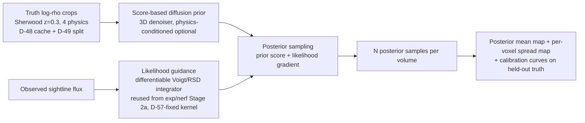

# LEDGER — diffusion-posterior (generative prior + posterior sampling for Lyα tomography)

## **Architecture Diagram (Mermaid)**

---

## 1. The Pulse (Progress & Roadmap)

| Stage | Focus Area | Status | Target Metric | Notes |
|:--- |:--- |:--- |:--- |:--- |
| **Stage 0** | Track founding + research proposal | 🟧 **PARKED-DORMANT — activation gated on `exp/unet-inversion` Stage 2 (see §3 [DP-01] activation clause) or explicit PI/user election** | Proposal of record in §2/§3 | Founded 2026-07-23 per user directive |
| **Stage 1** | Unconditional 3D diffusion prior over truth ρ crops | ⏳ | Sample fidelity vs held-out truth statistics (P(k), PDF, MVSK) | Prior quality is measurable before any inversion |
| **Stage 2** | Posterior sampling with flux-likelihood guidance | ⏳ | Corrected-metric suite on posterior mean + calibration coverage | Reuses exp/nerf differentiable integrator |
| **Stage 3** | Cross-physics generalization + uncertainty audit | ⏳ | Coverage within pre-set tolerance on held-out physics | |

### Completed Milestones
- **2026-07-23**: Track founded; proposal parked (this file). No code, no runs yet.

---

## 2. Methodology & Architecture (proposal of record, v0 — pre-PI-ratification)

**The one-paragraph mental model.** The NeRF track measured that many different 3D maps explain the same z=0.3 flux equally well (exp/nerf [D-73] K2). When the data cannot decide between maps, one best-guess map is the wrong output format. The honest output is the whole set of maps consistent with the data, summarized as a mean map plus a per-voxel uncertainty map. A diffusion model learns from the simulation what real cosmic density fields look like; at inference time, sampling is steered so every generated field also reproduces the observed flux. The measured degeneracy stops being a defeat and becomes the motivation for the method.

**Two components.**
1. **Prior**: a score-based diffusion model (3D denoising network) trained on truth log-ρ crops from the [D-49] train region — same dataset, no new data (user directive 2026-07-23). Optionally physics-conditioned via a 4-way embedding.
2. **Likelihood guidance**: at each sampling step, push samples toward agreement with the observed sightline flux using gradients through the exp/nerf Stage 2a differentiable Voigt/RSD integrator (the [D-57]-corrected kernel) — the NeRF track's main engineering asset, reused as-is. Diffusion-posterior-sampling-style guidance; the exact guidance scheme is a Stage-2 design decision with its own panel cycle.

**Deliverables no baseline in this literature produces**: per-voxel calibrated uncertainty, posterior coverage curves, and multiple flux-consistent realizations for downstream statistics.

**Known confound to manage**: likelihood guidance re-introduces the FGPA-vs-truth forward-model slack ([D-73] am-9 §9b caveat b). Pre-registered control: report posterior behavior with the guidance weight swept, including weight → 0 (prior-only), so the prior's and the likelihood's contributions separate.

---

## 3. The Logic (Decision Log)

- **[DP-01] Track founding + activation gate + inherited constraints (2026-07-23).**
  Provenance: user directive 2026-07-23 (session: Fable): new-architecture tracks on the SAME dataset; one branch + LEDGER per suggested track.
  **Activation gate (pre-committed):** this track stays DORMANT until one of: (a) `exp/unet-inversion` Stage 2 shows a learned prior recovers structure the flux likelihood alone cannot (its outcome cells (a), (b) or (d)) — then this track upgrades the point estimate to a posterior; (b) `exp/unet-inversion` lands in its cell (c) (learned prior adds nothing) — then this track is LIKELY NOT VIABLE either and needs an explicit PI case before any compute; (c) explicit user/PI election overrides. Rationale: both tracks inject the same class of prior information; the cheaper track measures whether that information helps before the expensive generative track spends.
  **Inherited binding constraints from exp/nerf close-out:** identical list to `exp/unet-inversion` LEDGER §3 [U-01] items 1–10 (K2 under-constraint → prior injection; flux gates ⇏ structure; all outcome cells enumerated; truth-anchored regularizers; no integrated-statistic-only gates; corrected ξ estimator prerequisite; matched frames; bootstrap flux stats; [D-53] discharged-by-design via density-domain prior training; [D-37] honest reporting). Not duplicated here to avoid divergence; that list is normative for both tracks.
  **Additional track-specific constraints:**
  1. Calibration is a first-class gate, not a nice-to-have: posterior coverage (e.g. the fraction of truth voxels inside the central 68% / 95% posterior bands) must be reported with the same prominence as accuracy. An over-confident posterior FAILS the track even if the mean map scores well.
  2. Guidance-weight sweep mandatory (see §2) — one-lever discipline per exp/nerf R10.
  3. Sampling cost is reported (samples × steps × wall-clock) — generative tracks hide cost easily.
  **Preliminary success gates (PI ratification owed):** G1 corrected-estimator prerequisite (shared with sibling track); G2 posterior-mean beats the Wiener baseline and the banked 192³ grid on smoothed-r and r(k), held-out region, matched frame; G2b coverage within ±5pp of nominal at 68%/95% (tolerance TBD at ratification); G3 cross-physics generalization.
  **Pre-enumerated outcome cells:** (a) mean map wins + calibrated → full methods win; (b) mean map wins + mis-calibrated → accuracy-only claim, calibration disclosed as FAIL; (c) mean map ≈ baselines but calibrated → uncertainty-quantification contribution only, verb-ceiling scoped; (d) prior-only ≈ guided (guidance weight sweep flat) → flux adds nothing beyond the prior at z=0.3 → sharpest possible restatement of the exp/nerf under-constraint finding, publishable as characterization; (e) prior samples unfaithful at Stage 1 → track halts before inversion, symmetric disclosure.

---

## 4. The Data (Lineage & Governance)

Same dataset as exp/nerf — no new external data (user directive 2026-07-23). Identical source table to `exp/unet-inversion` LEDGER §4 (sightlines + tauH1 z=0.3 ×4 physics; SherwoodIGM_gal truth via [D-48] cache / [D-50] CIC / [D-49] split; exp/nerf baseline artifacts as eval-context columns). DVC rule: any artifact > 10 MB tracked at `s3://cosmo-gas-vision-storage/dvc-data`.

---

## 5. Evaluation Plan

Adopts verbatim the corrected-metric suite being spec'd on the exp/nerf close-out (per-lag Pearson ξ(r); smoothed log-ρ Pearson at σ ∈ {1, 2, 4} h⁻¹Mpc; r(k); SSIM/PSNR slabs; matched frames; truth+noise controls) so all tracks score on one common table. Adds track-specific: posterior coverage at 68%/95%, rank histograms, per-voxel spread maps, guidance-weight sweep curves, sampling-cost accounting.

---

## 6. Visualization & Artifacts

(placeholder — first entries expected at Stage 1: prior sample gallery vs held-out truth crops, matched P(k)/PDF overlays)

---

## 7. Session History & Next Handoff

### Session Snapshot: 2026-07-23 (track founding — Fable session)
- Founded as the second of two same-dataset successor tracks (sibling: `exp/unet-inversion`, the activation gatekeeper — see §3 [DP-01]).
- Dormant by design; no dispatches authorized. In flight elsewhere: exp/nerf corrected-metric spec (PI) + prior-art/novelty panel (covers diffusion-based tomography prior work — must land before any novelty claim here).
- **Immediate next steps:** none on this branch until the [DP-01] activation gate fires; then PI proposal review → Stage 1 prior training design doc with its own panel cycle.
