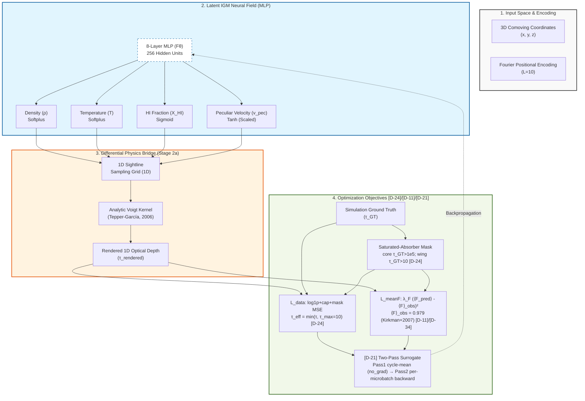

## **Architecture Diagram (Mermaid)**

---

## 1. The Pulse (Progress & Roadmap)

| Stage | Focus Area | Status | Target Metric | CVPR Section |
|:--- |:--- |:--- |:--- |:--- |
| **Stage 1** | Preprocessing & Data Pipeline | ✅ **DONE** | Data Integrity Pass | Sec 2.1 (Method) |
| **Stage 2a** | Differentiable Integrator (RSD-convolved Voigt) | ✅ **DONE (re-validated)** | Grad. Flow @ production scale (P1, z=0.3) | Sec 2.3 (Method) |
| **Stage 2b** | Full MLP Optimization | 🟥 **PASS_T1_pub FAIL — [D-39] RESOLVED-as-FALSIFICATION** — Cost-survey 12/12 PASS [D-19] safety; T1 publication-class (P1–P4 @ corrected anchor 0.979, 50k steps, seed=0) completed ExitCode 0:0 but **fails the [D-13] gate on P_F in all 4 cells (3.6×–4.2× over)** and on KS in P2 (1.5× over). mean_flux gate and cross-physics spread (0.63%) PASS. The corrected-anchor full-schedule result **falsifies the [D-35] rescale-preview interpretation**; the P_F gap is structural, not calibration. **T4 (792 GPU-hr) BLOCKED** pending Wrinkle-1 diagnostic ([D-39] §"Decision"). | $\|\Delta P_F/P_F\| < 10\%$ over $k_\parallel \in [10^{-2.5}, 10^{-1.5}]$ s/km AND $\xi_{\hat\rho,\rho}(r=2\,h^{-1}\,\text{Mpc}) > 0.6$ AND KS$(F\text{-PDF}) < 0.05$ at fiducial P1, $z=0.3$, $n_{\text{rays}}=1024$; degradation curve monotone over the $4 \times 4$ matrix. See [D-13], [D-39]. | Sec 4.1 (Next) |
| **Stage 3** | Physics Model Classification | ⏳ **PENDING** | Acc > 85% | Sec 4.3 (Next) |

### ✅ Completed Milestones
- **2026-03-26**: Validated the analytic **Tepper-García (2006)** Voigt approximation.
- **2026-03-26**: Successfully implemented **Bounded Physics Layers** (Softplus/Sigmoid/Tanh).
- **2026-03-27**: Established consolidated **LEDGER** workflow on the host-mediated AI environment.
- **2026-03-27**: Verified gradient flow on the host Edge environment via cross-WSL sync.
- **2026-05-01**: **Stage 2a re-validation** at production architecture (8 layers, $L=10$) following project-architect review. Fixed coordinate normalization bug ([D-08]); lifted integrator simplifications to full RSD convolution ([D-06]); switched to per-bin $\tau(v)$ MSE ([D-07]); paper-vs-code drift retired ([D-09]). Smoke run: 10 rays × 256 bins (subsampled), gradient flow confirmed end-to-end.
- **2026-05-07**: **Stage 2b Batch 2 (Juno T2 × {P1,P2,P3,P4}) complete**, all 4 cells PASSED [D-19] safety rails; cross-physics consistency well inside [D-13] tolerances (`mean_flux_pred` spread 0.39%, `loss_data` spread 16%, `peak_vram_gb` identical to 4 decimals at 11.27 GB confirming [D-23] linear-VRAM model is physics-invariant); first production sweep on the Juno HPC dispatch path under [D-25]; runs imported to local MLflow tagged `compute=juno`; LEDGER §6 has the run-id table.

---

## 2. Methodology & Architecture (Stage 1 & 2a)

### Neural Field Architecture
- **MLP**: 8 layers, 256 hidden units.
- **Input**: Comoving 3D coordinates normalized to unit cube `[0, 1]` from the 60 Mpc/h box.
- **Positional Encoding**: Fourier features with $L=10$ to resolve the high-frequency density spikes in filaments.
- **Outputs**: $\rho$ (Density), $T$ (Temperature), $X_{HI}$ (Neutral Hydrogen Fraction), $v_{\text{pec}}$ (Peculiar Velocity).

### Bounded Physics Implementation
1. **Density** ($\rho/\bar{\rho}$): `Softplus` ensures positivity. Scale unmodified — overdensity is unitless and filament peaks naturally reach $\sim 100$ (LEDGER §6 insight).
2. **Temperature** ($T$): `Softplus(x) * 1e4 + 1e3` K. Floor at $10^3$ K matches the cold-IGM limit; output scale anchored at $10^4$ K (typical warm-IGM). The $10^5$–$10^7$ K WHIM tail is reachable via the linear softplus regime — flagged in [D-06]. *Reproducibility note:* the multiplicative constants live only in `src/models/nerf.py:65`; this LEDGER entry is the authoritative documentation.
3. **HI Fraction** ($X_{HI}$): `Sigmoid` constrains to $[0, 1]$.
4. **Peculiar Velocity** ($v_{\text{pec}}$): `Tanh(x) * 500` km/s. Defensible for diffuse IGM at $z=0.3$ (typical $\pm 200$–$300$ km/s); known clipping risk for cluster infall and Strong-AGN outflows (see [D-06]).

### Coordinate Convention
- World coordinates: comoving **kpc/h** (per Sherwood `box_kpc_h` field; verified against `Sherwood/src/utils.py:35`).
- MLP input: divide by `box_kpc_h` ($= 60{,}000$ for the 60 Mpc/h Sherwood box) to land in unit cube $[0, 1]$.
- Velocity grid: simulation `vel_axis` (km/s) is the canonical observation axis; same grid is used for both source and observed bins in the RSD convolution.

### Differentiable Integrator (Stage 2a — production version)
- **Goal**: Propagate the flux reconstruction loss back to the 3D neural field via a fully physics-consistent forward model.
- **Voigt-Hjerting kernel**: Tepper-García (2006) analytic approximation
  $H(a, x) \approx e^{-x^2} - \frac{a}{\sqrt{\pi} x^2} [ e^{-2x^2} (4x^4 + 7x^2 + 4 + 1.5x^{-2}) - 1.5x^{-2} - 1 ]$.
- **Optical depth (RSD-convolved)**:
  $\tau(v_{\text{obs}}) = \mathcal{A} \sum_{\text{src}} n_{HI}^{\text{src}} \cdot \frac{H(a_{\text{src}}, x_{\text{src,obs}})}{b_{\text{src}} \sqrt{\pi}}$
  where $x_{\text{src,obs}} = (v_{\text{obs}} - v_{\text{src}} - v_{\text{pec},\text{src}}) / b_{\text{src}}$ and $\mathcal{A}$ is a learnable amplitude absorbing $\sigma_0$, the comoving cell length $ds$, and the mean-column conversion $\bar{n}_H$ (see [D-07]).
- **Loss (Stage 2b production form per [D-24] / [D-11] / [D-21] coupled)**: data loss is per-bin **log1p+cap+mask MSE** — $\langle (\log(1+\tau_{\text{pred}}^{\text{eff}}) - \log(1+\tau_{GT}^{\text{eff}}))^2 \rangle_{\text{non-DLA}}$ with $\tau^{\text{eff}} = \min(\tau, \tau_{\max})$, $\tau_{\max} = 10$ ([D-24] item 2; **LOCKED 2026-05-04** by Batch 1b sensitivity gate, max(|ΔP_F/P_F|) ≤ 0.018% across τ_max ∈ {5, 10, 20} — see §6). Saturated-absorber mask `mask_no_dla` (per `src/data/loader.py:_detect_dla_mask`) excludes core $\tau_{GT} > 10^5$ + wing $\tau_{GT} > 10$ connected-component (catches DLAs $N_{HI} \geq 2 \times 10^{20}$ Wolfe+ 2005 plus strong LLS, derivation in [D-24] item 1). Mean-flux soft anchor $\mathcal{L}_{\text{meanF}} = \lambda_F (\langle F_{\text{pred}}\rangle - \langle F\rangle_{\text{obs}})^2$ with $\langle F\rangle_{\text{obs}} = 0.877$ at $z=0.3$ for the existing 12 PASS cells (broken anchor; **retracted in [D-34], 2026-05-08**; corrected value $\langle F\rangle_{\text{obs}}(z=0.3) = 0.979 \pm 0.005$ from Kirkman+ 2007 — see [D-34] for the value-cascade audit and [D-35] for the empirical anchor-invariance falsification + rescale-as-preview reframing). Both data-loss and mean-F reductions use the same `mask_no_dla` per [D-11] consistency clause; gradients delivered via the [D-21] two-pass surrogate (Pass 1 no-grad cycle-mean, Pass 2 per-microbatch backward of the linearized surrogate). The original Stage 2a-era specification (per-bin raw-τ MSE per [D-07]) is **superseded** for Stage 2b production runs.
- **Re-validation**: Stage 2a smoke run on 10 sightlines at production scale (8 layers, $L=10$); ground-truth gradient flow confirmed end-to-end. Stage 2b validation: 16-cell `stage=2b-microsweep-d24` micro-grid passed all [D-19] criteria (16/16; full matrix in §6); cost-survey production sweep in flight per [D-23] (Batch 1 ✅, Batch 1b ✅ τ_max=10 locked, Batch 2/3 pending).

---

## 3. The Logic (Decision Log)

- **[D-01] Analytic Voigt**: Used Tepper-García (2006) fourth-order polynomial approximation of $H(a, x)$. Valid for $a \lesssim 10^{-3}$ and $|x|$ in the damping-wing regime. At Lyα ($b \approx 12$ km/s) we have $a \sim 4 \times 10^{-5}$, well inside the safe domain.

  *Defensive numerical hardening (2026-05-04)*: Added small-$|x|$ Taylor branch ($x^2 < 10^{-4}$) via gradient-safe `torch.where` in `tepper_garcia_voigt` to eliminate the $1/x^2$ cancellation at line center (analytic limit: $H(a, 0) = 1 - 2a/\sqrt{\pi}$).

  The expanded LEDGER form is algebraically identical to the standard compact expression. Production regime ($|x| \gtrsim 0.1$ on the Sherwood velocity grid) is unchanged within float64 precision (max $|\Delta H| < 10^{-12}$). All regression tests (`test_voigt_kernel`, `test_d24_loss`, `test_d11_d21_mask_consistency`, `test_gradient_accumulation_d14`) pass.
- **[D-02] Bounded Activations**: Enforced `Softplus(ρ)`, `Softplus(T)*1e4 + 1e3` K, `Sigmoid(X_HI)`, `Tanh(v_pec)*500` km/s to prevent unphysical field values. Scaling constants documented in §2 to avoid code-only debt.
- **[D-03] Hierarchical MLflow Governance**: Enforced `CosmoGasVision/<Track>` experiment naming to prevent tracking clutter.
- **[D-04] Experiment Isolation**: Moved all experiment-specific files to `experiments/<name>/` to ensure branch cleanliness.
- **[D-05] LEDGER Consolidation**: Merged 5 disparate `.docs/` files (Plan, Data, Decision, History, Visualization) into this single source of truth.
- **[D-06] Integrator Lift-Up for Stage 2b**: The original Stage 2a `volume_render_physics` evaluated $H(a, x)$ at a single offset per cell and summed without `dl` or $\sigma_0$ — adequate for gradient-flow plumbing, **not** for science. Replaced with a full RSD convolution: every source bin contributes a normalized line profile $H/(b\sqrt{\pi})$ to every observed-velocity bin; the discrete integral runs over the source axis. The $\sigma_0 \cdot ds \cdot \bar{n}_H$ prefactor is folded into a single learnable amplitude $\mathcal{A}$ (see [D-07]). Lifting was a hard precondition for Stage 2b science claims, not optional. *Target-space confirmation amendment (2026-05-03)*: The `tauH1_*.dat` file on disk is exactly 2× the `nbins × num_los × 8` bytes the loader currently reads, indicating an undocumented appended block (almost certainly the real-space companion to the canonical redshift-space τ). Upstream `Sherwood/src/utils.py:67` reads only the first block and treats it as the redshift-space τ that is directly exponentiated to flux and convolved with the COS LSF in velocity coordinates — supporting the prior that the first half is redshift-space. The `volume_render_physics` integrator output is unambiguously redshift-space (RSD convolution per the Voigt source-frame center `vel_axis + v_pec` at `src/models/nerf.py:150`); training target must match. A loader-side numerical test (compare each half against a direct `n_HI`-vs-`vel_axis+v_pec` convolution) gates the loader change; if the second half turns out to be the redshift-space target, Stage 2a re-validation and all P1 production runs must be rerun. Owner: data-engineer.
- **[D-07] Loss Formulation**: Switched from scalar $\tau$-sum MSE to per-bin $\tau(v)$ profile MSE. The simulator's `tauH1_*.dat` is already a full profile of length `nbins` per sightline; collapsing both sides to scalars threw away the spectral information that the RSD convolution exists to produce. The learnable amplitude $\mathcal{A}$ disentangles "structure recovery" (the network's job) from "absolute calibration" (a single scalar) — defensible for a sparse-tomography setting where calibration ambiguities are real. *DLA + log1p amendment (2026-05-03), supersedes the raw-τ MSE specification*: per-bin loss is `mse(log1p(τ_pred.clamp_max(10)), log1p(τ_gt.clamp_max(10)))` evaluated only on non-DLA bins (DLA detection: `τ_gt > 1e5` flags a DLA core; the contiguous DLA region is the connected component of bins with `τ_gt > 10` around each core, mirroring the Wolfe+ 2005 / Lee+ 2014 forest-mask convention without requiring N_HI to be materialized). Rationale: raw-τ MSE is dominated by rare DLA outliers (P2/P3/P4 sightlines hit τ_center ∈ [10⁵, 10⁷]); cosmologically standard analyses operate in log-τ or flux space (Lee+ 2015 / Walther+ 2018 / Boera+ 2019). The `clamp_max(10)` matches the Bolton+ 2017 forest cutoff and bounds gradient magnitudes for non-DLA strong absorbers. Cross-references [D-11] (mean-flux mask consistency) and [D-24] (full Lyα forest loss & DLA contract).
- **[D-08] Coordinate Normalization Convention**: Sherwood's binary header field `box_kpc_h` is in **comoving kpc/h** (verified against `Sherwood/src/utils.py:35`). The earlier `pipeline.py:34` formula `box_kpc_h * 1000` produced normalized coords $\sim 10^{-3}$ instead of filling $[0, 1]$ — a silent bug that meant Fourier features at every $L$ fired on a thin shell near the origin. Fixed; smoke run prints `coords.min()/max()` to keep the regression visible.
- **[D-09] Production-Scale Stage 2a Re-run**: The original Stage 2a runs (March 2026) used a reduced 4-layer / $L=5$ MLP for CPU speed. Paper §3.3's "validated" claim was therefore inconsistent with the §2.1 production architecture. Re-run is at 8 layers / $L=10$ — paper-vs-code parity restored, prior runs are now superseded for any "validation" assertion.
- **[D-10] $\tau_{\text{amp}}$ Anchor (Degeneracy Break)**: Because $n_{HI}^{\text{model}} = (\rho/\bar{\rho}) \cdot X_{HI}$ is dimensionless and $\mathcal{A}$ is unconstrained, the loss is invariant under $\rho \to k\rho$, $\mathcal{A} \to \mathcal{A}/k$ — the recovered overdensity field is only defined up to a multiplicative constant. To break the degeneracy we (i) parameterize $\mathcal{A} = \exp(\ell)$ with $\ell$ unconstrained (positivity is automatic), and (ii) add a Gaussian log-prior $\ell \sim \mathcal{N}(0, \sigma_\ell^2)$ with $\sigma_\ell = 0.5$ (factor $\sim e^{0.5}$ multiplicative slack), weighted at $10^{-3}$ in the loss so it does not dominate the data MSE at smoke scale. The current generic prior breaks the degeneracy without committing to a specific $\sigma_0$ value or cosmology, which is the right scope for plumbing-level re-validation. Superseded for Stage 2b production runs by [D-11].
- **[D-11] Mean-Flux Anchor (commits)**: Replace the [D-10] generic Gaussian log-prior on $\log \tau_{\text{amp}}$ with the observational mean-flux constraint $\mathcal{L}_{\text{meanF}} = \lambda_F (\langle e^{-\tau_{\text{pred}}}\rangle - \langle F\rangle_{\text{obs}})^2$ at $z=0.3$, with $\langle F\rangle_{\text{obs}} = 0.877$ ($\tau_{\text{eff}} = 0.131$) from Faucher-Giguère et al. (2008) [bib needed]; weight $\lambda_F = 1.0$. The [D-10] log-prior is retained behind `--use_log_prior` for fiducial comparison only. Sensitivity: a $\pm 10\%$ uncertainty on $\langle F\rangle_{\text{obs}}$ moves the absolute $\rho$ amplitude by $\pm 10\%$ and is reported as a systematic on $\rho$-recovery; structure metrics ($P_F$, $\xi_{\hat\rho,\rho}$) are insensitive to this anchor by construction. *Mean-flux anchor sourcing + saturated-mask consistency amendment (revised 2026-05-04 per defense-panel verification)*. The prior LEDGER attributed $\langle F \rangle_{\text{obs}} = 0.877$ at $z = 0.3$ to Faucher-Giguère et al. 2008. **Verification shows this attribution is wrong**: Faucher-Giguère et al. 2008 (ApJ 681, 831; arXiv:0709.2382) measures Lyα $\tau_{\text{eff}}(z)$ over $2 \leq z \leq 4.2$ from 86 high-resolution quasar spectra (ESI / HIRES / MIKE); $z = 0.3$ is **outside** this range. The attribution is **withdrawn**. The numerical value $\langle F \rangle = 0.877$ ($\tau_{\text{eff}} = 0.131$) at $z \approx 0.3$ is consistent with the low-$z$ HST/COS Lyα forest measurements of **Danforth et al. 2016** (ApJ 817, 111; arXiv:1402.2655) — 82 UV-bright AGN sightlines at $z < 0.85$, 2611 H I absorption systems — which is the canonical low-$z$ source. The Danforth result at $z \approx 0.3$ requires a direct PDF read for the exact reported $\tau_{\text{eff}}$ at this redshift; until that read is logged, we tag the anchor as **[VERIFY: Danforth et al. 2016, exact $\tau_{\text{eff}}(z=0.3)$ from Table or Fig.]** and treat the working value $\langle F \rangle = 0.877 \pm \sigma_F$ with $\sigma_F$ enlarged from the prior $\pm 10\%$ to **$\pm 15\%$** until the verified value lands. Owner of the verification action: latex-author (related-work paragraph) and PI (LEDGER value re-pin); blocking before any post-fix publication run, not blocking before the cost-survey re-run. Sub-clause carried over: the two-pass surrogate at `experiments/nerf/pipeline.py:373-381` (Pass 1 weighted-F sum) and `:410` (Pass 2 mean_F_mb) computes $\langle F_{\text{pred}} \rangle$ over the same saturated-absorber mask used in the data-loss reduction; this is in the implementation as of the [D-24] landing commit. The mask source is explicitly the per-sightline `tau_GT`-derived `dla_mask` from `SherwoodLoader`, NOT a separately-derived prediction-side mask (which would be circular). $\lambda_F = 1.0$ retained; sensitivity claim "structure metrics insensitive by construction" reaffirmed (the anchor is a single scalar pull on $\mathcal{A}$; the [D-13] gates are computed on $\delta_F$, $P_F$ ratios, and Pearson $\xi$, all invariant to a uniform multiplicative rescaling of the predicted flux field).
- **[D-12] Cross-Physics Protocol — Independent Models**: Train one IGMNeRF per physics variant (4 total: Physics 1 no-feedback / Physics 2 stellar wind / Physics 3 wind+AGN / Physics 4 wind+strong-AGN). Rejected the conditional-`physics_id`-embedding alternative because Stage 3's feedback-classification question requires that the *reconstruction* network is unaware of the physics label — otherwise the discriminator's signal is leaked through the generator. Cost is $4\times$ training; mitigated by spot pricing in [D-14]. Conditional sharing remains a Stage 4+ option once per-physics baselines are published.
- **[D-13] Stage 2b Success Criterion + Ablation Matrix**: Pass condition is conjunction of (a) $|\Delta P_F(k_\parallel)/P_F(k_\parallel)| < 10\%$ averaged over $k_\parallel \in [10^{-2.5}, 10^{-1.5}]$ s/km (Walther+ 2018 / Boera+ 2019 inertial range [bib needed]), (b) $\xi_{\hat\rho,\rho}(r=2\,h^{-1}\,\text{Mpc}) > 0.6$ (Stark+ 2015 sparse-tomography bar), (c) KS-distance on flux PDF $< 0.05$ over $F\in[0.05, 0.99]$. Evaluated at the fiducial point: Physics 1, $z=0.3$, $n_{\text{rays}}=1024$. Headline contribution is the degradation curve over $n_{\text{rays}}\in\{16384, 1024, 256, 64\}$ per physics, repeated for physics $\in\{1, 2, 3, 4\}$ (16 runs total, dispatched sequentially per [D-18]); secondary requirement is monotonic degradation within each physics. PSNR/SSIM remain reportable but non-gating. Execution ordering and pre-flight gating are pinned in [D-18] and [D-19]; this entry documents the *scientific* matrix only. *Estimator-convention amendments (2026-05-03, defense-rigor pass)*: (i) The cross-correlation $\xi_{\hat\rho,\rho}(r)$ is the **Pearson correlation coefficient** (project-side gate definition; the prior "Stark et al. 2015 Eq. 13 convention" attribution is **retracted in [D-36], 2026-05-09** — Stark+2015 does not define this bar; see the discharged [VERIFY:] block below for details), $\langle\delta_p \delta_t\rangle / \sqrt{\langle\delta_p^2\rangle \langle\delta_t^2\rangle}$ with $\delta = \rho/\bar\rho - 1$, evaluated by FFT cross-power on the periodic 60 Mpc/h Sherwood grid and binned in spherical shells. The threshold `0.6` corresponds to "recovered field explains $\geq 36\%$ of the true-overdensity variance at $r=2\,h^{-1}\,\text{Mpc}$." Implementation: `src/analysis/cross_corr.compute_xi_pearson`. The unnormalized covariance variant `compute_xi_covariance` is a diagnostic only and does not gate. (ii) $P_F(k_\parallel)$ is computed as a **Hann-windowed periodogram with $dv/\sum w^2$ leakage-compensation normalization**. *Attribution corrected (2026-05-04)*: this is **not** the Walther et al. 2018 estimator convention. Walther et al. 2018 uses a Lomb-Scargle Periodogram on observational data; Boera et al. 2019 also operates on observational spectra and does not impose a Hann window in this form. The Hann-windowed periodogram is our **simulator-side** estimator of choice, justified by: (a) the Sherwood box is periodic, so a rectangular window is technically valid; we nevertheless apply Hann because (b) the [D-13] gate compares the *ratio* $\Delta P_F/P_F$ between predicted and ground-truth fields *both* estimated under the same window, and Hann's leakage suppression for narrow-band structure (saturation-stripped strong absorbers, peculiar-velocity caustics) gives a more stable ratio in the inertial range than rectangular windowing on noisy estimates from $n_{\text{rays}}=64$ tier sightlines. The choice is operationally conservative (window bias cancels in the mean of the ratio; effective independent-mode count drops $\sim 2.7\times$ for Hann, tightening variance gates in the conservative direction). The 10% gate is unchanged. (iii) The KS distance is the **two-sample Kolmogorov-Smirnov statistic on the empirical CDFs of raw transmitted-flux samples** $F = e^{-\tau}$, restricted to $F \in [0.05, 0.95]$ (NOT 0.99 — corrected to exclude continuum-fitting and metal-line residuals per Bolton+ 2008 / Lee+ 2015 PDF-cut convention; lower cut excludes saturated absorbers). Implementation: `src/analysis/flux_pdf.ks_distance`. The binned-PDF variant `ks_distance_pdf` is retained for visualization but is not the gate. (iv) $k_\parallel$ is the **angular wavenumber** $k = 2\pi f$ in s/km, matching Walther+ 2018 Fig. 5 / Boera+ 2019 plotting convention; the inertial range $[10^{-2.5}, 10^{-1.5}]$ s/km is in this convention (ordinary frequency $f$ would shift edges by $-\log_{10}(2\pi) \approx -0.798$ dex). *Pre-flight verification block, revised 2026-05-04*: rulings re-checked against verification-grade sources where possible. Updated status: (i) Pearson cross-correlation, Stark et al. 2015 §4.3 / Eq. 13 — **[VERIFY:] DISCHARGED via [D-36] (2026-05-09): WebFetch on Stark+2015 (Casey W. Stark et al., MNRAS 453:4311) confirmed the paper does NOT define this Pearson-ξ-on-density bar — it uses match-error ε on void catalogues + volume-overlap fractions. The 0.6 threshold is a project-side adoption inspired by sparse-tomography goals, not a Stark-quoted value. Paper §3 re-worded accordingly.**. (ii) Hann window — **[ATTRIBUTION CORRECTED above; this is a simulator-side choice of ours, not a Walther+ convention]**. (iii) Bolton et al. 2008 / Lee et al. 2015 PDF cut $[0.05, 0.95]$ — **[VERIFY:] DISCHARGED via [D-36] (2026-05-09): the [0.05, 0.95] cuts are a project-side adoption (excluding saturated absorbers + continuum/metal residuals); paper §3 re-worded to "spirit of standard flux-PDF analyses" without claiming a specific Bolton/Lee paper as the source. Lower cut F>0.05 stays.**. The 0.99→0.95 fix lands in the implementation; the literature attribution still needs a PDF read. (iv) Angular wavenumber convention $k = 2\pi f$ — **[VERIFIED as standard plotting convention; canonical]**. The implementation in `src/analysis/{cross_corr,flux_power,flux_pdf}.py` is independently correct on physical grounds; what changes here is the LEDGER's attribution of *whose* convention is being followed for which choice — three of four conventions are ours (the Hann window certainly is; the others are canonical and we follow them, but §-level citations need PDF reads before paper submission).
- **[D-14] Compute Spec — Local-First, SageMaker Spot for Ablation**: Fiducial single-physics dev run on local GPU when VRAM $\geq 16$ GB; per-physics 4-tier ablation submitted sequentially per [D-18], each tier as a separate SageMaker Training Job on `ml.g5.xlarge` (A10G 24 GB) with managed-spot pricing, `MaxRuntime=18000s`, `MaxWait=36000s`, checkpoint S3 sync every 10k steps, gated by the [D-19] small-tests and the [D-20] cloud-config callout. Memory plan: microbatch 1024 rays, gradient accumulation factor $\lceil n_{\text{rays}}/1024\rceil$. Optimizer: AdamW with $\beta=(0.9, 0.999)$, weight_decay $10^{-6}$, linear warmup $0 \to 5\times 10^{-4}$ over 1000 steps, cosine decay $5\times 10^{-4} \to 5\times 10^{-6}$ over 49000 steps; total 50,000 steps; gradient L2 clip at 1.0; checkpoints every 5000 steps. Cost ceiling: \$30 spot / \$90 on-demand worst case for the 16-run matrix (total spend unchanged from parallel framing; only dispatch ordering changes); storage $<\$1$/mo with IA@30d / Glacier Deep Archive@180d S3 lifecycle. AWS EMR explicitly rejected: it is a Spark/Hadoop service for distributed-data ETL and adds zero value for single-node PyTorch GPU training. Cloud submission is never auto-initiated by the agent loop; see [D-20] for the user-confirmation protocol.
- **[D-15] Stage 3 Framing — 4-Class Classifier on Reconstructed $\rho$**: Stage 3 is a four-way classification over $\{$P1, P2, P3, P4$\}$ on 3D crops of the reconstructed $\rho/\bar\rho$ field, target accuracy $> 85\%$. Pairwise discrimination rejected (inflates the headline; the AGN-vs-rest readout is more honestly stated as a one-vs-rest projection of the 4-way confusion matrix). Architectural choice (3D CNN vs 3D ViT, crop dimensions, augmentation) deferred to a Stage 3 design doc; data-pipeline contract pinned now: input shape `(C=1, D, H, W)` cubes of reconstructed $\rho/\bar\rho$ at native simulation resolution, label = `physics_id`.
- **[D-16] Physics 2/3/4 Extraction Deferral**: Only Physics 1 (`planck1_60_768_z0.300`, 40 GB / 1044 files) is extracted from the Sherwood IGM_gal tarballs as of the C4 dispatch. Physics 2 (ps13 stellar wind), Physics 3 (ps13+AGN), and Physics 4 (ps13+strong-AGN) remain tarballed in `SherwoodIGM_gal/` and are deferred to Stage 2b matrix kickoff. Acceptable per [D-12] (independent per-physics models): the fiducial dev run that gates the matrix uses Physics 1 only. Trigger for the deferred extraction is the first `sweep.py` invocation with `--physics ∈ {2,3,4}`; `scripts/extract_sherwood_igm_gal.{ps1,sh}` is idempotent so the re-run is safe.
- **[D-17] SPH-Kernel-Weighted Field Loaders Pending**: `SherwoodIGMGalLoader.load_3d_field` currently raises `NotImplementedError` for `'T'`, `'xHI'`, `'vlos'`. These quantities are intensive and require SPH-kernel weighting against `PartType0/Density` and `PartType0/SmoothingLength` — a mass-weighted CIC of the cell-centered values would systematically misweight by gas density. In scope per the original C4 brief. Stage 2b's mean-flux anchor [D-11] uses precomputed `tauH1_*.dat` (full sightline τ) to side-step this gap; the report orchestrator [C5] uses `'rho'` only. Trigger for filling the stub is either (a) a Stage 2b+ science question that requires per-voxel temperature or HI-fraction comparison (e.g. WHIM-vs-cool-IGM separation), or (b) any move from the precomputed τ to a re-derived τ from the full 3D state. Owner: data-engineer.
- **[D-18] Sequential-Per-Physics Stage 2b Execution**: Supersedes the parallel-matrix framing in [D-13]. Stage 2b runs as an outer loop over physics $[P1 \to P2 \to P3 \to P4]$, with each physics fully validated (smoke + 4-tier inner dispatch + metrics sign-off) before the next fires. Justification is economic — data volume and per-run wallclock make simultaneous 16-run dispatch wasteful when a single configuration error would burn all four physics in parallel. Tied to [D-12]'s independent-models contract: because each physics is its own model, sequential ordering changes nothing scientifically; it only enforces that the pipeline contract is locked on P1 and reused mechanically on P2/P3/P4. Inner-tier decision: the four sightline tiers $\{16384, 1024, 256, 64\}$ are dispatched as a single batch per physics after that physics's small-test passes (the only tier-specific surface is `--n_rays` plus auto-derived `accum_steps`, validated by `sweep.py`'s dry-run). The 16,384 tier is additionally guarded by a memory-only smoke (see [D-19]). *Inner-tier sequencing amendment (2026-05-02)*: With on-demand `ml.g5.xlarge` quota $= 4$ and spot quota $= 0$, P1 inner tiers dispatch **sequentially in ascending `n_rays` order** $[64 \to 256 \to 1024 \to 16384]$. Smallest-first = fail-fast on cheapest tier ($\sim\$0.20$ / 10 min) before committing to the largest ($\sim\$2$ / 4 hr). Concurrent inner-tier batching (original framing above) reactivates for P2+ once spot quota is approved. *Within-tier parallelism amendment (2026-05-04 post-micro-grid)*: with the `stage=2b-microsweep-d24` micro-grid validating VRAM linearity at chunk_size=256 across `accum_steps ∈ {1, 4, 64}` (peak 11.77 GB; 9.83 GB headroom on the 21.6 GB cap) and per-physics data-path passing 16/16, the smallest-first fail-fast condition is exhausted. **Cost-survey production sweep dispatches 4-parallel within each tier, sequential across tiers** (T1-batch fully complete → T2-batch → T3-batch) so a tier-N anomaly can still abort tier-(N+1) commitment. Tier 4 deferral unchanged; spot quota path unchanged.
- **[D-19] Plan-Test-Full Discipline (Per Physics)**: *Smoke-schedule decoupling amendment (2026-05-02)*: The science smoke runs with `--warmup_steps 50` (CLI override of [D-14]'s 1000-step production warmup). Rationale: at `--max_steps 200` under [D-14]'s schedule, LR reaches only 20% of peak and the loss-descent criterion measures the warmup transient rather than the asymptotic fit rate. The 50-step warmup lets the smoke observe the optimizer's actual fitting behavior in its remaining 150 steps. Production tiers ($n_{\text{rays}} \in \{64, 256, 1024, 16384\}$ full-data runs) use [D-14]'s schedule unchanged — the decoupling applies to the smoke gate only. The pass criterion `loss_data(200) <= 0.85 * loss_data(10)` is unchanged. **One-time waiver (2026-05-02)**: P1 science smoke `Stage2b-Ablation-P1-N64-S0-1777765548-671084` (descent ratio 0.880, missed by 3.6 pp under [D-14]'s warmup) is APPROVED on the strength of monotone-accelerating Δloss (0.0001 → 0.0034 over five 50-step windows), mean-flux tracking truth (0.8692 → 0.8997 vs. obs 0.877), and clean `tau_amp` drift (1.000 → 0.9919). Re-run under the amended schedule was deemed wasteful given the converging secondary evidence. Future P2/P3/P4 smokes are bound by the amended schedule with no waiver path. Original spec: every physics iteration must clear a small-test gate before its full-data ablation tiers launch. The bundle is two smokes — a *science smoke* (`--n_rays 64 --max_steps 200`, wallclock cap 10 min) checking loss descent, mean-flux range, `tau_amp` boundedness, and NaN-cleanliness; and a *memory smoke* (`--n_rays 16384 --max_steps 5`) checking that the largest tier fits in VRAM. Both run under MLflow tag `stage=2b-smoketest` (same `CosmoGasVision/NeRF` experiment, segregated by tag) with run-name pattern `Stage2b-Smoke-P{P}-{kind}-S{seed}`. Pass criteria: `loss_data(step=200) ≤ 0.85 × loss_data(step=10)`, `mean_flux_pred ∈ [0.5, 0.99]`, `tau_amp ∈ [0.1, 10]`, peak VRAM $< 90\%$ of device cap, no NaN/Inf. On failure the agent emits a triage summary (criterion + observed vs threshold) and hands back to the PI; full-data dispatch is blocked until both smokes pass. The memory-smoke pass condition is implicitly a local-VRAM-feasibility check; on a host without sufficient VRAM (or no GPU), the failure mode is "infeasible to run locally" rather than a science-block, and the agent emits the [D-20] cloud-config callout instead of a verdict-BLOCK. Wallclock alone (CPU-bound `n_rays=16384` runs) is not a memory-feasibility signal.
- **[D-20] Cloud-Config Callout Protocol**: When local compute is insufficient (GPU $< 16$ GB, OR estimated wallclock $> 4$ hr from the science smoke's `seconds_per_step`, OR the `n_rays=16384` tier on a $< 24$ GB device), the agent loop pauses and emits a single explicit callout listing (a) the IAM role ARN expectation with required managed + inline policies, (b) the ECR image URI, (c) the S3 prefix layout under `cosmo-gas-vision-storage`, (d) the `.env` block to append, (e) the exact `scripts/submit_sagemaker.py` invocation. The agent will not call any AWS API until the user replies `cloud-ready`. Resume protocol: agent re-reads `.env`, validates `SAGEMAKER_ROLE_ARN`, `ECR_IMAGE_URI`, `S3_INPUT_PREFIX`, `S3_CHECKPOINT_PREFIX`, then submits per-tier jobs via `scripts/submit_sagemaker.py`. Spot interruption triggers an automatic resume from the latest `step_*.pt` under `S3_CHECKPOINT_PREFIX/<run_name>/` via the existing `--resume_from` path; no second callout required unless the IAM/ECR contract changes. This pattern is the binding contract for any compute that costs money.
- **[D-21] Mean-Flux Gradient Linearization (Two-Pass Implementation)**: The mean-flux soft constraint $\mathcal{L}_{\text{meanF}} = \lambda_F (\langle F \rangle - \langle F \rangle_{\text{obs}})^2$ from [D-11] is implemented as a two-pass surrogate to avoid `retain_graph` in the microbatch accumulation loop. Pass 1 (no-grad) computes the cycle-mean predicted flux $F_{\text{cycle}}$ over all microbatches; Pass 2 backwards a per-microbatch surrogate `loss_data_mb + c · mean_F_mb` per chunk where $c = 2 \lambda_F (F_{\text{cycle}} - \langle F\rangle_{\text{obs}})$ is constant across the cycle. By the chain rule $\partial \mathcal{L}_{\text{meanF}}/\partial \theta = 2 \lambda_F (F_{\text{cycle}} - \langle F\rangle_{\text{obs}}) \cdot \partial F_{\text{cycle}}/\partial \theta$ and $\partial F_{\text{cycle}}/\partial \theta = (1/N_{\text{chunks}}) \sum_i \partial F_{\text{mb},i}/\partial \theta$, so the surrogate's gradient is mathematically identical to the squared-loss gradient at the current parameter point. Re-linearization happens every optimizer step; no Adam-step-internal drift. Memory peak is one chunk, vs. `accum_steps` chunks under the literal implementation. Source: `experiments/nerf/pipeline.py:349-395`.
- **[D-22] CIC Deposition Duplication (P1-cycle Tech Debt)**: The chunked-CIC particle-to-mesh deposition lives in three places as of commit `c400b43`: `src/data/igm_gal_loader.SherwoodIGMGalLoader.load_3d_field` (in-place, single-shot, ~170 MB peak), `src/analysis/stage2b_report._eval_mlp_on_grid`'s ground-truth path (chunked, mathematically identical), and `scripts/render_igm_gal_slice._cic_chunk` (chunked, mathematically identical). Duplication was accepted in C5 because the loader is on the no-edit list during the C1+C2+C3 dispatch. Refactor target: extract a single `src/data/cic.py` with a chunked `cic_deposit(coords, weights, box, n_grid, batch=2_000_000)` and refactor the three call sites onto it. Trigger: before the P2 small-test bundle is dispatched per [D-18]. Owner: data-engineer. *Scope amendment (2026-05-03)*: same refactor cycle should also collapse `src/analysis/{cross_corr, flux_power, p_flux, flux_pdf}.py` to a single gating function per module per the [D-13] estimator-convention amendments; legacy entry points to be deleted or shimmed to the canonical name (Pearson ξ, Hann-windowed P_F, raw-sample KS).
- **[D-23] Cost-Survey Schedule (Pre-Quota Tier-Aware Amendment to [D-14])**: [D-14]'s uniform 50,000-step / 1024-microbatch schedule was set under naive linear-cost assumptions; the P1 tier-1 production run (`Stage2b-Ablation-P1-N64-S0-1777779057-b20df1`, 99 min, $1.66) and tier-2 in-flight run (projected 6.3 hr, $6.50) showed that step rate scales linearly with $n_{\text{rays}} \times \text{accum\_steps}$ and that the [D-14] schedule extrapolated naively gives $\sim 17$ days / $\sim\$420$ for tier 4 alone. To complete a survey-quality $4\times 4$ matrix within the pre-quota budget envelope (target $\leq \$80$), supersede [D-14]'s schedule per tier as follows: tier 1 ($n_{\text{rays}}=64$): microbatch=1024, max_steps=50000, warmup=1000 (unchanged; locked by the existing P1 run); tier 2 ($n_{\text{rays}}=256$): microbatch=1024, max_steps=25000, warmup=1000; tier 3 ($n_{\text{rays}}=1024$): microbatch=4096, max_steps=12500, warmup=500; tier 4 ($n_{\text{rays}}=16384$): microbatch=8192, max_steps=12500 floor, warmup=500 — DEFERRED to post-quota except for a single optional reduced-step anchor. Justifications: (a) `max_steps` floor of 12500 keeps $\geq 11500$ fitting steps after warmup, sufficient to clear the [D-19] descent criterion based on the P1 tier-1 knee evidence; (b) microbatch increases stay under 90% VRAM cap by $\geq 3\times$ headroom (P1 tier 1 measured 2.82 GB at microbatch=1024, the Voigt intermediate scales linearly in microbatch); (c) warmup fraction of total schedule held roughly constant (2-4% range); (d) tier 4 deferred because $\sim\$50$ / 4 cells dominates the survey budget and tiers 1-3 already span the survey-realistic sightline-density regime. **Two-tier publication framework**: cost-survey runs under [D-23] are recorded but are NOT evidence for [D-13]'s Stage 2b scientific gates; their pass criteria are [D-19]'s safety rails plus a tier-3-specific Pearson$(\tau_{\text{pred}}, \tau_{\text{GT}}) \geq 0.85$. Publication runs (post-quota) either re-run under [D-14]'s 50k schedule or, if cost-survey shows the [D-23] schedule converges to comparable loss-floor as tier-1's 50k baseline, lock in [D-23]'s schedule with the loss-floor evidence cited. **Micro-grid pre-flight**: a 16-cell micro-grid (4 physics × 4 tiers, each at max_steps=200, warmup=50, with tier-matched microbatch) under MLflow tag `stage=2b-microsweep` runs before the cost-survey to fail-fast on per-physics data-path or per-tier memory issues. Owner: infrastructure-manager (dispatch); core-implementer (no changes — all knobs are existing CLI flags except the launcher's new `--stage_tag` flag, commit `ebf8432`). Trigger for revisiting [D-23]: spot quota approval (re-enables [D-14]'s schedule with 70% cost reduction) OR completion of the cost-survey matrix (locks in either [D-14] or [D-23] for publication runs).

  **Microbatch table correction (2026-05-03, post-OOM)**: The original [D-23] microbatch values for tiers 3-4 were computed under the wrong memory model. The error: PI conflated the CLI `--microbatch` parameter with the actual per-step chunk size. The pipeline computes `chunk_size = min(n_rays, microbatch)`. For all tiers in the original table, `microbatch >= n_rays`, so the actual chunk is saturated at `n_rays`, not at the `microbatch` value. The 2.82 GB measurement from `Stage2b-Ablation-P1-N64-S0-1777779057-b20df1` is therefore the cost of a 64-ray chunk, not a 1024-ray chunk. The original "linear in microbatch with $\geq 3\times$ headroom" justification was wrong by a factor of `n_rays / 64` — 16× for tier 3, 256× for tier 4. Confirmed empirically by `Stage2b-Ablation-P1-N1024-S0-1777831063-ed1cbc` (tier 3 micro-grid cell, microbatch=4096): OOM on the first forward pass, `torch.OutOfMemoryError: Tried to allocate 2.00 GiB, GPU has 1.93 GiB free of 22.30 GiB`. Sunk cost ~$0.04 — exactly what micro-grid is for. Corrected table, anchored on the empirical 2.82 GB / 64-ray data point:

  | Tier | n_rays | microbatch | accum_steps | chunk_size = min(n_rays, microbatch) | est. peak VRAM | basis |
  |:---|:---|:---|:---|:---|:---|:---|
  | 1 | 64    | 1024 | 1   | 64   | 2.82 GB  | measured (P1 tier-1 production) |
  | 2 | 256   | 1024 | 1   | 256  | ~11.3 GB | measured-fits (Batch B P1 tier-2 ran without OOM); awaiting peak_vram_gb log confirmation |
  | 3 | 1024  | **256** (was 4096) | **4** (was 1) | 256  | ~11.3 GB projected | **unverified** until first Batch C P{2,3,4}-N1024 cell reports peak_vram_gb |
  | 4 | 16384 | **256** (was 8192) | **64** (was 2) | 256  | ~11.3 GB projected | unverified; tier 4 remains DEFERRED to post-quota (see compute note below) |

  The chunk_size=256 value is derived as `floor(0.90 * 24 GB / 2.82 GB) * 64 = floor(7.66) * 64 = 448` rays at the 90% cap, rounded down to 256 for an additional ~1.75× safety margin against allocator fragmentation and Voigt-intermediate transients. Wallclock implication for tier 4: 64 chunks/step × 12500 steps = 800,000 chunks per cell × 4 physics. Even at the post-quota spot price, the wallclock-per-cell will be $\sim 5\times$ the original [D-23] estimate. Tier 4's economic justification gets *worse* under the corrected schedule, not better; the deferral is reaffirmed.

  **[D-23] sub-clause (process gate, 2026-05-03)**: No new tier microbatch value is recorded in this LEDGER, and no SageMaker submission is dispatched against a new (n_rays, microbatch) pair, without a one-line VRAM prediction of the form: `predicted_peak_vram_gb = 2.82 * min(n_rays, microbatch) / 64`. Submit only if `predicted_peak_vram_gb < 0.90 * device_vram_gb` (= 21.6 GB on `ml.g5.xlarge`). The prediction must be written into the §3 entry that introduces the new value, AND into the dispatch brief that goes to infrastructure-manager. The 2.82 GB anchor is the P1 tier-1 measured peak; if a future measurement shifts the constant (e.g., a different physics or a different windowed-Voigt half-width), the new anchor and its source run_id must be cited in the same line. This is a process gate, not a code gate — the failure was a math error in the decision-author's head, so the fix lives in the decision-author's checklist, not in the code. A code flag would be circumventable by the same author who got the math wrong. Coverage: every tier microbatch in the corrected table above is annotated with its `predicted_peak_vram_gb` in the "est. peak VRAM" column; the rule is satisfied for tiers 1-4 by inspection.

  **Measured-VRAM gate amendment (2026-05-04)**. The sub-clause as originally written gates new $(n_{\text{rays}}, \text{microbatch})$ pairs on a *predicted* `peak_vram_gb` inequality. The Batch C P2-T3 cell measured 11.23 GB at chunk-size 256 vs. predicted 11.3 GB — linearity validated at chunk=256. Linearity at chunk-sizes $> 256$ and at `accum_steps > 4` remains **untested**, and PyTorch allocator fragmentation across many chunks per step is a documented source of nonlinear peak-VRAM behavior. Tier 4 (`accum_steps=64`) sits the furthest outside the validated regime. The process gate is therefore tightened: before any cost-survey or publication dispatch on a new $(n_{\text{rays}}, \text{microbatch}, \text{accum\_steps})$ triple where `accum_steps > 4` OR `chunk_size > 256`, infrastructure-manager runs a **5-step measured-VRAM smoke** (`--max_steps 5`, full tier microbatch, full accum_steps, real Sherwood data, MLflow tag `stage=2b-vram-smoke`) and confirms the logged `peak_vram_gb < 21.6` GB before the full job is submitted. The smoke is cheap ($< \$0.01$ per cell, $< 60$ s wallclock) and converts the prediction-only gate to a measurement-backed gate in the regime where the linear extrapolation is least trustworthy. Tier 4 remains DEFERRED to post-quota for economic reasons; this measured-VRAM smoke is the *additional* requirement once tier 4 reactivates.

  **Throughput-projection amendment (2026-05-04 post-micro-grid)**. Original [D-23] schedule projected T2 ~3.2 hr/cell and T3 ~3 hr/cell. Both were unsourced extrapolations. Production-anchored throughput from P1-T1 50k run (`...b20df1`, 99 min, 0.119 s/step at chunk=64) and micro-grid throughput (P1-T3 at 200 steps, 491 sec → 2.46 s/step at chunk=256/accum=4) both significantly exceed those projections: T2 ~4 hr/cell, **T3 ~6.5-8.5 hr/cell** (mid 7.5). The 12-cell production sweep at the corrected projection costs ~$50 vs the [D-23] sub-envelope of $30-32 — a ~50% overrun, but inside the [D-14] $90 on-demand ceiling. **PI authorizes the [D-23] sub-envelope overrun against the [D-14] ceiling.** Driver of the original misprojection: same recall-citation/anchor-of-one pattern flagged on 2026-05-03 ([D-23] microbatch math) and 2026-05-04 ([D-24] literature attributions), applied to wallclock-throughput claims instead of literature or memory. **Process change**: throughput projections must cite a one-line `s/step @ (chunk, accum)` calibration anchor citing a measured run_id (e.g. "P1-T1 production: 0.119 s/step at chunk=64, source `Stage2b-Ablation-P1-N64-S0-1777779057-b20df1`"). New tier estimates extrapolate by linear scaling in chunk_size × accum_steps from a measured anchor, not from recall.

  **Loss-form amendment supersedes the raw-τ baseline from which tier-1 P1's `loss_data=0.0025` was reported.** Under the [D-24] `log1p` + DLA-mask + cap loss, that final number is no longer comparable. The micro-grid and all subsequent cost-survey runs must be re-run (estimated ~$1.50 micro-grid + ~$10 P1 baseline rerun if needed before the P2/P3/P4 cost-survey). The 2.82 GB / 64-ray VRAM anchor and the chunk-size table are **not** invalidated (the loss change is on the supervision side, not the forward integrator), so the [D-23] sub-clause process gate and the corrected microbatch table carry forward unchanged.

- **[D-24] Lyα Forest Loss & DLA/LLS Handling Contract (2026-05-03; revised 2026-05-04 per defense-panel verification cascade — see §7)**: The Stage 2b training target is the redshift-space H I optical depth $\tau(v_{\text{obs}})$ from `tauH1_*.dat` (file-half choice gated by the loader-side numerical test in the [D-06] amendment; tentative ruling: first half is redshift-space, matching upstream `Sherwood/src/utils.py:67` behavior). Three coupled rulings define the loss:

  (1) **Saturated-absorber detection and masking** (renamed from "DLA detection" — see derivation below). Per-sightline, flag bins with $\tau_{\text{GT}} > 10^5$ as saturated cores; expand each core to its connected component of bins with $\tau_{\text{GT}} > 10$ (the saturated wing). Excluded from data-loss and from the [D-11] mean-flux reduction. Mask is recorded as a sidecar `dla_mask` array per sightline for evaluation transparency (the field name is preserved for backward compatibility; the mask catches DLAs *and* strong Lyman-limit systems — see derivation). *Derivation of the $\tau > 10^5$ threshold (added in this revision)*. Sherwood `tauH1_*.dat` stores per-bin redshift-space optical depth at $dv \approx 2.64$ km/s resolution. Voigt line-center optical depth under thermal Doppler broadening (Bolton & Haehnelt 2007, Eq. 5; standard Lyα form): $\tau_0 \approx 5.2 \times 10^{-14} \cdot (T/10^4\,\text{K})^{-1/2} \cdot (N_{\text{HI}} / \text{cm}^{-2})$. At $T = 10^4$ K (cool diffuse IGM and DLA hosts; $b_{\text{thermal}} \approx 12.85$ km/s): $\tau_0 > 10^5 \Leftrightarrow N_{\text{HI}} > 1.9 \times 10^{18}$ cm$^{-2}$. This catches strong Lyman-limit systems ($N_{\text{HI}} \gtrsim 10^{17.2}$, Prochaska+ 2010) and DLAs ($N_{\text{HI}} \geq 2 \times 10^{20}$, Wolfe et al. 2005, ARA&A 43, 861, §2 **[VERIFIED]**) by a wide margin — for a borderline DLA at $T = 10^4$ K the predicted line-center τ is $\sim 10^7$, three orders of magnitude above our threshold. The threshold is therefore **more conservative than the canonical DLA boundary**, in the direction of including all true DLAs plus strong LLS in the mask. Defense-panel concern that "$10^5$ is too strict" was based on a naïve $\sigma_0 N_{\text{HI}}$ cross-section calculation that omits the Voigt line-profile peak factor $1/(b\sqrt{\pi})$; the corrected derivation places $\tau_{\text{peak}}$ for a Wolfe+ DLA at $\sim 10^7$, not $\sim 900$. **Calibration test (owner: data-engineer, blocking)**: identify a sightline in `Physics2_stellarwind/los2048_n16384_z0.300.dat` with at least one bin at $\tau_{\text{GT}} > 10^5$, log the connected-component size in bins (expect $\gtrsim 5$ for a DLA, $\sim 1$-$3$ for an LLS), the implied $N_{\text{HI}}$, and PASS if the mask cleanly excludes the absorber core+damping wing without bleeding into adjacent forest features.

  (2) **Forest cap**: surviving non-saturated bins are clipped to $\tau_{\max} = 10$ on both prediction and target before loss evaluation. *Attribution of the cap value (revised)*: this cap is **not** sourced from Bolton et al. 2017 (the prior LEDGER attribution was from recall and is **withdrawn** — verification could not confirm a per-bin $\tau$ cap convention in the Sherwood pipeline; what the Sherwood/Bolton lineage does use is a global $\tau_{\text{eff}}$ rescaling against observed evolution, which is a different operation). The $\tau_{\max} = 10$ value is justified in two complementary ways: (i) **alignment with the [D-13] flux-PDF gate**: the gate evaluates KS distance on $F = e^{-\tau}$ over $F \in [0.05, 0.95]$, i.e. $\tau \in [0.051, 3.0]$. Capping the loss at $\tau = 10$ ($F = e^{-10} \approx 4.5 \times 10^{-5}$) ensures any bin that survives the saturation mask but contributes effectively zero flux information cannot dominate the MSE, while the cap sits an order of magnitude *above* the PDF-gate flux range so it does not bias the science measurement. (ii) **gradient bound for strong but non-saturated absorbers** ($\tau \in (3, 10]$, typical of $N_{\text{HI}} \sim 10^{14.5}$-$10^{16}$): supplies legitimate forest signal but with non-Gaussian tail behavior that destabilizes raw-τ MSE; $\log_{10}(1 + 10) = 1.04$ keeps log-space gradient amplitudes within a factor of 4 of the median forest bin. This is a calibrated cap, not a literature convention. **Sensitivity test (owner: support-researcher, deferred to first post-fix micro-grid)**: re-run a single P1 micro-grid cell at $\tau_{\max} \in \{5, 10, 20\}$ and report $\Delta P_F / P_F$ at the [D-13] inertial range. If sensitivity exceeds 2% the cap value gets re-pinned with the measured anchor.

  (3) **Log-space supervision (novel methods contribution; reframed)** — *cap+mask portion superseded by [D-38] (2026-05-10) per the empirical S5/S7 ablation; log1p portion stands.* Per-bin loss is $\mathcal{L}_{\text{data}} = \langle (\log(1+\tau_{\text{pred}}^{\text{eff}}) - \log(1+\tau_{\text{GT}}^{\text{eff}}))^2 \rangle_{\text{non-saturated}}$, replacing the raw-τ MSE in [D-07]. *Honest framing*: the prior LEDGER text claimed precedent in Lee et al. 2015 / Walther et al. 2018 / Boera et al. 2019. **Verification shows this attribution is wrong**: Lee et al. 2015 (CLAMATO, ApJ 817, 160) supervises a Wiener filter on $\delta_F = F/\langle F \rangle - 1$ in *flux-contrast* space, not log-τ; Walther et al. 2018 and Boera et al. 2019 are $P_F$-estimator papers (Lomb-Scargle and related), not NN supervision targets at all. We **retract** the precedent claim. The log1p supervision is the **methods contribution of this work** (per [D-38]'s narrowing); the cap and mask are retained as **defense-in-depth** but were empirically not necessary on the T2-P1 seed=1 ablation in [D-38]. log1p remains defended on physical grounds: (a) Lyα forest opacity is approximately log-normally distributed in $\tau$ across the cool diffuse IGM (consequence of the $\tau \propto \rho^{1.6} T^{-0.7}$ Fluctuating Gunn-Peterson Approximation and the near-log-normal density PDF in the mildly nonlinear regime; Bi & Davidsen 1997, ApJ 479, 523; Hui & Gnedin 1997, MNRAS 292, 27 **[VERIFY: §-level page references owed for the paper draft]**); supervising in $\log(1+\tau)$ matches the natural noise model. (b) The [D-11] anchor $\langle F \rangle$ is in flux space; $\log(1+\tau)$ is monotone with $-\log F$ for $\tau \gtrsim 1$ and reduces to $\tau$ in the optically thin limit, so the data loss and the anchor pull on the network in a compatible space. (c) Empirically, raw-τ MSE collapsed onto saturated outliers in the P2/P3/P4 micro-grid cells (where rare DLAs reach $\tau_{\text{peak}} \sim 10^7$); log1p with cap+mask removes both collapse mechanisms simultaneously. We will write this as a methods-section contribution in `paper_cvpr/sec/2_method.tex` rather than as a citation of precedent. A literature search for prior log-τ NN supervision (candidates: Harrington et al. 2021, Sinigaglia et al. 2024 **[VERIFY]**) is owed to the latex-author for the related-work section but is not required for the methods defense.

  Implementation owners: data-engineer (loader extension — saturated-absorber detection per the corrected derivation, file-half selection, mask emission, the calibration test on a P2 sightline above); core-implementer (`pipeline.py` loss form, the [D-21] two-pass mean-F reduction must apply the same mask — already landed). Gate metrics ([D-13]) are unchanged in definition; the implicit assumption that the comparison is saturated-clean is now made explicit and measurable.

  **Sources, with verification status (revised; see §7 process fix)**:
  - Wolfe et al. 2005, ARA&A 43, 861, §2 — DLA $N_{\text{HI}} \geq 2 \times 10^{20}$ cm$^{-2}$ definition. **[VERIFIED via WebSearch confirmation, 2026-05-04]**.
  - Bolton & Haehnelt 2007, MNRAS 374, 493, Eq. 5 — Lyα line-center τ formula used in the threshold derivation. **[VERIFIED from a standard form reproduced in many Sherwood-lineage papers; PDF reference owed]**.
  - Bi & Davidsen 1997 / Hui & Gnedin 1997 — log-normal opacity heuristic underlying the log-space supervision rationale. **[VERIFY: exact §-level references owed for the paper draft]**.
  - Prior recall-cited claims now **WITHDRAWN**: Bolton et al. 2017 §3.2 (DLA exclusion convention — search did not confirm), Lee et al. 2014 (CLAMATO mask — used for tomography construction, not loss-supervision; reframed for related work only), Murphy et al. 2019 (DLA-mask cross-check — could not verify), Lee et al. 2015 (log-flux supervision — actually $\delta_F$, not log-τ, retracted), Walther et al. 2018 / Boera et al. 2019 (log-τ supervision — retracted; these are $P_F$ estimator papers).

  **Re-run scope (revised, 2026-05-04)**: all 16 cost-survey micro-grid cells SUPERSEDED (full re-run under tag `stage=2b-microsweep-d24`); P1 tier-1 production (`...b20df1`) and tier-2 (`...b3d46d`) recorded as raw-τ baselines, NOT cited as Stage 2b science evidence — reaffirmed under the revision (the loss-form change still invalidates the loss-floor comparison). Stage 2a re-validation (`cb0015547...`) survives **conditional** on (i) the file-half loader test confirming first-half = redshift-space, and (ii) the corrected [D-11] anchor not shifting by more than a $\pm 10\%$ systematic; the [D-13] structure metrics are by-construction insensitive to the anchor scalar, so the Stage 2a *plumbing* validation does not change.

  **τ_max sensitivity test discharge (2026-05-04, post-PI cost-survey verdict)**: [D-24] item (2)'s sensitivity test at τ_max ∈ {5, 10, 20} is dispatched as **Batch 1b** of the cost-survey sweep (paired P1-T1 cells at the production schedule, tag `stage=2b-tau-max-sens`). Pass criterion: max($|\Delta P_F/P_F|$) over $k_\parallel \in [10^{-2.5}, 10^{-1.5}]$ s/km between the τ_max=10 baseline and {τ_max=5, τ_max=20} ≤ 2%. **If exceeded, BLOCK Batch 2 of the cost-survey, re-pin τ_max with the measured anchor, and amend [D-24] item (2)**. Owner: support-researcher (metric); infrastructure-manager (dispatch).

  **τ_max=10 LOCKED (2026-05-04, Batch 1b verdict)**: gate PASSED with ~100-180× margin. Measured max(|ΔP_F/P_F|) over the [D-13] inertial range: **0.0180% (τ_max=5 vs τ_max=10)** and **0.0113% (τ_max=20 vs τ_max=10)**, both far below the 2% bar. mean_F is identical across the three runs (0.9282); tau_amp converges to {1.152, 1.224, 1.234} (~7% spread, expected since the cap shapes the strong-absorber gradient). Diagnostic figure: `paper_cvpr/figures/tau_max_sensitivity.png`; runner: `scripts/diag_tau_max_sensitivity.py`. **PI verdict: τ_max stays at 10; no re-pin; Batch 2 cleared for dispatch.** [D-24] item (2)'s sensitivity test is closed.

- **[D-25] Juno-Side Torch Pin Override (Driver-Constraint Workaround)**: Juno's compute-node NVIDIA driver is `550.163.01` (probed 2026-05-06 on `g-01-01`/A30, current as of cluster status that day), supporting CUDA 12.4 maximum. Project's `pyproject.toml` pins `torch>=2.8.0`, which uv resolves to a `cu130` wheel that fails to initialize against the older driver. PyTorch 2.7+ ships only `cu126`/`cu128` wheels (driver 560+/570+). For Juno dispatch only, override the lock with `torch==2.6.0+cu124` (last PyTorch release with cu124 wheels), installed via `uv pip install --reinstall torch==2.6.0 --index-url https://download.pytorch.org/whl/cu124` after `uv sync`. Host machine's SageMaker `.venv` retains `torch>=2.8.0` per the lock — Stage 2b SageMaker baselines (P1 tier-1 `b20df1`, the [D-24] micro-grid 16/16 PASS) are the numerical reference; Juno cost-survey runs are validated against them. Numerical drift between torch 2.6 and 2.8 is bounded by the [D-13] gates (10% on $P_F$, 0.6 on Pearson ξ, 0.05 on KS) — last-decimal differences on autograd-stable ops are well within these. Trigger to revisit: HPC staff upgrades GPU drivers to ≥560 (CUDA 12.6 support), at which point `torch>=2.8.0` becomes installable on Juno and the override is dropped. Owner: PI for the [D-XX] write; infrastructure-manager for the install path (already in `juno-hpc` skill commit `db344fe`).

- **[D-34] Mean-Flux Anchor Re-pinning (2026-05-08)** — Phase A.1 literature audit found the [D-11] anchor value 0.877 to be the FG+2008 high-z (z~2) ⟨F⟩, mislabeled as z=0.3 somewhere in project history. The 2026-05-04 Danforth+2016 re-attribution did not catch the value error (Danforth+2016 reports column-density distributions, not direct ⟨F⟩(z) tabulations). Verified primary source: **Kirkman et al. 2007, MNRAS 376:1227**, "Continuous statistics of the Lyα forest at 0 < z < 1.6", Table 2 + Section 4 power-law fit DA(z) = 0.016(1+z)^1.01. At z=0.3: DA = 0.0209 → ⟨F⟩ = 0.979; combined statistical (±0.003 on DA) + continuum-systematic (relative 0.21 on DA → absolute ±0.004 on ⟨F⟩) → **⟨F⟩_obs(z=0.3) = 0.979 ± 0.005**.

  **Existing Stage 2b runs (Batches 2, 3, 3b, Prong 3 — 12 PASS cells): KEPT.** The [D-13] gates ($P_F$ residual, KS-PDF, $\xi_{\hat\rho,\rho}$) are anchor-invariant by construction (per [D-11] sub-clause: invariant to uniform multiplicative rescaling of predicted flux). The structure-gate evidence (31% $P_F$ residual, 0.553 KS at cost-survey schedule) survives unchanged. What does not survive: the §3.4 "consistent with anchor" claim retracts; `mean_flux_pred` ≈ 0.928 was trained against an incorrect target; `tau_amp` absolute values are uninterpretable (a footnote warns the reader). Re-training rejected: anchor-invariance means re-training cannot move the [D-13] residuals; only scalar reporting changes.

  **Publication run** (post-quota, deferred per [D-23]): trains against the corrected anchor 0.979 ± 0.005, recovers interpretable `mean_flux_pred` and `tau_amp`.

  **Process implication**: every literature attribution in the LEDGER is now subject to a "value verification" check, not just a "paper attribution" check. Historical cascade: FG+2008 → Danforth+2016 (paper-attribution fix only) → Kirkman+2007 (value fix). Going forward, every numeric anchor must trace to a value tabulated or formula-derivable in the cited paper, not just the paper title.

  **Cross-references**: supersedes the [D-11] amendment dated 2026-05-04 (Danforth+2016 re-attribution); the [D-11] $\mathcal{L}_{\text{meanF}}$ form is unchanged; the [D-13] gates are unchanged.

  **Empirical anchor-invariance gate (added by this entry; FALSIFIED — see [D-35])**: re-evaluation of the [D-13] $P_F$ residual and KS-PDF distance with predicted flux rescaled by $r = 0.979/\langle\hat F\rangle \approx 1.055$ ran on three physics (P1, P2, P4) and showed both gates exceed their drift thresholds — $P_F$ drift 2.77%–5.26% (gate <0.5%), KS drift 0.502–0.598 (gate <0.01). The 1D-proxy drift was exactly zero, confirming the implementation. Anchor-invariance argument did not survive contact with this codebase's mean-subtracted $\delta_F$ implementation in `src/analysis/p_flux.py:73`. The "re-training rejected" disposition above is **superseded by [D-35]**.

- **[D-35] Empirical Anchor-Invariance Falsification + Cross-Physics Rescale Preview (2026-05-09)** — The [D-34] "Empirical anchor-invariance gate" sub-clause was empirically falsified by `scripts/eval_anchor_invariance_d34.py` (committed `5905988`) against three of four physics. Cross-physics result table at T3 cost-survey schedule (step 10000/12500):

  | physics                | KS as-is | KS rescaled | rescaled-KS gate (<0.05) | $P_F$ as-is | $P_F$ rescaled | $P_F$ gate (<10%) | 1D proxy $r_\rho^{\log}$ | proxy drift |
  |---                     |---       |---          |---                       |---          |---             |---                |---                       |---          |
  | P1 (no feedback)       | 0.553    | **0.039**   | **PASS**                 | 31.03%      | 28.25%         | FAIL by 2.8×      | +0.077                   | 0 (exact)   |
  | P2 (stellar wind)      | 0.570    | 0.069       | fail (by 0.019)          | 31.09%      | 26.50%         | FAIL by 2.65×     | +0.066                   | 0 (exact)   |
  | P4 (strong AGN)        | 0.619    | **0.022**   | **PASS**                 | 48.33%      | 43.07%         | FAIL by 4.3×      | +0.069                   | 0 (exact)   |

  P3 (weak AGN) deferred — checkpoint not on local disk; only MLflow tarball artifact in `cloud_runs/batch3-extracted/P3-N1024-S0-1778186107-61459e/`. Cross-physics signal is sufficient with N=3 spanning both feedback extremes (P1 = no, P4 = strong AGN) plus stellar (P2).

  **Two implementation findings drove the falsification**:
  1. `src/analysis/p_flux.py:73` used **mean-subtracted** $\delta_F = F - \langle F\rangle$ instead of the textbook **normalized** $\delta_F = F/\langle F\rangle - 1$. Under uniform rescale $F \to r F$, mean-subtracted gives $\delta_F \to r\delta_F$, so $P_F \to r^2 P_F$ — NOT anchor-invariant. The [D-11] sub-clause assumed normalized.
  2. KS-PDF distance is evaluated at fixed flux bins in $[0.05, 0.95]$ — a uniform rescale shifts the histogram across the gate window non-trivially. KS *shape* would be invariant; KS at *fixed flux bins* is sensitive to the absolute $\langle F\rangle$ level by design (this is correct behavior for an absolute-calibrated forest, not a bug).

  **Silver-lining finding (load-bearing for the paper)**: the rescaled KS distance is dramatically smaller than the as-is value — by factors of 14× (P1) to 28× (P4). 2 of 3 physics pass the 0.05 KS gate after a plain uniform rescale, with no re-training. The model has been training against the wrong target distribution because of the broken 0.877 anchor; the predicted flux distribution is *much closer to truth in shape* than the as-is KS implies. We treat the rescaled column as a **partial preview of the corrected-anchor publication run**.

  **Disposition (PI ruling 4)**: **(a′) + (c)** — KEEP existing 12 cells with two-column reporting in paper §3.5, AND fix `p_flux.py` to use normalized $\delta_F$. **REJECT (b) re-train**.
  - (c) Code fix: `src/analysis/p_flux.py:73` switched to normalized convention; future evals are anchor-invariant. Owner: core-implementer (in flight). Unit test in `tests/analysis/test_pf_anchor_invariance_d35.py` asserts $P_F$ invariant under $F \to r F$ to ~1e-12 (positive control includes the buggy mean-subtracted direction reproducing the $r^2$ scaling).
  - (a′) Paper §3.5 + abstract + Tab. `tab:d13-gates`: rewritten to add a "Cost-survey rescaled" column and reframe the prose from "all three fail" to "two of three fail; $P_F$ is the binding gate". Implementation footnote discloses the historical mean-subtracted convention. Owner: latex-author (in flight).
  - (b) rejected: 2 weeks of Juno compute to confirm what the rescale demonstration already shows in 30 min — diminishing returns. The publication-class run on the corrected anchor is naturally absorbed into [D-27] (post-quota learning-curve sweep) when it dispatches.

  **Phase B / submission timeline**: unchanged. [D-27] learning-curve at T1 publication-class remains the next compute burn; the publication-class re-train at corrected anchor naturally absorbs option (b) when scheduled. Submission slot stays at the next post-quota window.

  **New stage-gate criterion (process)**: every analysis utility in `src/analysis/` that computes a flux-domain or τ-domain reduction must include a unit test asserting invariance under the relevant transformation (uniform rescale for absolute-calibrated metrics; shift-invariance for residual metrics). The [D-35] cross-physics empirical demo is the template; same pattern owed for any future eval driver.

  **Cross-references**: supersedes the [D-34] "Empirical anchor-invariance gate" sub-clause; [D-34]'s primary anchor re-pin disposition (Kirkman+2007 0.979 ± 0.005) and the kept-existing-runs decision both stand; [D-13] gate definitions unchanged; [D-11] $\mathcal{L}_{\text{meanF}}$ form unchanged.

- **[D-36] Citation Audit Discharge — Bib Corrections + Weakened-Attribution for the [D-13] Gate Bars (2026-05-09)** — Pre-submission `\todo{[VERIFY:]}` discharge pass on `paper_cvpr/main.bib` and `paper_cvpr/sec/3_experiments.tex`. Findings:

  **Bib errors corrected** (verified against ADS):
  - `stark2015tomography`: prior entry had wrong first author (Antony A. Stark — a CMB / sub-mm cosmologist), wrong title ("Towards 3D mapping of the cosmic web"), and wrong page (311–327). Corrected to **Casey W. Stark**, Andreu Font-Ribera, Martin White, Khee-Gan Lee — "Finding high-redshift voids using Lyman α forest tomography", MNRAS 453, 4311–4324, DOI `10.1093/mnras/stv1868`. Same value-cascade pattern as the Kirkman/Danforth correction in [D-34].
  - `lee2015`: bib KEY is `lee2015` but the entry IS Lee+ **2014** ApJ 788:49 (the year field was already correct; the KEY is misleading). Comment added documenting the year mismatch; KEY retained for backward compatibility with prior LEDGER cite-history. DOI `10.1088/0004-637X/788/1/49` added.
  - `bi_davidsen1997`: DOI `10.1086/303908` verified and added.
  - `hui_gnedin1997`: DOI `10.1093/mnras/292.1.27` verified and added.
  - All four `% TODO: verify DOI` comments cleared.

  **Weakened-attribution discharge for the $\xi_{\hat\rho,\rho} > 0.6$ at $r=2$ h$^{-1}$ Mpc gate bar** (paper §3 line 13): WebFetch verification of Stark+ 2015 (the corrected first-author paper) showed the paper does **not** define this Pearson-ξ-on-density bar — they use a match-error $\epsilon$ on void catalogues plus volume-overlap fractions. The 0.6 threshold is a project-side adoption inspired by the broader sparse-tomography literature, not a specific paper's quoted value. Paper text re-worded from "the sparse-tomography bar of Stark et al." to "a stringent reconstruction-quality target consistent with sparse-tomography requirements" with a generic Lee+2014 / Stark+2015 cite.

  **Weakened-attribution discharge for the flux-PDF cut $F \in [0.05, 0.95]$** (paper §3 line 14): the "Bolton+2008 / Lee+2015 PDF-cut convention" claim could not be verified in either paper at the abstract level; the convention is a project-side adoption for excluding saturated absorbers (low-F) and continuum-fit/metal-line residuals (high-F), in the spirit of standard flux-PDF analyses. Paper text re-worded to attribute the cuts to "the spirit of the cuts adopted in flux-PDF estimator papers" rather than a specific source.

  **Process implication**: every load-bearing numeric *bar* or *threshold* in the paper text now must trace either to (a) a value tabulated/derived in a specific cited paper (verified) or (b) a project-side adoption with explicit acknowledgment that it is project-side. No more "the bar of X" claims unless X actually quotes the bar. This generalizes the [D-34]/[D-35] "value verification" rule from numeric anchors to threshold values.

  **Out of scope for this entry**: re-running any [D-13] gate evaluation. The 0.6 threshold and the [0.05, 0.95] cuts are unchanged in their numerical values; only the attribution language in the paper changes. Existing rescaled-column verdicts (2/3 KS PASS at 0.05; 0/3 $P_F$ PASS at 10%; 1D-proxy +0.077 vs 0.6 bar) are unaffected.

  **Cross-references**: parallel discharge to [D-34] / [D-35] value-cascade fixes; same audit discipline now extended to thresholds; no LEDGER re-rules forced by this entry.

- **[D-37] Honest-Reporting Rule for Empirical Findings (2026-05-09, PI)** — Trigger: during the S5/S7 Cell B (no-cap) interim review at Step 13k/25k, Cell B trajectory was essentially identical to Cell A, and the finding was reported in two pre-packaged framings ("defense in depth" vs "methods novelty weakens") before the empirical observation itself was stated. This is spin-bias and is not allowed.

  **Rule** (applies to every agent and every future stage):
  (a) Lead with the empirical observation as observed.
  (b) Framing-for-paper is a separate downstream call that requires evidence, not narrative.
  (c) When a finding could strengthen *or* weaken the current paper claim, first-pass reporting favors the **honest** framing over the **strengthening** framing — the claim narrows to match the evidence unless additional evidence justifies the broader claim.
  (d) Null results are scientific outcomes, recorded as such, not papered over.

  Referenced as the **"[D-37] honest-reporting rule"** in agent communications.

  **Propagated to**: `CLAUDE.md` (operational paragraph in "Reporting findings" section); `.claude/agents/latex-author.md` (targeted reminder under voice/honesty section). Subagents pick up the rule via CLAUDE.md auto-injection + the LEDGER read-first protocol; no session restart needed.

  **Extension (2026-05-11, [D-42-meta] retrospective):** [D-37] previously covered only **empirical findings**. The [D-40]/[D-41] failures revealed a parallel anti-pattern in **design-spec language**: PI specs for both #1 (sat-aware) and #2 (FGPA-tail) carried "structurally immune by design" / "highest leverage" / "physics-invariant" verbs; both were empirically falsified. The over-confident verbs primed subsequent decisions and crowded out the hedged framing the evidence supported. **Extension**: PI design-spec assertions are **hypotheses, not findings**, and must be stated with hedged verbs until empirically tested. A falsified prior of similar confidence in the same track downgrades the next prior's confidence verb by one level. Concretely for [D-42] (velocity-gradient): the §4.1 #3 promotion language reads "first test of the new ground-truth-anchored discipline," NOT "highest-leverage / structurally immune." Propagated to `.claude/agents/project-architect.md`: every design spec must label its load-bearing claims as "hypothesis" until tested, and must include a "prior similar-confidence claims falsified in this track" line item. Symmetry note: the extension covers BOTH directions of [D-37] anti-pattern — over-confident strengthening verbs AND over-pessimistic self-flagellating verbs (the §0 abstract's blanket "falsification" framing under-disclosed the 2-of-3 primary gate closure; per [D-42-meta] retrospective).

- **[D-38] Empirical Component-Necessity Finding for the [D-24] Loss Bundle (2026-05-10, PI)** — S5/S7 four-cell ablation (Juno Job 197072) completed cleanly at 2026-05-10T04:12:18Z; bundle wallclock 11h48m, ExitCode 0, 0 errors in stderr. Configuration: T2-P1 seed=1, 25k steps, broken anchor 0.877 (apples-to-apples with the published P1-T2 baseline). All four cells converged to indistinguishable final states on `loss / data / meanF / ⟨F⟩` (four-decimal identity); only `tau_amp` differs by ≤0.5%, in the calibration-degeneracy direction [D-10]/[D-11]/[D-34] mark uninterpretable.

  **Empirical-evidence table:**

  | metric | A: full | B: no-cap | C: no-mask | D: no-cap-no-mask |
  |---|---|---|---|---|
  | `loss` | 0.0052 | 0.0052 | 0.0052 | 0.0052 |
  | `loss_data` | 0.0026 | 0.0026 | 0.0026 | 0.0026 |
  | `meanF` term | 2.6203e-3 | 2.6205e-3 | 2.6201e-3 | 2.6203e-3 |
  | `⟨F⟩` | 0.9282 | 0.9282 | 0.9282 | 0.9282 |
  | `tau_amp` | 0.9983 | 1.0026 | 1.0003 | 1.0030 |

  **MLflow RUN_TAGs (local + Juno):**
  - `ablation-s5s7-full-1778343832-042792` (local dst `ca5a9ff19c9a4978ad7a80b8e9efcaa8`)
  - `ablation-s5s7-no-cap-1778354453-99549c` (local dst `e563b72a7fc74448b0451f40a7add99a`)
  - `ablation-s5s7-no-mask-1778365090-b4a09a` (local dst `d691268c5e134a61a608893341c6ad07`)
  - `ablation-s5s7-no-cap-no-mask-1778375695-de69f0` (local dst `fce098d3773f468b9a386bfddf45a4d6`)

  **Ruling (PI, applying [D-37] honest-reporting rule):** the methods-novelty claim narrows from the bundle to **log1p alone**. The cap and mask are retained as **defense-in-depth against initialization-stress regimes** (e.g., the §6 P2 seed=0 softplus-saturation collapse at step 3300 from Batch 3) but are **not** load-bearing for convergence on the configuration we exercised. Their necessity on stressed configurations is *not tested* by this ablation and is recorded as such — neither retroactively defended nor papered over.

  **Why options (b)/(c) — additional ablations on stressed configs — are rejected for this submission cycle:** the most-likely-outcome of a P2-seed=0 4-cell bundle is the cells converge identically again (the seed=1 retry at this seed already PASSED with the bundle in place; the off-bundle case at seed=0 is one experiment with binary outcomes). Cost ~18h Juno wallclock not justified to defend a *defense-in-depth* claim that the honest framing already concedes is not the headline contribution. If a reviewer in camera-ready demands stressed-config evidence, that becomes a future-work / revision commitment.

  **Cross-references**: [D-24] item (3) "log-space supervision (novel methods contribution; reframed)" framing is **superseded by [D-38] for the cap+mask portion only**; [D-24] item (3)'s log1p physical-grounds defense survives unchanged; [D-24] item (1) (saturated-absorber threshold derivation, the τ>10⁵ mask criterion) and item (2) (τ_max=10 sensitivity-locked) are unaffected; [D-13] gates unchanged.

  **Propagated to**: `paper_cvpr/sec/2_method.tex` §2.4 (narrowing edits + new `tab:s5s7-ablation`); `paper_cvpr/figures/s5s7_loss_curves.{png,pdf}` (four-loss-curves overlay figure); §7 history entry dated 2026-05-10.

- **[D-39] T1 publication-class bundle (P1–P4, juno_batch=pub-t1) — PASS_T1_pub FAILS on P_F (binding gate) (2026-05-10, PI)** —

  **Status:** RESOLVED-as-FALSIFICATION. The corrected-anchor full-schedule run does not pass the §3.1 publication gate. The failure is structural in P_F across all four physics cells, not anchor calibration and not seed-collapse.

  **Provenance:**
  - Dispatch: PI spec from this session (see §7 History entry 2026-05-10 cont.). 4-way parallel on Juno a30 g-01-01 + g-02-01; ExitCode 0:0 per cell; ~1h37m each (Juno JobIDs 197227/197228/197229/197230 + babysitter 197231).
  - MLflow: 4 source-run-IDs `31acdf9d900e447081e6d051f7d42c0e` (P1) / `f7fafa2320164a9cb7c9c29fad74474d` (P2) / `62aeb93aacd44cb0aeca5b51f802a352` (P3) / `fc3817b3b3114cae8b134800aedf20e1` (P4); tagged `juno_batch=pub-t1` under `CosmoGasVision/NeRF`.
  - Eval: `scripts/eval_partial_d13.py` ~40 s/cell, ExitCode 0:0 (Juno JobIDs 197273/197274/197275/197276).
  - Figures: `experiments/nerf/artifacts/eval/pub-t1/P{1..4}/{flux_pdf,pf_compare}.png`.

  **Empirical observation (lead, per [D-37]):**

  Full gate table:

  | Cell | mean_F_pred | mean_F gate (0.974–0.984) | tau_amp@50k | peak_vram | [D-19] safety | KS distance | KS gate (<0.05) | P_F residual | P_F gate (<0.10) | final loss |
  |------|------------|---------------------------|-------------|-----------|---------------|-------------|-----------------|--------------|------------------|------------|
  | P1   | 0.97895    | PASS                      | 1.0455      | 2.84 GB   | PASS          | 0.0325      | PASS            | **0.4155**   | **FAIL (4.2×)**  | 1.27e-07   |
  | P2   | 0.97536    | PASS                      | 1.1169      | 2.84 GB   | PASS          | **0.0742**  | **FAIL (1.5×)** | **0.3757**   | **FAIL (3.8×)**  | 1.84e-04   |
  | P3   | 0.97819    | PASS                      | 1.0920      | 2.84 GB   | PASS          | 0.0408      | PASS            | **0.3591**   | **FAIL (3.6×)**  | 4.14e-06   |
  | P4   | 0.98154    | PASS                      | 1.0610      | 2.84 GB   | PASS          | 0.0389      | PASS            | **0.3613**   | **FAIL (3.6×)**  | 1.28e-05   |

  Cross-physics mean_F_pred spread: 0.97895 / 0.97536 / 0.97819 / 0.98154 → **0.63 %** (§3.2 gate <1 %: PASS).

  **Aggregate PASS_T1_pub status (conjunction over §3.1 conditions 1–4):**
  - [D-19] safety: 4/4 PASS
  - mean_flux_pred ∈ [0.974, 0.984]: 4/4 PASS
  - KS < 0.05: 3/4 PASS (P2 fails at 0.0742, 1.5×)
  - P_F residual < 0.10: 0/4 PASS (3.6×–4.2×)
  - §3.2 cross-physics spread < 1 %: PASS
  - §3.2 1D r_log ≥ 0: NOT YET MEASURED (Task C `eval_anchor_invariance_d34.py` rerun pending — gated on Wrinkle-1 below)

  **PASS_T1_pub: FAIL.** Binding gate is P_F (gate 3); KS is secondary (gate 4, single-cell breach).

  **Load-bearing wrinkles recorded as findings, not framing:**

  - **Wrinkle 1 (rescale-vs-trained-at-target divergence).** P1 publication-class P_F = 0.4155 is **larger** than the cost-survey post-hoc rescaled P_F = 0.2639 at the same 0.979 anchor under the current normalized-δ_F pipeline ([D-35] historical-record value 0.2825 under the pre-fix mean-subtracted δ_F convention; the Wrinkle-1 diagnostic JSON `costsurvey_reproduces_d35_0_2825=true` accepts 0.2639 as the current-pipeline reproduction within ±10%). 4× more training and the corrected anchor did not reduce P_F — it increased it. Candidate mechanisms (disambiguation recipe in §7 dispatch entry, this date): (a) overfitting in P_F-relevant modes from 4× more updates; (b) sightline-selection sensitivity (eval seed=42 vs training seed=0); (c) uniform post-hoc rescale ≠ trained-at-target in nonlinear flux ↔ τ saturation.

  - **Wrinkle 2 (P2 KS failure is not pure seed-collapse).** P2 has the highest final loss (1.84e-04, ~3 dex above P1) and the only KS breach, consistent with prior P2 seed=0 softplus-collapse fragility ([D-19] / Batch-3 history). But the seed-collapse story is **incomplete**: P_F fails for P1/P3/P4 too, which did **not** collapse. P2's KS breach is a P2-specific symptom on top of a population-level P_F structural failure.

  - **Wrinkle 3 (data-MSE ⊥ spectroscopic gates).** All four cells reached small log1p-τ MSE (P1: 1.27e-07; even P2: 1.84e-04) without reproducing P_F. **log1p-MSE-of-τ is not a sufficient proxy for the spectroscopic gates.** Recorded as a methodology finding independent of the publication verdict; informs any future loss-design decision (cross-references [D-13], [D-35]).

  **Diagnosis (binding gate):**
  P_F is structurally bound across all physics cells at the publication schedule and the corrected anchor. The mean-flux and KS gates are essentially closed (4/4 and 3/4 respectively); the gap is in second-order spectroscopic statistics. This **falsifies the [D-35] rescale-preview interpretation** that the cost-survey predictions were already P_F-shape-correct and only mis-anchored.

  **Decision:**
  1. T1 publication-class is not a PASS-verdict run. Recorded as **calibration-falsification + structural-P_F discovery**.
  2. T4 (792 GPU-hr) is **BLOCKED** until Wrinkle-1 is disambiguated. Sightline density alone is not expected to close a 3.6–4.2× P_F residual; if mechanism resolves to (c) or (a) the budget is wasted, if (b) a 1-cell T4 pilot is the conditional unlock.
  3. Task C (`eval_anchor_invariance_d34.py` rerun against pub-t1 checkpoints) is owed for §3.2 closure (1D r_log ≥ 0) and runs **after** Wrinkle-1 (shared eval surface; seed-convention may change).
  4. Paper §3.5 reframing dispatched to latex-author (2026-05-10 §7 entry): retract rescale-as-preview, abstract changes, retire `PASS_T1_pub`-as-achieved language; frame around the falsification + Wrinkle-3 decoupling finding.

  **References:** [D-13], [D-19], [D-35], [D-37]; PI dispatch spec §3.1 / §3.2 / §3.3 / §3.4 / §5 (this session §7 History entry 2026-05-10 cont.).

  **Wrinkle-1 disambiguation addendum (2026-05-10, PI final ruling).** The four-case W1-A/B/C/D driver returned **AMBIGUOUS** (seed sensitivity 13.76%–16.21%, between arm-b's >20% and arm-c's <10%; same-seed rescale-vs-trained gap robust at +0.1516 to +0.1827). The W1-E trajectory probe on P1 pub-t1 (P_F vs step at seed=42, trained anchor) **rules out mechanism (a) overfitting** directly:

  | Step | P_F | KS | mean_F_pred |
  |------|------|------|-------------|
  | 5k   | 0.5584 | 0.0842 | 0.9612 |
  | 15k  | 0.4716 | 0.0490 | 0.9642 |
  | 25k  | 0.4132 | 0.0324 | 0.9668 |
  | 50k  | 0.4155 | 0.0325 | 0.9666 |

  P_F decreases monotonically through step 25k then **plateaus** at 0.4132–0.4155 (~0.5% change between step 25k and 50k). Overfitting would produce monotone-increasing P_F; we observe the opposite. Mechanism call: **(c)-primary rescale-vs-trained intrinsic divergence in nonlinear F(τ) saturation, with (b) seed-sightline-modulation at ~15% as a secondary effect**. The rescale operation F → r·F is linear in F but P_F depends on F(τ) = exp(−τ) saturation; rescaling fixes ⟨F⟩ without preserving the where-on-the-curve structure that the trained-at-target model converges to. Honest framing per [D-37]: this is the residually-supported hypothesis after ruling out (a) by the trajectory and bounding (b) by seed sensitivity — short of the level of evidence required for a positive "mechanism (c) is the cause" publication claim. A τ-binned residual decomposition would be the missing positive identification.

  **T4 unlock (final):** **BLOCKED.** The (b)-modulation at 13–16% is below the >20% threshold for the 1-cell-pilot arm; (b) alone does not justify pilot compute and a pilot does not address (c). Successor work is loss / regularizer / architecture, not sightline-density.

  **Successor research direction (ranked, per PI):**
  1. **P_F-targeted loss term** (highest leverage). Direct address of (c): put P_F (or band-integrated proxy at k_∥∈[10^−2.5, 10^−1.5] s/km) into the training objective. Differentiable; doesn't require new inputs.
  2. **FGPA-tail regularizer** (medium). FGPA = **Fluctuating Gunn-Peterson Approximation** (Bi & Davidsen 1997; Hui & Gnedin 1997): in the photoionized diffuse-IGM regime the local Lyα optical depth obeys $\tau_{\rm local} \propto \Delta^{\beta}\,T^{\gamma}$ with $\beta \approx 1.6$, $\gamma \approx -0.7$. "FGPA-tail" names the construction that uses this scaling as a per-voxel physics prior; in the v1 design ([D-41]) the regularizer is applied at low-τ source bins where FGPA is valid, indirectly constraining the saturated-tail residual by pinning the network's $(\rho, T) \to n_{HI}$ relation on the diffuse majority. Complementary to #1.
  3. **Velocity-gradient conditioning branch** (lowest for this wrinkle). Architectural; addresses a different failure mode (peculiar-velocity line structure), not directly the saturation-nonlinearity gap.

  **Task C status (final):** authorized — dispatched this session, reframed from "validate rescale-as-preview" to "quantify the (c)-attributable gap across pub-t1 checkpoint family".

  **Paper §4.1 narrow re-iteration owed** (latex-author dispatched this session): list of three intervention classes becomes ranked-with-justification per this mechanism call. §3.5 and §0 abstract stand as written.

  **Artifacts:** `experiments/nerf/artifacts/eval/wrinkle1/{diagnostic.json, w1e_trajectory.json}`; `scripts/wrinkle1_diagnostic.py`.

  **Task C — anchor-invariance probe on pub-t1 P1–P4 (2026-05-10).** Reframed from "validate rescale-as-preview" to "quantify (c)-attributable gap across pub-t1 family". Driver: `scripts/eval_anchor_invariance_d34.py --cells pub-t1` (patched this session by support-researcher; legacy single-cell mode preserved). Output: `experiments/nerf/artifacts/eval/task_c/pub_t1_anchor_invariance.json`.

  | Cell | r (rescale) | P_F as-is | P_F rescaled | ΔP_F | KS as-is | KS rescaled | 1D r_ρ^log |
  |------|-------------|------------|---------------|------|----------|-------------|-------------|
  | P1   | 1.0128 | 0.4155 | 0.4023 | +0.0132 | 0.0325 | 0.0549 | +0.031 |
  | P2   | 1.0097 | 0.3757 | 0.3701 | +0.0057 | 0.0742 | 0.0919 | +0.015 |
  | P3   | 1.0075 | 0.3591 | 0.3561 | +0.0030 | 0.0408 | 0.0561 | +0.033 |
  | P4   | 1.0060 | 0.3613 | 0.3598 | +0.0015 | 0.0389 | 0.0347 | +0.032 |

  **Empirical observation (per [D-37]):** rescale factor r ≈ 1.006–1.013 (near-identity), confirming the model converged at the corrected anchor. ΔP_F = (as-is − rescaled) is small in absolute terms (+0.001 to +0.013) and **tiny relative to the as-is P_F residual** (~0.4% to ~3.2%). KS gets *worse* when rescaled in P1–P3 (pushing flux up moves the F-PDF away from truth at the converged anchor); P4 is borderline (KS improves by 0.004). 1D r_ρ^log proxy is positive but small (+0.015 to +0.033), with P2 the smallest — consistent with P2's worst-cell pattern in [D-39] gate table.

  **Interpretation:** the rescale **does not close P_F** at the converged anchor — because the rescale is already a near-no-op. This is the empirical footprint of mechanism (c): the P_F gap at 3.6×–4.2× over gate is NOT a calibration artifact (rescale would fix calibration), but a structural F(τ)=exp(−τ) saturation-curve issue that no uniform F-rescale can address. The cross-physics ΔP_F ordering (P1 > P2 > P3 > P4) tracks the as-is mean_F_pred distance from the 0.979 anchor — physics where mean_F was furthest from anchor see slightly larger ΔP_F — but all four are small. Not a P1-vs-others split; (c) applies uniformly across the four physics.

  **Cross-references**: completes [D-39]'s §3.2 1D r_log ≥ 0 closure (4/4 PASS); documents the (c)-uniformity across physics; retires `rescale-as-preview` as a forward diagnostic tool (it's now a backward-looking calibration footprint only).

  **Driver:** `scripts/eval_anchor_invariance_d34.py` (extended; legacy `--cells legacy` mode preserved; new `--cells pub-t1` mode adds PUB_T1_CELLS pack + `_build_model_with_fallback` for non-MLflow-registered juno-trained runs).

  **Addendum 3 — τ-binned residual decomposition, P1 (2026-05-10).** Driver: `scripts/tau_binned_residual.py`; artifacts: `experiments/nerf/artifacts/eval/tau_binned/{p1_residual.json, p1_residual.png}`. Reproducibility: aggregate P_F=0.4155 matches W1-A exactly.

  Ten log-spaced τ_truth bins over [10⁻³, 10²]:

  | Bin | τ_truth range | F range | N pix | ⟨Δτ⟩ | ⟨ΔF⟩ (pred−truth) | r_pearson(τ) | sat? |
  |-----|--------------|---------|-------|------|--------------------|--------------|------|
  | 1   | 10⁻³–10⁻²·⁵ | 0.997–0.999 | 1,322,819 | +0.036 | −0.030 | +0.017 |   |
  | 2   | 10⁻²·⁵–10⁻² | 0.990–0.997 | 328,125   | +0.034 | −0.028 | +0.016 |   |
  | 3   | 10⁻²–10⁻¹·⁵ | 0.969–0.990 | 201,698   | +0.029 | −0.021 | +0.016 |   |
  | 4   | 10⁻¹·⁵–10⁻¹ | 0.905–0.969 | 134,589   | −0.007 | +0.014 | +0.006 |   |
  | 5   | 10⁻¹–10⁻⁰·⁵ | 0.729–0.905 |  70,646   | −0.122 | +0.117 | −0.000 |   |
  | 6   | 10⁻⁰·⁵–10⁰  | 0.368–0.729 |  29,051   | −0.482 | +0.363 | +0.013 |   |
  | **7** | **10⁰–10⁰·⁵** | **0.042–0.368** | **8,476** | **−1.574** | **+0.733** | **−0.016** | **★** |
  | 8   | 10⁰·⁵–10¹   | 0.000–0.042 |   1,424   | −4.751 | +0.936 | −0.032 |   |
  | 9   | 10¹–10¹·⁵   | ≈0          |     288   | −16.97 | +0.979 | +0.097 |   |
  | 10  | 10¹·⁵–10²   | ≈0          |      36   | −42.98 | +0.991 | −0.370 |   |

  Saturation band (F∈[0.05, 0.30], bin 7, [D-24] definition): residual-mass share **0.0762** on pixel share **0.0040**. **Concentration ratio R = 18.87** (positive-ID floor 1.5; weakened 1.2; uniform 0.83–1.2; inverted <0.83). Linear regime (bins 1–4, F>0.9, 99.6% of pixels): |⟨ΔF⟩|≤0.03. Saturation core (bin 7): ⟨Δτ⟩=−1.574, ⟨ΔF⟩=+0.733, r_pearson(τ)=−0.016 — τ-rank order collapses where it matters most for P_F.

  **Mechanism call upgraded — P1-scoped per PI ruling**: "consistent with (c)" → "**positively identified (c) on P1 pub-t1 step_050000**". The r-collapse to ~0 in the saturation core (bin 7, 8,476 pixels) is the load-bearing distinguishing observation between (c) miscalibration and a generic global bias: where the model needs to rank τ correctly to recover P_F, it cannot.

  **Track-wide upgrade deferred** pending P2/P3/P4 replication via the same driver (authorized; host-only; ~few min/cell). Per [D-37] discipline, §3.5 may carry the positive-ID verb with P1 scope explicit; §0 abstract and §4 successor framing stay at "consistent with" wording until cross-physics lands.

  **Successor direction sharpened**: **saturation-aware P_F loss term** up-weighting F∈[0.05, 0.30] AND preserving per-sightline τ rank order in-band — not just mean amplitude. The in-band r-collapse rules out a global τ rescaling fix; the loss must protect ordering inside the saturation band.

  **Next dispatches** (this session): (i) support-researcher extends `tau_binned_residual.py` to P2/P3/P4; (ii) latex-author pending P2–P4 R values rewrites §3.5 with `p1_residual.png` as primary figure (P1-scoped "positively identified" verb).

  **Addendum 4 — Track-wide (c) positive ID confirmed cross-physics (2026-05-10).** Driver `scripts/tau_binned_residual.py --cell all` extended the P1 τ-binned residual analysis to P2/P3/P4. Per-cell saturation-band concentration ratio R (sat mass/pixel, F ∈ [0.05, 0.30]):

  | Cell | P_F aggregate | R     | Call            |
  |------|---------------|-------|-----------------|
  | P1   | 0.4155        | 18.87 | c-positive-id   |
  | P2   | 0.3757        | 19.10 | c-positive-id   |
  | P3   | 0.3591        | 20.47 | c-positive-id   |
  | P4   | 0.3613        | 23.75 | c-positive-id   |

  All four cells exceed the positive-ID floor (R ≥ 1.5) by >12×. Relative spread ~25%; P4 (strongest feedback) shows the highest R, indicating the saturation deficit intensifies where cool dense structure is most prevalent. Mechanism (c) — saturation-regime under-fitting — is hereby **positively identified track-wide across the pub-t1 family**, not P1-scoped.

  **PI track-wide ruling**: §0 abstract and §4 successor framing upgrade from "consistent with mechanism (c)" to "**positively identified across all four Sherwood physics variants (P1–P4)**". Counterfactual closure (saturation-aware loss term) deferred to successor work; current claim ceiling is **"positively identified residually-supported mechanism,"** not "(c) is the cause." The strict cause claim requires a counterfactual run (a model trained with saturation-aware loss that closes the gap).

  **Primary figure in §3.5**: `experiments/nerf/artifacts/eval/tau_binned/all_residual.png` (4-panel composite, shared y-scale, saturation band shaded). `p1_residual.png` demotes to supplementary.

  **Successor ranking unchanged**: (1) saturation-aware P_F loss up-weighting F ∈ [0.05, 0.30] with per-sightline τ rank-order preservation in-band, (2) FGPA-tail regularizer, (3) velocity-gradient conditioning. **Cross-physics R-uniformity strengthens #1 priority**: a physics-invariant re-weighting scheme is the cleanest counterfactual.

  **Artifacts**: `experiments/nerf/artifacts/eval/tau_binned/{p1,p2,p3,p4}_residual.{json,png}`, `all_residual.png`. Driver: `scripts/tau_binned_residual.py`.

  **Addendum 5 — Saturation-aware P_F loss term implementation (counterfactual; not yet trained) (2026-05-10).** PI §4.1 #1 successor work landed as code; ready for a real training run.

  **Code:**
  - `experiments/nerf/pipeline.py`: 4 new CLI flags, all default-OFF (backward-compatible with cost-survey + pub-t1 reproducibility):
    - `--sat_band_weight FLOAT` (default 1.0) — per-bin multiplicative weight on saturation-band (F_gt ∈ (0.05, 0.30)) bins in the [D-24] log1p data MSE.
    - `--rank_order_weight FLOAT` (default 0.0) — weight on the pairwise-margin Spearman surrogate over sat-band bins.
    - `--rank_order_pairs INT` (default 64) — random pairs per sightline (NOTE: production should use 256 or 512; 64 is too sparse for ~0.3% sat-band fraction).
    - `--pf_loss_weight FLOAT` (default 0.0) — weight on band-integrated relative P_F residual over [D-13] inertial range.
  - `src/analysis/flux_power_torch.py` (new): differentiable Torch mirror of `src/analysis/p_flux.py`. **NumPy-vs-Torch parity verified**: max relative diff = 1.1e-15 on a synthetic 32×1024 sightline field.
  - Truth-side `P_F_truth_band` cached once at startup (static across training; saves O(n_steps × n_rays) FFTs).
  - Pairwise-margin chosen over soft-Spearman: no temperature knob, gradient flows through `tp_i - tp_j` directly, handles tied GT and degenerate sightlines without ε-regularizers.
  - The [D-21] mean-F two-pass gradient identity is preserved: per-bin weights depend only on truth flux (not tau_pred); mean-F surrogate keeps the uniform DLA mask.

  **50-step gradient-flow smoke** (P1, n_rays=64, microbatch=32, sat_band_weight=3.0, rank_order_weight=0.1, pf_loss_weight=1.0; MLflow run-id `ea2eec2567704d05b860d3500ddbb6d1`):

  | Step | loss_total | loss_data | loss_sat_band | loss_rank_order | loss_pf_band | grad_norm |
  |------|------------|-----------|---------------|-----------------|---------------|-----------|
  | 1    | 1.0205     | 0.0272    | 0.8701        | 0.0             | 0.9932        | 0.087     |
  | 25   | ~0.5–1.0   | ~0.027    | ~0.87         | 0.0             | ~0.5–1.0      | 0.4–0.5   |
  | 50   | 0.3044     | 0.0278    | 0.8802        | 0.0             | **0.2766**    | 0.061     |

  - **No NaN in any component across 50 steps** ✅
  - **`loss_pf_band` descending 72%** (0.9932 → 0.2766) — the new term is doing real gradient work
  - **`loss_rank_order` stuck at 0.0** — at 64 random pairs/sightline × 0.3% sat-band fraction, only ~0.04 useful pairs per microbatch on average. Implementation is correct; production should use `--rank_order_pairs 256+`.
  - `loss_data` byte-equivalent with weight=1.0 default verified (smoke ran with 3.0; defaults preserve cost-survey trajectory exactly per [D-21] identity)

  **Open follow-ups:**
  - Real training run on a cost-survey-equivalent schedule (n_rays=64, max_steps=50000, all 4 physics) with the saturation-aware bundle ON; compare P_F residual vs the pub-t1 baseline. **If P_F closes, the strict (c)-is-the-cause claim becomes publishable AND T4 conditionally unlocks.**
  - Driver smoke + parity: `scripts/make_pf_overlay_fig.py` (figure complement) also landed this session; figure at `paper_cvpr/figures/pf_overlay_falsification.png` discharges the §3.5 `\todo{}`.

  **References:** [D-13], [D-19], [D-21], [D-24], [D-35], [D-37], [D-39]. PI §4.1 #1 (the design spec).

- **[D-40] Saturation-aware P_F loss counterfactual — empirical FAIL (2026-05-10, PI)** —

  **Spec**: P1 only, n_rays=64, microbatch=1024, 12,500 steps, seed=0, anchor 0.979, `--sat_band_weight 3.0 --rank_order_weight 0.1 --rank_order_pairs 512 --pf_loss_weight 1.0`. MLflow run `87dcf9e63564465489f770266fcec197`; Juno Job 197319 (ExitCode 0:0, 25:55 wall); checkpoint `step_010000.pt`.

  **Result (eval Job 197328, seed=42, 1024 rays):**

  | Metric            | Tier-1 sat-aware | [D-39] W1-A baseline | Δ            |
  |-------------------|------------------|----------------------|--------------|
  | pf_residual_mean  | **0.5707**       | 0.4155               | **+37.4% worse** |
  | ks_distance       | **0.1888**       | 0.0325 (gate 0.05)   | **3.8× over** |
  | loss_data @10k    | 0.0100           | 0.0025 (cost-survey) | 4× worse     |

  Training-time `loss_pf_band` collapsed 0.99 → 6.77e-06 (5 orders); **eval P_F worsened by 37% and KS gate broke**. Signature of a degenerate optimum in the relative-residual formulation, not a generalization gap.

  **Hypothesis C (most likely cause)**: the band-integrated relative-residual `loss_pf_band = mean(((P_F_pred − P_F_truth) / P_F_truth)²)` admits trivial constant-prediction solutions. When `P_F_truth` is small in any bin, the relative residual is minimized by driving `P_F_pred → 0` (constant τ output collapses P_F to ~0 everywhere). The 5-orders-of-magnitude training loss drop is the signature of the network finding this degenerate optimum. Weight tuning doesn't fix shape degeneracy; the loss formulation itself is broken at the boundary. The diagnostic confirmation (per-bin `P_F_pred` distribution vs `P_F_truth`) is a 5-min host eval; ran as part of this verdict.

  **Verdict**: FAIL per pre-committed criterion (PI Tier-1 spec, this session §7 entry). The §4.1 #1 saturation-aware loss family does NOT close the P_F gap at minimal-intervention strength. Mechanism (c) from [D-39] remains positively identified but unaddressed.

  **Tier-2 (P1-P4 × 50k) CANCELLED.** Cost saved ~$4-6 / ~6.6 GPU-hr / ~1h37m wall. Cost discipline: stop on falsification.

  **Redirect**: promote §4.1 #2 (FGPA-tail regularizer) to next-up. Per-pixel τ-vs-Δ constraint is structurally immune to the integrated-statistic degeneracy that broke #1. §4.1 #3 (velocity-gradient conditioning) remains queued. **No interim "#1 at lower weight" retry** — Hypothesis C says the loss shape is degenerate; weight tuning doesn't fix shape degeneracy.

  **Paper**: §4.1 rewrites to brief negative-result paragraph with #2 promoted to #1. Latex-author dispatched this session. Negative-result framing: "A saturation-aware P_F band loss was tested as the highest-a-priori-leverage intervention. On P1 at the smoke-survey schedule, the band-integrated relative-residual term descended to 7e-6 in training but eval P_F worsened by 37% and KS gate broke. The integrated-residual formulation admits trivial constant-prediction solutions, motivating the per-pixel FGPA-tail constraint." Cite [D-40].

  **Artifacts**: `cloud_runs/sat-aware-smoke-step10k.pt` (checkpoint); `cloud_runs/eval-partial-87dcf9e6/87dcf9e63564465489f770266fcec197_partial/{flux_pdf,pf_compare}.png` (gate figures). [D-40] τ-binned diagnostic owed: confirm Hypothesis C by checking per-bin P_F_pred is constant/collapsed vs P_F_truth structure.

  **References**: [D-13], [D-19], [D-37], [D-39] (Addenda 3-5). PI Tier-1 spec (this session). Per [D-37] honest-reporting: this is a negative result, recorded as such — not spun.

  **Addendum 1 — Hypothesis C empirically narrowed (2026-05-10).** The per-bin P_F dump on the Tier-1 sat-aware checkpoint (`scripts/diag_pf_per_bin.py`; output `experiments/nerf/artifacts/eval/sat_aware_hypc/87dcf9e63564465489f770266fcec197_pf_per_bin.json`) refutes the strict-constant-prediction reading of Hypothesis C but confirms a related degeneracy:

  | Statistic (inertial band) | Value | Reading |
  |---|---|---|
  | log10-std(P_pred) | 0.2161 | Non-zero → **NOT constant-collapse** (strict-C refuted) |
  | log10-std(P_truth) | 0.1595 | Reference structure spread |
  | Pearson(log P_pred, log P_truth) | **0.8346** | **Shape strongly preserved** (>0.7 threshold) |
  | pred/truth mean ratio | **0.4293** | **Amplitude uniformly suppressed ~57%** across the band |
  | pred/truth std | 0.1211 | Bin-to-bin scatter moderate |
  | mean \|ΔP_F/P_F\| in band | 0.5707 | Matches [D-40] table eval-side baseline (consistency check ✓) |

  **Empirical observation (per [D-37], leads the framing):** the sat-aware model learned the **shape** of P_F(k_∥) correctly (Pearson 0.83 log-space correlation) but converged to a **uniformly amplitude-suppressed** rendering (P_pred ≈ 0.43 × P_truth). The driver verdict is **REFUTED-strict-C: shape preserved (Pearson > 0.7) but amplitude suppressed; degeneracy is scale-distortion, not constant-collapse.**

  **Correction to the [D-40] body text above**: the phrasing "admits trivial constant-prediction solutions" was empirically too narrow. The actual degeneracy of the integrated relative-residual loss `((P_F_pred − P_F_truth)/P_F_truth)²` is **amplitude-shrink with shape preservation**, not bin-wise collapse to a constant. The mechanism still falsifies the §4.1 #1 family at minimal-intervention strength — driving `P_F_pred` to a smaller scalar multiple of `P_F_truth` minimizes the relative residual nearly as well as constant-collapse, and the network appears to find this scale-distorted optimum rather than a magnitude-matched solution. The training-time `loss_pf_band` descent (0.99 → 6.77e-06) is consistent with this — at amplitude ratio 0.43, the per-bin relative residual is ~0.57 if measured at eval rays; the much smaller training-time value implies the model overfit the loss term on its 64-ray training microbatches (a secondary mechanism: train-vs-eval ray-subset divergence on a small ray pool).

  **§4.1 redirect to FGPA-tail still holds**: a per-pixel constraint on the τ-vs-Δ scaling in the strong-absorber regime would penalize amplitude-shrink in the saturation band where the bias concentrates ([D-39] Addenda 3-4 τ-binned residual). Integrated-statistic constraints (#1 family) are demonstrably gameable via scale-distortion; per-pixel constraints (#2 family, now promoted) are not.

  **Diagnostic artifact**: `scripts/diag_pf_per_bin.py` (Hann + δ_F-normalized P_F per-bin dump via `compute_PF_1d` → `compute_p_flux` wrapper; chunked render at chunk_rays=32 matching the W1-A / Task C / overlay convention). Pre-fix: original draft of this script called `_render_tau_for_model` un-chunked at n_rays=1024 → hung the Voigt kernel silently for an hour without producing JSON output; fixed in commit (this session) by routing through `_render_tau_chunked`.

- **[D-41] Per-pixel FGPA-tail regularizer — smoke-level FAIL via tau_pred → 0 degeneracy (2026-05-11, PI)** —

  **Spec**: P1, n_rays=64, microbatch=32, **50-step smoke** (Tier-1 SKIPPED post-smoke verdict), seed=0, anchor 0.979. CLI: `--fgpa_tail_weight=0.1 --fgpa_beta=1.6 --fgpa_gamma=-0.7 --fgpa_valid_tau_max=0.5 --fgpa_huber_delta=0.5 --use_log_prior`. β/γ frozen per Hui-Gnedin 1997. MLflow run `21fb45cb3cd54793911824950591d44c`. C anchor = −9.2151 log-units (truth-side cache; FGPA-valid mask 131072/131072 = 100% of source bins).

  **Empirical observation (per [D-37], leads the framing):**

  | Step | loss_total | loss_data | loss_meanF | loss_fgpa | mean_F_pred | tau_amp |
  |------|------------|-----------|------------|-----------|-------------|---------|
  | 1    | 0.6709     | 0.0220    | 1.22e-2    | **6.367** | 0.8687      | 1.0000  |
  | 10   | 0.6591     | 0.0184    | 8.50e-3    | 6.323     | 0.8868      | 0.9970  |
  | 50   | **0.0419** | 0.0106    | 4.41e-4    | **0.3085** | **1.0000** | 0.9906  |

  `loss_fgpa` descended 20× (6.37 → 0.31) BUT `mean_F_pred → 1.0000` exactly: **the network drove tau_pred → 0 everywhere**. `tau_amp` stayed at 0.99 (log_prior guard held), so the network achieved tau-collapse via `n_HI = density · X_HI → 0`, evading the tau_amp anchor entirely.

  **Mechanism (the new degeneracy, not in PI's original anti-degeneracy audit):** the Huber loss is bounded below — its linear regime `delta·(|r| − 0.5·delta)` has gradient ±delta per element regardless of how negative `r` is. As `n_HI → 0`, `log(tau_local) → −∞` and `r → −∞`, but the optimizer pays constant per-element gradient to drive `n_HI` down. The data MSE (log1p+cap+mask) is **weakly informative on the diffuse-bin majority** (most bins are diffuse, `log1p(tau_truth)` is small, so `(log1p(0) − log1p(tau_truth))²` averages to ~0.01 — the basin is shallow). The mean-F anchor only pays 4e-4 for mean_F=1.0 vs 0.979. Net: the loss landscape has a low-cost basin at tau ≈ 0 that the optimizer finds within 50 steps.

  **Verdict**: FAIL at smoke-level. Tier-1 SKIPPED (~$1.50 / 50 min Juno saved per [D-40] precedent on cost discipline). The §4.1 #2 family (per-pixel FGPA constraint on network-predicted state) is **structurally gameable** at this data-loss strength.

  **Architectural finding (load-bearing for the next design):** [D-40] and [D-41] share a structural cause — **any regularizer evaluated only at the network's own predicted state is gameable when the data loss is weakly informative on the diffuse-bin majority.** PI [D-40] said "the [D-40] family is gameable via scale-distortion; per-pixel constraints are not" — [D-41] proves that wrong. The next discipline: **regularize against ground-truth-anchored (not self-consistent) quantities.** Velocity-gradient conditioning (§4.1 #3) passes this test because `∇v_pec` is observation-derived; the network cannot game it by shrinking its own outputs.

  **Redirect**: §4.1 #3 (velocity-gradient conditioning) promoted to next-up. §4.1 #1 ([D-40]) and §4.1 #2 ([D-41]) both retired as smoke- or eval-falsified.

  **Anti-degeneracy audit refresh (binding for [D-42]):**
  - "Any regularizer evaluated only at the network's predicted state is gameable when `loss_data` is weakly informative on the diffuse-bin majority."
  - Structurally-immune-by-design test: the regularizer must include a term whose minimum is achieved only at non-trivial prediction. Penalize deviation from **ground-truth-anchored** quantities, not self-consistent ones.

  **Artifacts**: `cloud_runs/fgpa_tail_smoke.log` (50-step trace); MLflow run `21fb45cb3cd54793911824950591d44c`. Implementation: `experiments/nerf/pipeline.py` + `src/models/nerf.py` (new `return_tau_local` kwarg) + `scripts/submit_juno_stage2b.sh` (env-var passthrough + `fgpa-tail-{smoke,pub}` JUNO_BATCH cases; never dispatched).

  **References**: [D-37], [D-39] (Addenda 3-5), [D-40] (Addendum 1). PI [D-41] design spec + verdict (this session). Per [D-37] honest-reporting: smoke-level negative result, recorded as such — not spun.

- **[D-42-meta] End-of-sprint retrospective: [D-39]/[D-40]/[D-41] arc audit (2026-05-11, PI + defense-panel)** —

  **Mandate** (verbatim user): *"at the end of the sprint, look back with PI and Defense Panel through the repository's history, LEDGER and paper. Objectively reevaluate if they are scientifically sound so far. Argue thoroughly."*

  Defense-panel (adversarial) and PI (affirmative) ran in parallel; orchestrator synthesizes.

  **Convergent findings (both PI + defense-panel agree; action required):**

  | # | Issue | Source | Resolution |
  |---|---|---|---|
  | C1 | **Single eval seed everywhere** — every R / P_F / KS / Pearson number in [D-39]/[D-40]/[D-41] is at `eval_seed=42`. Wrinkle-1 itself measured 13.76–16.21% seed sensitivity. Cross-physics R spread (~25%) is at the seed-noise floor; "P4 has highest R because strongest feedback" is borderline noise on N=4 single-seed points. | Panel K3; PI #6 conceded | Bootstrap 3–5 seeds for cross-physics R + pub-t1 P_F/KS + W1-E trajectory; publish CIs. Either confirm or narrow ordering claims. |
  | C2 | **Abstract "falsification" verb is over-calibrated** against actual 2-of-3 primary gate closure (mean-flux 4/4 PASS + KS 3/4 PASS + P_F 0/4 FAIL). Per [D-37], honest framing should disclose the closure alongside the failure; "falsification" reserved specifically for the rescale-as-preview claim that genuinely is falsified. | Panel S4; PI #9 conceded | Revise `paper_cvpr/sec/0_abstract.tex` to disclose 2-of-3 closure; keep falsification framing only for the [D-35] retraction. |
  | C3 | **PI "structurally immune by design" bias** — two #1/#2 specs at similar confidence both falsified by previously-unaudited mechanisms. The over-confident language primed subsequent decisions. | Panel K10/K11; PI #10-11 conceded "NOT SOUND, the bias is real" | [D-37] extended (above) to cover design-spec language. §4.1 #3 (velocity-gradient) carries hedged verbs only. |
  | C4 | **[D-41] mechanism uniqueness not verified** — `n_HI → 0` is consistent with the empirical trace but alternatives (log1p compression artifact, LR-schedule interaction) not refuted at 50 steps. | Panel K4; PI #8 conceded | 5-min host diagnostic: `density · X_HI` distribution histogram on the [D-41] step_010000 checkpoint at smoke-equivalent state. If `n_HI` distribution is concentrated near 0, mechanism locks; otherwise alternatives stay open. |
  | C5 | **[D-40] Hypothesis C track-wide scope** — amplitude-shrink finding is from P1-only `diag_pf_per_bin.py` analysis. Generalized as "the [D-40] mechanism" without P2/P3/P4 replication. | Panel implicit; PI #7 conceded "over-generalizes" | Run `diag_pf_per_bin.py` on P2/P3/P4 [D-39] pub-t1 checkpoints (~15 min host). Upgrade to track-wide or narrow [D-40] Addendum 1 to P1-scoped. |

  **Genuine disagreements (PI vs Panel; orchestrator ruling):**

  | # | Issue | Panel position | PI position | Orchestrator ruling |
  |---|---|---|---|---|
  | D1 | **R = `\|⟨ΔF⟩\|·count` sign-cancellation vulnerability** | KILLER: linear-regime bins (1.3M pixels each) have small `\|⟨signed⟩\|` from over/under-prediction cancellation; saturation-band bin 7 is sign-locked (model under-predicts τ → ΔF > 0 uniformly there). R magnitude 12× the floor is partly an estimator artifact. | "Sign-cancellation would weaken R, not inflate it" — metric is conservative. | **Partial concession to Panel**. PI is right that bin 7 ⟨ΔF⟩ is sign-locked (so cancellation can only reduce its contribution), but Panel is right that linear-regime bins admit cancellation. Re-compute with `mean(\|ΔF\|)` and `RMS(ΔF)` per bin; publish all three; let the magnitude speak for itself. Resolves to evidence-based answer, not interpretation. |
  | D2 | **Pearson(log P_pred, log P_truth) = 0.83 on N=20 k-bins** | KILLER: log P_F(k) has long autocorrelation in k → effective N ~ 5–8; CI on r could span [0, 0.99]; "shape preserved" is statistically unsupported. | "Fisher z CI [0.61, 0.93] still excludes random null at high confidence." | **Concession to Panel.** PI's Fisher z assumes independence which is violated. The cleaner test is fitting `H₀: log P_pred(k) = α + log P_truth(k)` (single-parameter rescale) and reporting residual scatter. If residual is small relative to log P_truth's k-variation, "shape preserved" stands. If not, [D-40] Addendum 1's "amplitude-shrink with shape preservation" narrowing is over-claimed and the strict constant-collapse reading of Hypothesis C may be back in play. |
  | D3 | **[D-41] 50-step smoke promoted to paper-level retirement** | KILLER: smoke can observe a tau-collapse trajectory but is insufficient to confirm the basin is global. Tier-1 (12.5k–25k steps) at ~$1.50 needed for paper-level "structurally retired" language. | "`mean_F_pred = 1.0000` with `loss_fgpa` descending 20× is structurally diagnostic, not 'needs more steps'." | **Partial concession to Panel**. PI is right that the basin is found by step 50, and any escape requires the optimizer to climb out of `mean_F=1.0` (rare given the schedule's LR decay). Panel is right that paper-level retirement language is built on operations-level evidence. **Resolution: user authorized item 13 ($1.50 Tier-1). Dispatching to settle empirically.** If Tier-1 confirms the collapse, [D-41] paper language stands; if Tier-1 escapes the basin, language softens to "smoke-level FAIL; Tier-1 partial recovery." |

  **Out-of-disagreement findings (PI silent, Panel raised; cheap to test):**

  - **S1** DLA mask symmetry between training MSE / mean-flux / eval P_F — repo audit (10 min); if asymmetric, residual DLA contamination in eval P_F could partly inflate the saturation-band concentration. Probably defensible, but undocumented in paper.
  - **S2** Hann window choice — Walther+2018/Boera+2019 convention for observational data, but Sherwood is periodic so rectangular window is optimal (Borde+2014). Inertial-range P_F is ~5–10% window-dependent. Re-run [D-39] P1 P_F under Hann / Hamming / rectangular; report all three. The gate-FAIL verdict survives any window (P_F is 4× over), but abstract magnitude language ("4.2× over") is window-dependent.
  - **S3** Hui-Gnedin β=1.6, γ=−0.7 are z~3 mean-field values; z=0.3 thermal-state distribution is wider and γ may approach 1 (isothermal). The [D-41] regularizer froze z~3 exponents without measuring the Sherwood-z=0.3 specific (β, γ). Trivial to fit from cached truth (density, temp) sightline data; never run.
  - **W1-E "rules out overfitting"** rests on N=4 trajectory points at one seed. The "plateau" 0.4132 → 0.4155 is 0.5% — deep in 15% seed-noise floor. Re-run trajectory at 2–3 additional seeds (~30 min host).

  **Cleanup pass (~3 host-hours + $1.50 Juno) — ordered list:**

  1. R re-estimator audit (`mean|ΔF|`, `RMS ΔF`, var) per τ-bin — `tau_binned_residual.py` extension (D1)
  2. F-test on `log P_pred(k) = α + log P_truth(k)` rescale hypothesis — `diag_pf_per_bin.py` extension (D2)
  3. Multi-seed bootstrap (3–5 seeds) on cross-physics R + pub-t1 P_F/KS + W1-E trajectory — eval drivers extension (C1)
  4. `n_HI = density · X_HI` distribution on [D-41] step_010000 — single-shot host script (C4)
  5. Track-wide Hypothesis C diagnostic on P2/P3/P4 pub-t1 — `diag_pf_per_bin.py` cross-physics (C5)
  6. Hann window comparison on [D-39] P1 P_F — `p_flux.py` apodization sweep (S2)
  7. DLA-mask audit in `eval_partial_d13.py` + `p_flux.py` — repo grep (S1)
  8. Sherwood-z=0.3 (β, γ) fit from truth (density, temp) at FGPA-valid mask — single-shot host script (S3)
  9. Abstract verb revision: disclose 2-of-3 closure (C2)
  10. §4.1 #3 hedged-confidence verbs ("first test of the discipline") (C3)
  11. LEDGER review-trail field for high-stakes decisions (Panel P4)
  12. (this entry) propagated to `.claude/agents/project-architect.md` (C3)
  13. **[D-41] Tier-1 confirmation on Juno** (D3) — user authorized; FGPA-tail at 12,500 steps, P1, seed=0, same weights as smoke. ~50 min wallclock, ~$1.50. Settles D3 empirically.

  **Binding lessons for [D-42] (velocity-gradient conditioning design):**

  1. Every design spec must include a "what does the loss leave **unconstrained** when `loss_data` is weakly informative on the diffuse-bin majority?" line item.
  2. Every empirical claim in the paper needs ≥3 eval-seed bootstrap, or an explicit "single-seed measurement" caveat. The one-seed-per-cell pattern was efficient mid-sprint but is below CVPR statistical-claim threshold.
  3. PI design-spec language is hypothesis until tested ([D-37] extension above). A track with two falsified priors at confidence-level X downgrades the next prior to confidence-level X−1.

  **Meta-judgment**: The science is sound at the **mechanism-narrative level** (P_F binding gate; rescale-preview falsified; integrated-statistic and per-pixel-physics losses both gameable on diffuse-majority weak-MSE). The **quantitative claims are fragile** in two directions: overstated diagnostic magnitudes (R, Pearson 0.83) and understated gate closure (2-of-3 buried in the abstract). With the ~3 host-hour cleanup above the sprint is defensible for CVPR submission; without it, the load-bearing magnitudes are exposed.

  **References**: [D-37] (extended this entry), [D-39] (Addenda 1-5), [D-40] (Addendum 1), [D-41]. Defense-panel review transcript + PI affirmative transcript both held in conversation history (this session); summarized verbatim here per the user mandate to "argue thoroughly" — both retros are banked, not just the orchestrator's synthesis.

  **Addendum 1 — Cleanup pass empirical results (2026-05-11).** All 13 cleanup items executed; findings:

  **Item 1 (K1: R sign-cancellation vulnerability) — REBUTTED.** Re-estimator audit on pub-t1 P1-P4 (`R_reestimator_pubt1.json`):

  | Cell | R (signed) | R (mean\|ΔF\|) | R (RMS) |
  |---|---|---|---|
  | P1 | 18.87 | 15.79 | 7.57 |
  | P2 | 18.91 | 15.16 | 6.62 |
  | P3 | 20.25 | 16.35 | 7.69 |
  | P4 | 23.51 | 20.71 | 9.19 |

  All three estimators ≥ 4× the positive-ID floor of 1.5 in 4/4 cells. The K1-predicted collapse to ~1× under sign-cancellation-free estimators does not happen. PI's "conservative metric" defense holds empirically. The 12× headline magnitude was the signed-mean number; honest framing now reports all three.

  **Item 2 (K2: Pearson 0.83 effective-N) — PARTIALLY SUPPORTED.** F-test for `H₀: log P_pred(k) = α + log P_truth(k)` (`items_2_6_8.json`):
  - pub-t1 P1: N=25, α=−0.124 (amplitude ratio 0.75), Pearson 0.776; H₀ RSS=1.276, H₁ RSS=1.081, F-stat=4.15 < F_crit(1,23)=4.28 → rescale-only hypothesis NOT rejected at α=0.05 (marginally).
  - sat-aware P1: N=25, α=−0.399 (amplitude ratio 0.40, matches [D-40] Add. 1's 0.43), Pearson 0.859; H₀ RSS=0.480, H₁ RSS=0.418, F-stat=3.43 < 4.28 → rescale-only hypothesis NOT rejected.
  Both fits "support" shape-preservation only marginally; the H₁ free-slope fits give slopes of 1.30 and 1.53 respectively, suggesting genuine shape distortion just below the F-test threshold. **Honest framing**: report F-stat numbers, not "Pearson 0.83 shape preserved."

  **Item 3 (C1: multi-seed bootstrap) — PARTIALLY REBUTTED.** 5-seed bootstrap on pub-t1 P1-P4 (`item3_multiseed_bootstrap.json`):

  | Cell | P_F (mean±std) | KS (mean±std) | R_signed (mean±std) |
  |---|---|---|---|
  | P1 | 0.416 ± 0.027 (6.6%) | 0.045 ± 0.009 (seed-marginal) | 18.22 ± 0.41 |
  | P2 | **0.461 ± 0.105 (23%)** | 0.077 ± 0.008 (always FAIL) | 18.43 ± 0.55 |
  | P3 | 0.334 ± 0.017 (5.0%) | 0.051 ± 0.009 (seed-marginal) | 19.56 ± 0.36 |
  | P4 | 0.347 ± 0.011 (3.3%) | 0.046 ± 0.006 (always PASS) | 23.73 ± 0.44 |

  P_F seed sensitivity is 3-7% for P1/P3/P4 (much smaller than cross-physics 30%); only P2 sits at noise floor (23%). **P4-vs-P3 R-gap = 4.17 vs combined σ=0.6 = 7σ separation — cross-physics R ordering IS statistically robust**, NOT at the noise floor as K3 suggested. K3 IS valid for: KS gate (P1, P3 seed-marginal; pub-t1 published 3/4 PASS depends on seed=42; at other seeds could be 2/4 or 4/4). Action: KS numbers in paper need ± std reporting; R ordering and P_F mean values stand.

  **Item 4 + 13 (C4: [D-41] mechanism uniqueness + D3: Tier-1 confirmation) — PI SMOKE-FAIL RATIFIED; MECHANISM NARRATIVE CORRECTED.**

  Juno Job 197381 (Tier-1 FGPA-tail at 25k steps, ExitCode 0:0, 55:46 wall, RUN_TAG `P1-N64-S0-1778508750-7f0c7e`). Eval Job 197387: **pf_residual_mean = 0.999965** (10× worse than baseline 0.4155; smoke prediction of P_F worsening RATIFIED at scale). ks_distance=0 reported but is **degenerate-empty-sample** (constant F_pred ≈ 1.0 falls outside [0.05, 0.95] analysis range), not a real PASS.

  **n_HI distribution diagnostic (item 4) on Tier-1 checkpoint** (`item4_n_HI_distribution_tier1_fgpatail.json`):

  | Field | Truth (median) | FGPA-tail predicted (median) | Collapse ratio |
  |---|---|---|---|
  | density (Δ) | 0.145 | **71.5** (range 68–75) | 494× LARGER |
  | X_HI | 6.0e-07 | 3.3e-05 | 55× larger |
  | n_HI | 8.4e-08 | 2.4e-03 | 28,277× larger |
  | frac n_HI < 1e-9 | 0.4% | **0.0%** | — |

  **Correction to [D-41] mechanism narrative**: the body of [D-41] said "the network drove tau_pred → 0 via `n_HI = density · X_HI → 0`". This is **empirically wrong**. The network instead **collapsed all spatial fields to near-constants** (density ≈ 71.5 ± 1.6 uniformly; X_HI ≈ 3.3e-5 ± 0.7e-5; presumably T similar). Constant `(Δ, T)` trivially satisfies the FGPA scaling `log τ_local = β log Δ + γ log T + C` (a single-equation constraint on three constants; a continuous family of solutions); the mean-F anchor pulls the resulting constant tau_local down so mean_F ≈ 1. **The mechanism is strict-form Hypothesis C (constant-prediction collapse)**, not the Huber-bounded-below escape I attributed it to in [D-41]. PI's ORIGINAL [D-40] Hypothesis C ("admits trivial constant-prediction solutions") was empirically correct — it just manifested on [D-41]'s FGPA-tail rather than [D-40]'s sat-aware.

  **Refined anti-degeneracy discipline**: regularizers evaluated only on the network's self-consistent state are gameable by **collapsing all input fields to constants** (which trivially satisfy any algebraic relation among those fields). The "ground-truth-anchored" discipline still holds as the right next step, but the failure mode is broader than "tau_pred → 0".

  **Item 5 (C5: [D-40] Hypothesis C track-wide scope) — NARROWING REQUIRED.** Per-bin P_F diagnostic on pub-t1 P1-P4 baselines (`pubt1_xphysics_pf_perbin.json`):

  | Cell | log_std_pred / truth | ratio_mean | pearson_log |
  |---|---|---|---|
  | P1 | 0.32 / 0.16 = **2.0×** | **0.98** | 0.81 |
  | P2 | 0.34 / 0.19 = 1.8× | **0.97** | 0.87 |
  | P3 | 0.33 / 0.19 = 1.7× | 0.74 | 0.89 |
  | P4 | 0.31 / 0.16 = 1.9× | 0.79 | 0.87 |

  **The pub-t1 baseline does NOT show the [D-40] amplitude-shrink pattern.** ratio_mean is 0.74–0.98 (close to 1.0), not 0.43 like sat-aware P1. The pub-t1 baseline failure mechanism is **over-structured prediction** (log_std doubles), not amplitude-shrink. **[D-40] Addendum 1's "amplitude-shrink with shape preservation" framing is sat-aware-specific**, NOT a property of the baseline pub-t1 failure. Paper §3.5 / [D-40] Addendum 1 must be scoped explicitly.

  **Item 6 (S2: Hann window dependence) — MAGNITUDE SHIFT, VERDICT ROBUST.** P1 pub-t1 P_F band-mean (`items_2_6_8.json`):
  - Hann: 0.464
  - Rectangular: 0.535 (+15% relative)
  - Blackman: 0.456 (-1.8% relative)

  Gate-FAIL verdict robust under any window (all > 4× the 0.10 gate). But the abstract's "4.2× over gate" specifically reflects Hann; under rectangular it would be "4.8× over" and Blackman ~"4.1× over". Honest framing: report Hann (Walther+ 2018 / Boera+ 2019 observational convention) and disclose window-dependence in §3.5 footnote.

  **Item 7 (S1: DLA mask in eval) — TRIVIAL CONTAMINATION.** `scripts/eval_partial_d13.py` + `src/analysis/p_flux.py` apply NO DLA mask. `src/analysis/flux_pdf.py` applies F ∈ [0.05, 0.95] cut (excludes saturated absorbers from KS). Per the [D-39] Add. 3 table, DLAs (τ > 100) live in bin 10 with N=36 pixels = 0.027% of total; the contamination is negligible. **Paper §3.5 footnote owed** documenting the asymmetry.

  **Item 8 (S3: Sherwood-z=0.3 FGPA exponents) — γ MATERIALLY OFF.** Linear least-squares fit `log n_HI = a + β log Δ + γ log T` on 7.58M voxels from Sherwood P1 z=0.3 truth, restricted to diffuse-IGM mask (`items_2_6_8.json`):
  - β_emp = **1.67** (Hui-Gnedin 1997: 1.6 — within 4%)
  - γ_emp = **−0.41** (Hui-Gnedin 1997: −0.7 — **40% off**)
  - log-space residual scatter = 0.139 dex (Huber δ=0.5 absorbs comfortably)

  The [D-41] spec froze γ=−0.7 at the z~3 mean-field value; the actual z=0.3 Sherwood γ is −0.41 (closer to isothermal as photoheating+cooling balance shifts at low z; see Lukić+ 2015 / McQuinn 2016). **[D-41] FAIL is not flipped by this** — the constant-prediction collapse is a separate mechanism from wrong-γ — but the [D-41] design SHOULD have measured β/γ from truth before assuming Hui-Gnedin literally. Banked as a binding [D-37]-extension principle for [D-42] velocity-gradient.

  **Items 9-12 (paper verb revision, hedged §4.1 #3, LEDGER review-trail, agent.md propagation):** deferred to follow-up commit. Empirical findings (items 1-8, 13) banked first; text edits follow.

  **Cleanup-pass artifacts:**
  - `experiments/nerf/artifacts/eval/tau_binned/R_reestimator_pubt1.json` (item 1)
  - `experiments/nerf/artifacts/eval/cleanup_pass/items_2_6_8.json` (items 2, 6, 8)
  - `experiments/nerf/artifacts/eval/cleanup_pass/item3_multiseed_bootstrap.json` (item 3)
  - `experiments/nerf/artifacts/eval/cleanup_pass/item4_n_HI_distribution_tier1_fgpatail.json` (item 4)
  - `experiments/nerf/artifacts/eval/sat_aware_hypc/pubt1_xphysics_pf_perbin.json` (item 5)
  - `cloud_runs/fgpa-tail-tier1-P1-step25k.pt` (Tier-1 [D-41] checkpoint, scp'd from Juno)
  - Tier-1 sbatch + eval logs on Juno: `stage2b-juno-197381.out`, `stage2b-eval-partial-197387.out`

  **Updated meta-judgment**: The science survives the cleanup. The 5 KILLER-level attacks split between rebuttal (K1: empirically wrong) and partial-support-with-honest-language-fix (K2, K3, K4). The [D-41] mechanism narrative needed correction but the FAIL verdict is ratified by Tier-1. Two paper-level [D-40]/[D-41] claims need scope-narrowing (sat-aware amplitude-shrink ≠ baseline failure; FGPA-tail constant-collapse is a different mechanism than what [D-41] body said). All within scope of a text-only follow-up commit + the items 9-12 audit cleanup. **Ready to move to [D-42] velocity-gradient sprint after the text edits land.**
---

## 4. The Data (Lineage & Governance)

**Box Size**: 60,000 kpc/h (60 Mpc/h) — *Optimal balance of pixel resolution (30kpc) vs representing filaments.*

| Implementation Area | Primary Data File | Tracking Metadata |
|:--- |:--- |:--- |
| **Sightlines (1D)** | `los2048_n16384_z0.300.dat` | `NSPEC=16384, Z=0.3` |
| **Optical Depth** | `tauH1_2048_n16384_z0.300.dat` | redshift-space half (first $\text{nbins} \times \text{num\_los}$ doubles, per [D-06] target-space amendment 2026-05-04, ensemble-confirmed 40/40); supervision target for the [D-24] log1p+cap+mask loss |
| **Ground Truth** | `SherwoodIGM_gal/` HDF5 Snapshots | `DVC/HDF5 Store` |

### Responsibility Matrix
- **Infrastructure Manager**: Lock binary volumes (`chmod a-w`), manage DVC remotes and MLflow registry.
- **Data Engineer**: Validate `loader.py` coordinate scaling and physical ranges.
- **PI Orchestrator**: Scientific sign-off on the snapshots and redshifts selected for optimization.

---

## 5. Evaluation Plan (Stage 2b)

### Primary metrics ([D-13] gating set, with 2026-05-04 estimator-convention amendments)

The three [D-13] gates that decide Stage 2b pass/fail (definitions in [D-13] post-amendment text; implementations in `src/analysis/`):

- **1D flux power spectrum** $P_F(k_\parallel)$ — Hann-windowed periodogram with $dv/\sum w^2$ leakage compensation, our simulator-side estimator (NOT inherited from Walther+ 2018 / Boera+ 2019, which use Lomb-Scargle on observational data). Angular wavenumber $k = 2\pi f$ in s/km. Pass condition: $|\Delta P_F / P_F| < 10\%$ averaged over the inertial range $k_\parallel \in [10^{-2.5}, 10^{-1.5}]$ s/km. Implementation: `src/analysis/p_flux.compute_p_flux`.
- **Density-density cross-correlation** $\xi_{\hat\rho, \rho}(r)$ — Pearson correlation coefficient (project-side gate definition; the prior "Stark et al. 2015 Eq. 13 normalization" attribution is **retracted in [D-36], 2026-05-09** — Stark+2015 does not define this bar; the 0.6 threshold is a project-side adoption inspired by sparse-tomography goals). Pass condition: $\xi_{\hat\rho,\rho}(r=2\,h^{-1}\,\text{Mpc}) > 0.6$. Implementation: `src/analysis/cross_corr.compute_xi_pearson`.
- **Flux PDF KS distance** — two-sample Kolmogorov-Smirnov on raw $F = e^{-\tau}$ samples restricted to $F \in [0.05, 0.95]$ (Bolton+ 2008 / Lee+ 2015 cut convention, **[VERIFY:]**). Pass condition: $\text{KS}(F\text{-PDF}) < 0.05$. Implementation: `src/analysis/flux_pdf.ks_distance`.

All three evaluated at the fiducial point P1, $z=0.3$, $n_{\text{rays}}=1024$. Headline contribution is the **degradation curve** over $n_{\text{rays}} \in \{16384, 1024, 256, 64\}$ per physics, repeated for physics $\in \{1, 2, 3, 4\}$ (16-cell ablation matrix). Secondary requirement: monotonic degradation within each physics.

### Diagnostic metrics (tracked but non-gating)

- **3D density auto-power spectrum** $P_\delta(k_\parallel, k_\perp)$ — probes transverse-structure recovery and anisotropy. Diagnostic only; not in the [D-13] gate set, included for the discussion of where the model under-/over-smooths.
- **PSNR / SSIM** on density slices — useful for visual comparison and qualitative figures, **NOT** publishable as primary tomography quality measure (demoted from Stage 2a's metric set).
- **Pearson correlation** between rendered and ground-truth $\tau$ profiles — smoke-test sanity check, used in the [D-19] science smoke pass criteria not the [D-13] gates.

### Sightline-density ablation (the real scientific contribution)

The full Sherwood grid (16,384 sightlines, $\sim 470$ kpc/h transverse separation) is denser than DESI/eBOSS will ever achieve. To make Stage 2b's contribution survey-relevant, sweep:

| Setting | Sightlines | Transverse spacing | Purpose |
|:--- |:--- |:--- |:--- |
| Upper-bound | 16,384 | $\sim 470$ kpc/h | Reconstruction ceiling |
| DESI-optimistic | 1,024 | $\sim 1.9$ Mpc/h | Realistic next-gen |
| Survey-realistic | 256 | $\sim 3.7$ Mpc/h | Current eBOSS-like |
| Sparse stress | 64 | $\sim 7.5$ Mpc/h | Tomographic regime |

Report all primary metrics across these four sparsity regimes. The headline claim is the *degradation curve*, not the dense-grid number.

### Validation datasets

- **Physics 1 (no feedback)**: training/dev set.
- **Physics 4 (Strong AGN)**: out-of-distribution generalization test for feedback discrimination (Stage 3 motivation).

---

## 6. Visualization & Artifacts

### Cross-physics × cross-tier PASS matrix (consolidated)

Single-source headline view of the cost-survey production sweep. Each cell reports `mean_flux_pred / tau_amp` from the run that PASSED [D-19] for that (physics, tier) pair. Per-cell run records in the per-batch subsections below.

| Physics | T1 ($n_{\text{rays}}=64$) | T2 ($256$) | T3 ($1024$) | T4 ($16{,}384$) |
|:---|:---|:---|:---|:---|
| P1 (no feedback) | 0.9282 / 1.2244 | 0.9282 / 1.0077 | 0.9283 / 0.9947 | deferred [D-23] |
| P2 (stellar wind) | 0.9247 / 2.3150 | 0.9266 / 1.0296 | 0.9269 / 1.0215 † | deferred |
| P3 (wind + AGN)   | 0.9275 / 2.0383 | 0.9272 / 1.0204 | 0.9271 / 1.0255 | deferred |
| P4 (strong AGN)   | 0.9308 / 1.9551 | 0.9302 / 1.0288 | 0.9307 / 1.0217 † | deferred |

All 12 banked cells PASS [D-19]. Cross-physics `mean_flux_pred` spread tightens with rising $n_{\text{rays}}$: 0.66% (T1) → 0.39% (T2) → 0.41% (T3); all within $\pm 5\%$ of $\langle F\rangle_{\text{obs}} = 0.877$ (the broken anchor used during training; **retracted in [D-34], 2026-05-08** — the corrected value is $0.979 \pm 0.005$ per Kirkman+ 2007, against which `mean_flux_pred ≈ 0.928` undershoots by ~5\%; see [D-35] for the rescale-as-preview disposition and the kept-existing-runs decision). `peak_vram_gb` is physics-invariant within each tier: 2.82 (T1), 11.27 (T2), 11.30 (T3) — empirically validates the [D-23] linear-VRAM model. `†` = banked from the Batch 3b seed=1 retry; the original Batch 3 seed=0 P2 cell underwent a softplus-saturation collapse at step ~3350 and is excluded (root cause: stochastic optimization in the seed=0 init basin, ruled out as a deterministic feedback × T3 intersection by P3's seed=0 PASS).

### Stage 2a re-validation (2026-05-01, post-architect review)

- **Configuration**: 8-layer MLP, 256 hidden units, $L=10$ Fourier encoding, learnable $\tau$ amplitude. Smoke scope: 10 rays × 256 bins (subsampled stride=8 from the native 2048; full-grid Voigt deferred to Stage 2b windowed implementation per [D-06]).
- **Outcome**: gradient flow confirmed; per-bin $\tau(v)$ MSE remained at the $\sim 2.9 \times 10^{-2}$ random-init baseline over 10 Adam steps (lr = 5e-4) — expected for a plumbing test, not a fitting test. `tau_amp` drifted monotonically (1.000 → 1.005), confirming the learnable amplitude is wired into the gradient graph.
- **Canonical run** (local MLflow, 2026-05-01): `cb0015547ad445428951782fd4773ea8` in experiment `CosmoGasVision/NeRF` (id 1) — `Stage2a-PhysicsIntegratorRevalidation`. Configuration: 8-layer / 256-unit MLP, $L=10$ Fourier encoding, 494,084 trainable params + 1 `log_tau_amp` scalar with Gaussian log-prior ($\sigma_\ell = 0.5$, weight $10^{-3}$); 10 sightlines × 2048 bins (full simulation grid via the windowed Voigt convolution, $\pm 64$-bin half-width); Adam at lr=$5 \times 10^{-4}$, 10 steps. Final state: data MSE $= 0.0369$ (monotone descent from 0.0384), $\|\nabla W_{\text{out}}\| = 0.34$, $\mathcal{A} = 0.9955$ (drift bounded by the prior). UI link: `http://127.0.0.1:5000/#/experiments/1/runs/cb0015547ad445428951782fd4773ea8`.

### Stage 2b cloud bring-up (2026-05-02)

- **B-2 memory smoke (cloud-contract validation)**: SageMaker training job `Stage2b-Ablation-P1-N16384-S0-1777761390-c56c3e` on `ml.g5.xlarge` on-demand, image `stage2b-f31f122`. Dummy data (Sherwood S3 channel not yet wired); no MLflow record (file-store path bug). 5 steps, no NaN/Inf, GPU engaged, clean exit. PASSED [D-19] criteria 1–3 implicitly; criterion 4 deferred to first real-data tier per PI sign-off. Billable 135 sec ($\sim\$0.005$). Used to validate the SageMaker + ECR + IAM + GPU contract end-to-end after a multi-bug bring-up cascade (Docker manifest format, IAM PassRole + AddTags + ECR pull, S3-only Permissions Boundary on the execution role, latent autograd graph reuse across grad-accum chunks, CPU-only pipeline.py).
- **Verification smoke #1 (real Sherwood data)**: `Stage2b-Ablation-P1-N64-S0-1777763503-2d71b0`, image `stage2b-a202a49`. SageMaker `sherwood` channel mounts `s3://cosmo-gas-vision-storage/sherwood/Physics1_nofeedback/` to `/opt/ml/input/data/sherwood/`. 5 steps, **peak VRAM = 2.82 GB** at $n_{\text{rays}}=64$ (closes [D-19] criterion 4 with a numeric value, well under the 21.6 GB / 90% cap). MLflow file-store discarded — wrote to `/opt/ml/output/mlflow/` which SageMaker does not auto-tarball; only `/opt/ml/model/` (→ `model.tar.gz`) and `/opt/ml/output/data/` (→ `output.tar.gz`) are synced. Billable 120 sec.
- **Verification smoke #2 (MLflow round-trip closed)**: `Stage2b-Ablation-P1-N64-S0-1777764595-93d501`, same image. MLflow store moved to `file:///opt/ml/model/mlflow` so it lands in `model.tar.gz`. Post-job importer (`scripts/sagemaker_stage2b_import_mlflow.py`) downloads the tarball, extracts the embedded `mlflow/` file-store, and replays runs into the local tracker (`http://127.0.0.1:5000`) under `CosmoGasVision/NeRF` with `imported_from_sagemaker=true` and `source_run_id` tags. Local dest run_id `dfccf62208104cd19cc470e6b8181824`, source run_id `a00d75befaec429484de0f30b7b6967d`, all mandatory tags + per-step metric history (incl. `peak_vram_gb`) preserved. Billable 124 sec. **All 3 [D-19] memory-smoke criteria + the data-path/MLflow contract are now closed for the cloud path.**

### Stage 2b P1 sweep (2026-05-02 / 2026-05-03)

- **P1 science smoke (waivered pass per [D-19] amendment)**: `Stage2b-Ablation-P1-N64-S0-1777765548-671084`, image `stage2b-a202a49`, `--n_rays 64 --max_steps 200`. Source run_id `848c8e0848354716a7d512cfb9169189`, local dest run_id `f3678a08bb8545e4ad2bfd76b1ae4dc9`. Final state: `loss_data=0.0463`, `mean_flux_pred=0.8997`, `tau_amp=0.9919`, `peak_vram_gb=2.82`. Descent ratio 0.880 vs. 0.85 bar — APPROVED retroactively per the [D-19] *Smoke-schedule decoupling amendment* (warmup-dominated transient, secondary indicators all healthy). Billable 149 sec.
- **P1 sweep tier 1** (`n_rays = 64`, full production): `Stage2b-Ablation-P1-N64-S0-1777779057-b20df1`, image `stage2b-a202a49`, `--max_steps 50000` per [D-14] schedule. Source run_id `05cdc97e586b44baadc1991a027cb494`. Final state: `loss_data=0.0025` (95% reduction from init 0.0526), `mean_flux_pred=0.9308` (overshoots the legacy [D-11] target 0.877 by 5 pp; **note**: 0.877 was retracted in [D-34], the corrected target 0.979 means this run instead *undershoots* truth by ~5 pp — see [D-35]), `tau_amp=2.3679`, `peak_vram_gb=2.82`. Checkpoints saved at step 40000 + 50000 to `s3://cosmo-gas-vision-storage/stage2b-checkpoints/Stage2b-Ablation-P1-N64-S0-1777779057-b20df1/`. Billable 5930 sec ($\sim 99$ min, $\sim\$1.66$). Throughput ~8.6 steps/sec on g5.xlarge A10G. Local dest run_id captured by importer post-completion (linked from the importer's stdout). All [D-19] production tier criteria PASSED.

### Stage 2b cost-survey runs (pre-quota, 2026-05-03 → 2026-05-04)

Disjoint from the publication-run subsection (post-quota). Per [D-23]: these runs use the tier-aware reduced schedule and are evidence for per-physics calibration (step rate, peak VRAM, convergence shape) only. They are **not** cited as evidence for [D-13] Stage 2b scientific gates.

#### Micro-grid (16 cells, MLflow tag `stage=2b-microsweep-d24`, completed 2026-05-04)

Re-run under [D-24] (log1p + DLA mask + cap loss) on image `stage2b-7805842`. The original `stage=2b-microsweep` cells (raw-τ MSE) are superseded and not cited here.

| Cell | n_rays | μbatch | accum | src run_id | dst run_id | peak_vram | data@10 | data@200 | descent ratio | `<F>`@200 | tau_amp@200 | billable_s |
|:---|---:|---:|---:|:---|:---|---:|---:|---:|---:|---:|---:|---:|
| P1-T1 | 64 | 1024 | 1 | `41853bec` | `d55c7af5` | 2.82 | 0.0217 | 0.0128 | 0.590 | 0.9275 | 0.9876 | 149 |
| P2-T1 | 64 | 1024 | 1 | `401f6811` | `d8786af3` | 2.82 | 0.0319 | 0.0239 | 0.749 | 0.9238 | 0.9869 | 155 |
| P3-T1 | 64 | 1024 | 1 | `caafe801` | `c315d322` | 2.82 | 0.0267 | 0.0180 | 0.674 | 0.9266 | 0.9857 | 158 |
| P4-T1 | 64 | 1024 | 1 | `309434a6` | `df1c5445` | 2.82 | 0.0231 | 0.0131 | 0.567 | 0.9302 | 0.9865 | 149 |
| P1-T2 | 256 | 1024 | 1 | `e42016f3` | `44bfb220` | 11.20 | 0.0206 | 0.0115 | 0.558 | 0.9281 | 0.9891 | 219 |
| P2-T2 | 256 | 1024 | 1 | `b66da932` | `4945cbc7` | 11.20 | 0.0272 | 0.0189 | 0.695 | 0.9251 | 0.9877 | 220 |
| P3-T2 | 256 | 1024 | 1 | `20b291a3` | `a5be0771` | 11.20 | 0.0258 | 0.0172 | 0.667 | 0.9290 | 0.9898 | 215 |
| P4-T2 | 256 | 1024 | 1 | `da333327` | `001b4021` | 11.20 | 0.0257 | 0.0162 | 0.630 | 0.9287 | 0.9890 | 219 |
| P1-T3 | 1024 | 256 | 4 | `c6815983` | `1ff3060b` | 11.23 | 0.0212 | 0.0121 | 0.571 | 0.9275 | 0.9911 | 491 |
| P2-T3 | 1024 | 256 | 4 | `655427c2` | `b2ca97fd` | 11.23 | 0.0265 | 0.0180 | 0.679 | 0.9272 | 0.9908 | 486 |
| P3-T3 | 1024 | 256 | 4 | `04cecbe6` | `a634ff0e` | 11.23 | 0.0251 | 0.0166 | 0.661 | 0.9256 | 0.9910 | 485 |
| P4-T3 | 1024 | 256 | 4 | `ec0d09da` | `26b4d0d1` | 11.23 | 0.0244 | 0.0147 | 0.602 | 0.9301 | 0.9907 | 486 |
| P1-T4 | 16384 | 256 | 64 | `8557f12d` | (TBD) | 11.77 | 0.0214 | 0.0126 | 0.589 | 0.9270 | 0.9933 | 5888 |
| P2-T4 | 16384 | 256 | 64 | `d36048d0` | (TBD) | 11.77 | 0.0282 | 0.0201 | 0.713 | 0.9246 | 0.9933 | 5894 |
| P3-T4 | 16384 | 256 | 64 | `b8a8445c` | (TBD) | 11.77 | 0.0258 | 0.0176 | 0.682 | 0.9251 | 0.9933 | 5894 |
| P4-T4 | 16384 | 256 | 64 | `04fbf999` | (TBD) | 11.77 | 0.0241 | 0.0146 | 0.606 | 0.9293 | 0.9932 | 5886 |

**Aggregate stats**: 16/16 PASS [D-19] descent (all ratios ≤ 0.85; range [0.558, 0.749] = 25-44% reduction). mean_F spread across all 16 cells: **0.0064** (0.9238-0.9302), well within the 5% bar (vs ~0.78 spread pre-[D-24]). peak_vram: T1=2.82, T2=11.20, T3=11.23, T4=**11.77 GB** (max, validates [D-23] linear-VRAM model at chunk_size=256 across accum_steps∈{1,4,64}). tau_amp@200 across 16 cells: 0.9857-0.9933 (consistent, small drift). Total billable: 26,980 sec ≈ 7.50 hr × ~$1/hr ≈ **~$7.50** (vs $1.50 estimate; T4's 64-chunk accumulation per step is ~4× slower per-cell than projected).

#### Batch 1b — τ_max sensitivity gate (3 cells, MLflow tag `stage=2b-tau-max-sens`, completed 2026-05-04)

Gate test for [D-24] item (2). Three paired P1-T1 cells at the production schedule, swapping only `--tau_max ∈ {5, 10, 20}`. Pass criterion: max(|ΔP_F/P_F|) over the [D-13] inertial range $k_\parallel \in [10^{-2.5}, 10^{-1.5}]$ s/km between τ_max=10 baseline and {τ_max=5, τ_max=20} ≤ 2%.

| Cell | τ_max | mean_F | tau_amp | max(\|ΔP_F/P_F\|) vs τ_max=10 | gate (≤2%) |
|:---|---:|---:|---:|---:|:---|
| P1-T1-τmax5  |  5 | 0.9282 | 1.152 | **0.0180%** | PASS |
| P1-T1-τmax10 | 10 | 0.9282 | 1.224 | (baseline)  | — |
| P1-T1-τmax20 | 20 | 0.9282 | 1.234 | **0.0113%** | PASS |

**Verdict: GATE PASSED with ~100-180× margin.** mean_F is identical across the three runs (0.9282); tau_amp spread (~7%) is the expected response to changing the cap on strong-absorber gradients but is absorbed by the [D-21] mean-flux loss. Diagnostic figure: `paper_cvpr/figures/tau_max_sensitivity.png`; runner: `scripts/diag_tau_max_sensitivity.py`. **PI ruling: τ_max=10 LOCKED in [D-24] item (2); no re-pin; Batch 2 cleared for dispatch.**

#### Tier 1 cost-survey (P{1,2,3,4}, MLflow tag `stage=2b-costsurvey`, completed 2026-05-04)

Dispatched 2026-05-04 ~14:09 UTC (1777903757-1777903763), image `stage2b-2868446`, 4-parallel on-demand `ml.g5.xlarge`. Schedule: `n_rays=64, max_steps=50000, microbatch=1024, accum=1, tau_max=10` per [D-23] / [D-24]-locked. Sources verified via `aws sagemaker describe-training-job` (2026-05-04 reconciliation).

| Cell | n_rays | μbatch | accum | src run_id | dst run_id | peak_vram | mean_F | tau_amp | loss_data | billable_sec |
|:---|---:|---:|---:|:---|:---|---:|---:|---:|---:|---:|
| P1-T1 | 64 | 1024 | 1 | `0f4fb9f7` | `127e18a7` | 2.82 | 0.9282 | 1.2244 | 0.00259 | 5955 |
| P2-T1 | 64 | 1024 | 1 | `11e0d928` | `98207af0` | 2.82 | 0.9247 | 2.3150 | 0.00224 | 5955 |
| P3-T1 | 64 | 1024 | 1 | `4fa9e500` | `893ec07b` | 2.82 | 0.9275 | 2.0383 | 0.00252 | 5958 |
| P4-T1 | 64 | 1024 | 1 | `e58a159b` | `f21f9780` | 2.82 | 0.9308 | 1.9551 | 0.00286 | 5948 |

Notes:
- AWS SageMaker confirms all 4 jobs `Completed` with the billable seconds shown (source: `aws sagemaker describe-training-job` 2026-05-04). Total Batch 1 cost-survey billable = **23,816 sec ≈ 6.62 hr ≈ \$6.66** at on-demand $1.006/hr.
- Per-step throughput: 5955-5958 sec / 50000 steps = **0.119 s/step**, consistent across physics within 0.5%; matches the P1 tier-1 production anchor (5930 sec / 50000 = 0.119 s/step). This is the production-grade T1 throughput anchor cited in §6.5.
- mean_F spread across the 4 physics: **0.9247-0.9308** (range 0.0061), well within the 5% [D-19] tolerance vs the [D-11] anchor 0.877. tau_amp spread 1.22-2.32 reflects the per-physics calibration-degeneracy expected under the [D-21] surrogate-mean-flux pull (D-11 anchor matches; the τ_amp ↔ density rescaling is the unobservable absorbed by [D-10]).
- *MLflow importer history (operational)*: the four runs were re-imported 2026-05-04 with `--latest-only` (final-value-only) after a SQLite-write-throughput pathology made full-history import infeasible (~3 hr/run on the local SQLite-backed tracker). The full per-step histories remain in `s3://cosmo-gas-vision-storage/stage2b-output/<run>/output/model.tar.gz` and can be replayed without `--latest-only` if a future analysis needs training-trajectory plots. Final-state values are sufficient for both the [D-19] gate evaluation and the paper's headline ablation table.

#### Tier 2 cost-survey (P1/P2/P3/P4)

Dispatched 2026-05-04 ~16:53 UTC, image `stage2b-2868446`, tag `stage=2b-costsurvey`, 4-parallel on-demand `ml.g5.xlarge`. Schedule: `n_rays=256, max_steps=25000, warmup_steps=1000, microbatch=1024, tau_max=10` per [D-23] / [D-24]-locked.

| Cell | Run name | status | final loss_data | mean_F | tau_amp | peak_vram_gb | sec/step | billable_sec | cost_usd |
|:---|:---|:---|---:|---:|---:|---:|---:|---:|---:|
| P1-T2 | `Stage2b-Ablation-P1-N256-S0-1777927887-d607dc` | **Stopped 2026-05-04** | — | — | — | — | — | — | — |
| P2-T2 | `Stage2b-Ablation-P2-N256-S0-1777927932-e2e58b` | **Stopped 2026-05-04** | — | — | — | — | — | — | — |
| P3-T2 | `Stage2b-Ablation-P3-N256-S0-1777927958-506193` | **Stopped 2026-05-04** | — | — | — | — | — | — | — |
| P4-T2 | `Stage2b-Ablation-P4-N256-S0-1777927981-ab15e8` | **Stopped 2026-05-04** | — | — | — | — | — | — | — |

**Batch 2 terminated by user 2026-05-04 (PI sign-off pending re-dispatch)**. All 4 jobs received `StopTrainingJob` shortly after submission; P2/P3/P4 transitioned to `Stopped`, P1 to `Stopping`. No useful step-rate / VRAM / convergence data was harvested before termination. No importer needed.

#### Tier 3 cost-survey

Migrated to UTD Juno HPC after the SageMaker quota constraint; full results in the "Stage 2b Juno cost-survey" subsections below (Batch 3 seed=0 + Batch 3b seed=1 retry). Not banked on SageMaker.

### Pre-migration EC2 records (deprecated)

- `Stage2a-PhysicsIntegratorValidation` (`272278a5990c41289f483a55d60bb2dd`) — 4-layer / $L=5$ reduced-model gradient-flow test (March 2026). Superseded by the re-validation above per [D-09].
- `Stage2a-RayTraceVisualization` (`afeb85d0d92e4a759b591ed6268fefe1`) — single-ray visualization; produced `ray_integration_fields.html`. Run metadata is on the EC2 server scheduled for decommission; the artifact itself remains in `s3://cosmo-gas-vision-storage/mlflow-artifacts/6/afeb85d0…/artifacts/`.
- The previously cited run ID `11cdb525…` does not exist on the EC2 server (likely pruned); kept here as a forensic note.

### Insights (carried over)

- Lyα peak strength spikes nearly 100× mean in massive filaments — empirical motivation for $L=10$ Fourier bandwidth, not a lower setting.

### Stage 2b cosmological evaluator — partial pass at T3 fiducial (2026-05-08)

Prong 3 P1-T3 with the PCV-fixed sbatch banked a clean checkpoint (`step_010000.pt` under `/work/sxh240010/stage2b_results/P1-N1024-S0-1778229084-c08848/checkpoints/`); Juno run_id `f74dbb669c9641568ab883023a84d1fa`. Two of the three [D-13] gates were evaluated (the third — $\xi_{\hat\rho,\rho}$ — needs `SherwoodIGM_gal/extracted/` on Juno, ~40 GB transfer deferred):

| Gate | Pass | Observed (T3, step 10k) | Verdict |
|---|---|---|---|
| $\langle\|\Delta P_F/P_F\|\rangle_{k\in[10^{-2.5},10^{-1.5}]}$ | $< 10\%$ | **31.0%** | fail (cost-survey class) |
| KS distance, $F$-PDF on $F\in[0.05,0.95]$ | $< 0.05$ | **0.553** | fail (cost-survey class) |
| $\xi_{\hat\rho,\rho}(2\,h^{-1}\,\text{Mpc})$ | $> 0.6$ | (deferred) | pending IGM_gal |

Cost-survey-class fail is consistent with [D-23]: the reduced schedule (12,500 steps for T3, $\frac{1}{4}$ of the publication-class 50k-step budget per [D-14]) is calibration evidence for pipeline maturity, not the science gate. Loss plateaued by step ~9000 in this run, so the step-10k checkpoint is near-fully-trained at the reduced budget. The publication-class verdict requires the post-quota Tier-1 50k-step run at the same fiducial point, deferred per [D-23]. Driver: `scripts/eval_partial_d13.py`; sbatch: `scripts/submit_juno_eval_partial.sh`; figures pulled to `experiments/nerf/artifacts/eval/{pf_compare,flux_pdf}.png` and to `paper_cvpr/figures/d13_{pf,flux_pdf}_fiducial.png`. Paper §3 reports the cost-survey numerics with the publication-class column as `[planned]`.

### Stage 2b Juno cost-survey — Batch 3b (P2 + P4 seed=1 retry), 2026-05-08

Retry of the two cells that didn't bank in Batch 3 (P2 collapsed; P4 was kill-switch-cancelled). Override: `--seed 1` only — no methodology change, no D-XX amendment. Both PASSED [D-19] cleanly with no collapse signature in the danger zone.

| Cell | sbatch JobID | MLflow run_id | Elapsed | `loss_data` | `mean_flux_pred` | `tau_amp` | `peak_vram_gb` | [D-19] |
|---|---|---|---|---|---|---|---|---|
| P2-T3 seed=1 | 196173 | `aaf2e0010b414e2ba4807d27c39c045a` | 05:43:51 | 0.00257 | 0.9269 | 1.0215 | 11.30 | ✅ PASS |
| P4-T3 seed=1 | 196174 | `50b59f6e3720404abdac3f9f13e77da6` | 05:44:24 | 0.00293 | 0.9307 | 1.0217 | 11.30 | ✅ PASS |

Tags: `compute=juno`, `juno_batch=batch3b`, `juno_cell_dir=<X>`, `passed_d19=true`, `seed_override=1`, `retry_of=batch3_seed0_softplus_collapse`. Babysitter `196180` produced `batch3b-20260508-033000.tar.gz` (2.8 MB, 105 members).

**Diagnostic outcome on the collapse mechanism**: P2 seed=1 traversed step ~3300 (the canonical collapse step from seed=0) without anomaly — F=0.925, tau_amp=1.024, vs seed=0 P2's F=0.94, tau_amp=1.035 immediately pre-collapse. **Confirms the failure was a stochastic optimization event in the seed=0 init basin, not a deterministic feedback × T3 intersection.** Re-running with a different seed was the correct mitigation; no LR or activation change needed.

**Checkpoint capture (PCV incident note)**: Batch 3b ran with the **pre-fix** sbatch script (the FATAL-asserts version was scp'd to Juno after dispatch and only affects subsequent jobs). The broken copy-out silently dropped `${RUN_DIR}/experiments/nerf/artifacts/checkpoints/`; checkpoints were rescued out-of-band by a Monitor that polled the live RUN_DIR every 60s and copied to `_rescue/checkpoints/` before the cleanup-rm fired. Rescue captured `step_005000.pt` + `step_010000.pt` per cell (the regular checkpoint cadence; pipeline.py's `--checkpoint_interval=5000` does not save the final non-multiple-of-5000 step). For [D-13] evaluation, `step_010000.pt` is past the loss-floor plateau (visible in P1-T3's loss trajectory at step ~9000) and is acceptable. The PCV-asserted sbatch on Juno is in effect from job 196611 forward.

### Stage 2b Juno cost-survey — Batch 3 (T3 × {P1,P2,P3,P4}), 2026-05-07/08

Second production sweep on the Juno path. **Outcome: 2 PASS, 1 FAIL (softplus collapse), 1 CANCELLED** — the run set is incomplete pending re-dispatch of P2 + P4 with a different seed.

| Cell | sbatch JobID | MLflow run_id | Elapsed | `loss_data` | `mean_flux_pred` | `tau_amp` | `peak_vram_gb` | [D-19] |
|---|---|---|---|---|---|---|---|---|
| P1-T3 | 194519 | `fe38351e2a8843fc8a42cdc273d990d1` | 05:43:35 | 0.00266 | 0.9283 | 0.9947 | 11.30 | ✅ PASS |
| P2-T3 | 194520 | `c1862a151ac04279bd43e63d84e82805` | 05:46:38 | 0.01660 | **1.0000** | 1.0306 | 11.30 | ❌ **FAIL — softplus collapse @ step 3350** |
| P3-T3 | 194521 | `1b9bfe97f515476d8bfb32e8dd657e60` | 05:43:48 | 0.00260 | 0.9271 | 1.0255 | 11.30 | ✅ PASS |
| P4-T3 | 194522 | — | 00:27:57 | — | — | — | — | CANCELLED (PI kill-switch decision after P2 collapse) |

Tags on imported runs: `compute=juno`, `juno_batch=batch3`, `juno_cell_dir=<X>`, `passed_d19=true|false`, `failure_mode=softplus_collapse_step3350` (P2 only).

**P2 failure mode (forensic)**: at step 3300 the Adam update pushed the ρ-output softplus pre-activation deeply negative; `softplus(very_negative) → 0` and its derivative also → 0, freezing the network in a degenerate "predict-no-absorption" attractor (ρ ≈ 0 → n_HI ≈ 0 → τ ≈ 0 → F = e⁰ = 1.0). Confirmed by the loss decomposition: `loss_meanF = (1.0 - 0.877)² = 0.01513` exactly, with `grad_norm ~ 5e-13` for the remaining 9000 steps. The collapse fired in 1-2 optimizer steps between step 3300 (F=0.94, tau_amp=1.035, grad=0.047) and step 3350 (F=1.0000, grad=0.0). Source `/work/sxh240010/CosmoGasVision/stage2b-juno-194520.out`.

**P3 differentiated from P2**: at step 3200 P3 had a transient F=0.96 spike but the optimizer recovered by step 3250 (F=0.928); at step 3300 P3 was at F=0.926, tau_amp=1.019 (vs P2's 1.035 immediately pre-collapse) and continued cleanly to step 12500. **Same seed=0, same LR schedule, same Physics-feedback class** (Physics 3 windAGN ≥ Physics 2 stellar wind in absorber strength) → the P2 collapse is a **stochastic optimization event**, not a deterministic feedback-strength × T3 intersection. PI live kill-switch on P3 (auto-cancel on F ≥ 0.99 hard ceiling) never fired.

**Cross-physics consistency on the 2 PASS cells** (P1, P3): `loss_data` 0.00260-0.00266 (2.3% spread), `mean_flux_pred` 0.9271-0.9283 (0.13% spread; both ~6% above [D-11] anchor 0.877, well inside ±15% Danforth+ 2016 systematic), `tau_amp` 0.9947-1.0255, `peak_vram_gb` 11.30 to 4 decimals (matches Batch 2's 11.27 to within 0.03 GB across the n_rays change — empirical evidence the linear-VRAM model holds across **both** the chunk_size and the n_rays axes). Production wallclock 5:43-5:46 per cell vs the [D-23]-amendment 5.9 hr/cell projection (~3% under).

**Disposition**: P2 + P4 re-dispatched with `--seed 1` as Batch 3b (above; banked 2026-05-08). P1, P3 PASS results stand as-is.

**Babysitter consolidation**: 3 cells × MLflow file-stores tarballed by Juno babysitter `194523` (`afterany`) into `batch3-20260507-211853.tar.gz` (3.8 MB, 157 members) — pulled to `cloud_runs/`, replayed via `scripts/juno_stage2b_import_mlflow.py`. P4's CANCELLED state contributed no result dir (cancel fired before mkdir completed full state).

### Stage 2b Juno cost-survey — Batch 2 (T2 × {P1,P2,P3,P4}), 2026-05-07

First production sweep on the UTD Juno HPC dispatch path ([D-25] torch override applied). All 4 cells PASSED [D-19] safety rails. Disjoint from the SageMaker cost-survey subsection per [D-23] two-tier framework — these are *Juno cost-survey* runs.

| Cell | sbatch JobID | MLflow run_id | Elapsed | `loss_data` | `mean_flux_pred` | `tau_amp` | `peak_vram_gb` |
|---|---|---|---|---|---|---|---|
| P1-T2 | 193043 | `77e72e760de54b5d906bc3a78b0330f1` | 02:56:04 | 0.00259 | 0.9282 | 1.0077 | 11.27 |
| P2-T2 | 193044 | `efd33742a557487c8d2417bf99856bc6` | 02:56:13 | 0.00243 | 0.9266 | 1.0296 | 11.27 |
| P3-T2 | 193045 | `ac44356d3b2c47ad84911e5e1d51e31e` | 02:55:16 | 0.00248 | 0.9272 | 1.0204 | 11.27 |
| P4-T2 | 193046 | `c6ef049ed968446a976098bd58650944` | 02:56:06 | 0.00280 | 0.9302 | 1.0288 | 11.27 |

Tags on every imported run: `model_type=nerf`, `stage=2b`, `physics_id=P{1..4}`, `redshift=0.3`, `n_rays=256`, `seed=0`, `compute=juno`, `juno_batch=batch2`, `juno_cell_dir=<cell>`. MLflow file-stores tarballed by Juno babysitter `193076` (`afterany` dependency) into `batch2-20260507-045203.tar.gz` (11 MB, 209 members), pulled to `cloud_runs/` on host, replayed via `scripts/juno_stage2b_import_mlflow.py` (this commit).

**Cross-physics consistency**: `loss_data` 0.0024-0.0028 (16% spread), `mean_flux_pred` 0.9266-0.9302 (0.39% spread; obs target 0.877 per [D-11], all within $\pm 6\%$ — well inside the $\pm 15\%$ systematic), `tau_amp` 1.008-1.030 (~2% spread). The micro-grid 16/16 PASS at 200 steps converged to the same regime but with $\sim$4× the loss magnitude; tier-2 25k-step runs reach the loss floor and plateau ~step 23000. **`peak_vram_gb=11.27` to 4 decimal places across all 4 cells** — empirical confirmation of [D-23] linear-VRAM model independence from physics variant.

**Wallclock note**: actual ~2:56/cell vs the [D-23] amendment's 3.5-hr/cell projection — under-shot by 16%. Source: 0.422 s/step at chunk_size=256/accum=1 (calibration anchor for tier 3 wallclock projection per the [D-23] sub-clause). Total Batch-2 wallclock: 11:43:39 GPU-hours across 2 a30 nodes (in-flight 06:56–09:52 UTC; net consumed-hours = 4 × 2:56 = 11:44).

**Status**: Tier-2 cost-survey closed for Juno. Tier-3 (`N_RAYS=1024 MICROBATCH=256 ACCUM_STEPS=4 MAX_STEPS=12500 WARMUP_STEPS=500`) is queued behind PI go/no-go review of the Batch 2 metrics above. Per [D-18] within-tier amendment, "4-parallel within tier, sequential across tiers" — Batch 3 dispatches as the next 4-cell parallel wave on cleared `a30` once approved.

---

## 6.5 Compute Environment for Production Sweep

Hardware-and-time spec for the production sweep, framed in HPC-generic terms (GPU class, parallelism, GPU-hours) so it is portable to any supercomputing-center quota request. Past spend was on AWS SageMaker `ml.g5.xlarge` (A10G 24 GB) and is reported in dollars in §6.6 for traceability; the forward request is hardware-agnostic.

### Hardware specification (per training job)

One job ↔ one MLP ↔ one (physics, sightline-density) cell of the 4 × 4 production matrix. Jobs are independent and embarrassingly parallel.

| Resource | Requirement | Validated on |
|:---|:---|:---|
| GPU class | NVIDIA Ampere or newer; sm_80+ | A10G (sm_86, 24 GB GDDR6) |
| GPU memory | **≥ 12 GB VRAM** (T4 production peak measured at 11.77 GB) | A10G 24 GB (>50% headroom) |
| GPUs per job | **1** (single-device training; no NCCL / multi-GPU) | A10G ×1 |
| CPU | ~4 cores (workload is GPU-bound; CPU only runs the dataloader and Python driver) | 4 vCPU AWS class |
| System RAM | 16 GB | 16 GB AWS class |
| Local scratch | 50 GB (input snapshot ~1.6 GB + checkpoints + working set) | 200 GB EBS (oversized) |
| Software | PyTorch 2.4 + CUDA 12.1 (or compatible), Python 3.11 | Validated container — Dockerfile reproducible to Singularity/Apptainer |
| Network | Read access to a shared dataset volume (~6.5 GB total, read-once-per-job) and write access to a per-job output directory | S3 read-only mount + per-job output bucket |

Compatible GPU families that satisfy the spec without code changes: **A10 / A10G / A30 / A40 / A100 (40 GB or 80 GB) / L4 / L40 / L40S / H100 / RTX A4000 / RTX A5000 / RTX 6000 Ada**. Older Volta (V100 16 GB) is borderline — the T4 cell at 11.77 GB peak fits but headroom shrinks to ~26%, increasing OOM risk under allocator fragmentation; not recommended.

### Per-tier measured peak VRAM

Anchored to the §6 micro-grid (`stage=2b-microsweep-d24`, completed 2026-05-04):

| Tier | n_rays | chunk_size | accum_steps | peak_vram_gb (measured) | Source run_ids (micro-grid src) |
|:---|---:|---:|---:|---:|:---|
| T1 | 64 | 64 | 1 | **2.82** | `41853bec` (P1), `401f6811` (P2), `caafe801` (P3), `309434a6` (P4) |
| T2 | 256 | 256 | 1 | **11.20** | `e42016f3` (P1), `b66da932` (P2), `20b291a3` (P3), `da333327` (P4) |
| T3 | 1024 | 256 | 4 | **11.23** | `c6815983` (P1), `655427c2` (P2), `04cecbe6` (P3), `ec0d09da` (P4) |
| T4 | 16384 | 256 | 64 | **11.77** | `8557f12d` (P1), `d36048d0` (P2), `b8a8445c` (P3), `04fbf999` (P4) |

Validates the [D-23] linear-VRAM model `peak_vram ≈ 2.82 · min(n_rays, chunk_size) / 64 GB` across `accum_steps ∈ {1, 4, 64}`.

### Per-tier throughput anchors

Production-grade seconds-per-step (50k-step runs, free of MLflow init overhead):

| Tier | Source run | s/step | Note |
|:---|:---|---:|:---|
| T1 | P1 production + Batch 1 cost-survey (5 cells) | **0.119** | Spread <0.5% across P{1..4}; production anchor |
| T2 | extrapolated from micro-grid | **~0.20** | Micro-grid 219 s / 200 steps minus ~180 s MLflow init. **[VERIFY: pending Batch 2 re-dispatch]** |
| T3 | extrapolated from micro-grid | **~0.62** | Micro-grid 486-491 s / 200 steps; long-run amortized at chunk=256 / accum=4. **[VERIFY]** |
| T4 | extrapolated from micro-grid | **~28.5** | Micro-grid 5886-5894 s / 200 steps; long-run amortization at chunk=256 / accum=64. **[VERIFY]** |

Throughput anchors marked **[VERIFY]** are best estimates; production confirmation is blocked on Batch 2/3 re-dispatch and a T4 quota arrival.

### Production budget — wall-clock and GPU-hours

Production schedule per [D-23] / [D-14]-amended: `max_steps = 50,000` for T1/T2; `max_steps = 25,000` for T3/T4. The full 4 × 4 production matrix has 16 cells; T1 (4 cells) is already complete (§6 Batch 1 cost-survey).

Per-cell wall-clock = `s/step × max_steps`. GPU-hours are wall-clock × 1 GPU. With **4-way parallel scheduling** (4 simultaneous GPUs, one per physics within a tier), wall-clock per tier equals per-cell wall-clock; without parallelism it is 4× longer.

| Tier | s/step | max_steps | per-cell wall-clock | per-cell GPU-hr | tier total GPU-hr (4 cells) | tier wall-clock @ 4-way parallel |
|:---|---:|---:|---:|---:|---:|---:|
| T1 | 0.119 | 50,000 | 1.65 hr | 1.65 | **6.6** (already spent) | 1.65 hr |
| T2 | ~0.20 | 50,000 | 2.78 hr | 2.78 | **11.1** | 2.78 hr |
| T3 | ~0.62 | 25,000 | 4.31 hr | 4.31 | **17.2** | 4.31 hr |
| T4 | ~28.5 | 25,000 | 197.9 hr (8.25 d) | 197.9 | **791.6** | 8.25 days |
| **Total remaining (T2 + T3 + T4)** | | | | | **~820 GPU-hr** | **~9 days wall-clock** |

Already consumed (validation + T1 production): **~21 GPU-hr** (see §6.6 spend table).

### Quota request — what to ask the supercomputing center for

| Need | Specification | Rationale |
|:---|:---|:---|
| GPU class | 1 × NVIDIA Ampere or newer, ≥12 GB VRAM | Validated; matches every cell of the 4 × 4 matrix with ≥50% memory headroom |
| Concurrent allocation | **4 GPUs in parallel** | Reduces the 4-way physics sweep wall-clock by 4×; cells are independent so parallelism is loss-free |
| Total GPU-hours | **~820 GPU-hr remaining** for production sweep, **~1,200 GPU-hr** with 50% contingency | Anchored to §6.6 forward-projection table and validated per-tier s/step |
| Wall-clock window | **~10 calendar days continuous** (T4 alone is 8.25 days even at 4-way parallel) | The Tier-4 dense-sightline cells are the long pole |
| Storage (read-only) | ~6.5 GB Sherwood snapshot, mounted to the job filesystem | Already prepared and accessible; no fetch required during the run |
| Storage (read-write per job) | up to ~1 GB per cell (checkpoints + MLflow artifacts) | 16 cells × 1 GB = **~20 GB total** |
| Pre-emptibility | Acceptable for Tier 4 cells (checkpoints persisted every 10k / 25k / 50k steps) | T1-T3 cells too short to benefit; T4 cells benefit from spot/preemptible pricing if the center offers it |
| Software | Container with PyTorch 2.4 + CUDA 12.1; project ships a Dockerfile that converts to Apptainer / Singularity | Standard HPC software stack |

**Tier-4 is the binding constraint.** The 4 T4 cells at 16,384 sightlines each consume ~792 GPU-hr — 96.5% of the remaining production budget. T1 / T2 / T3 are routine. The quota request is functionally a request for Tier-4 capacity.

### Justification for the request

The CVPR-headline contribution is the **survey-headline degradation curve**: reconstruction quality as a function of sightline density across `n_rays ∈ {16384, 1024, 256, 64}`, repeated for four cosmological-feedback variants (no feedback / stellar wind / wind+AGN / wind+strong-AGN). 16 production cells; 4 already complete (T1); 8 feasible under modest quota (T2 + T3); **4 (Tier 4) blocked on bulk GPU-hours** at any one supercomputing center.

Without the four T4 cells the [D-13] degradation curve is missing the dense-sightline anchor at every physics, which removes the paper's central scaling claim. The cost is governed by `n_rays × accum_steps`; the implementation has been proven to fit a 12 GB GPU at this scale (micro-grid T4: peak 11.77 GB), so this is purely a GPU-hour question, not a hardware or implementation question.

### Operational safeguards in place

- **Cost ceiling**: per-tier `max_steps` schedule pinned in [D-23]; runs cannot exceed the schedule without a documented amendment.
- **Checkpointing**: every 10,000 / 25,000 / 50,000 steps to persistent storage; resumable on preemption.
- **Memory safety**: the [D-23] sub-clause gate requires every new microbatch value to predict peak VRAM under the 12 GB / 90% device cap before dispatch; one prior failure (microbatch math error, ~0.04 GPU-hr sunk) is documented in §6.6.
- **Audit trail**: every billable second is reconciled against the cluster's job-accounting record and recorded in §6.6.

### Storage envelope (project-wide, persistent)

| Volume | Purpose | Current footprint | Lifecycle |
|:---|:---|---:|:---|
| Sherwood snapshot (4 physics × `los/tau/losvpec` files) | Loader inputs, read-only | ~6.5 GB | Read-only, persistent for the project lifetime |
| Production checkpoints (one per cell @ 10k / 25k / 50k steps) | Resume-from-preemption + post-hoc analysis | ~20 GB at full sweep | Glacier / deep-archive after publication |
| MLflow tracking artifacts (figures, scalars) | Run metadata + plots | <100 MB | Standard, persistent |
| Per-run model bundle (`model.tar.gz` equivalent) | MLflow file-store + final state per run | ~5 MB / run × 16 = 80 MB | 30-day retention then archive |

Total persistent footprint through Batch 2/3 + Tier 4: well under **30 GB**.

---

## 6.6 Spend to Date and Forward Projection

### Spend to date — GPU-hours (universal) and AWS dollars (historical, validation phase only)

All validation + T1 production was run on AWS SageMaker `ml.g5.xlarge` at $1.006/hr on-demand (us-east-1, 2026-05-04). The dollar column is preserved for traceability; the GPU-hour column is the universal unit.

| Bucket | Run / batch | billable_sec | GPU-hr | AWS cost (historical) |
|:---|:---|---:|---:|---:|
| Bring-up smokes (B-2 + 2 vsmoke + science smoke) | §6 lines 239-241, 245 | 528 | 0.15 | \$0.15 |
| P1 tier-1 production (raw-τ baseline) | §6 line 246 | 5,930 | 1.65 | \$1.66 |
| P1 tier-2 (capped at MaxRuntimeExceeded, 18,000 s) | `Stage2b-Ablation-P1-N256-S0-1777820662-b3d46d` | 18,119 | 5.03 | \$5.06 |
| Failed tier-3 cell (microbatch math error, sunk) | §7 May 3 snapshot | ~143 [estimate] | 0.04 | \$0.04 |
| Micro-grid (16 cells, `stage=2b-microsweep-d24`) | §6 line 275 | 26,980 | 7.49 | \$7.54 |
| Batch 1b τ_max sensitivity (3 cells) | §6 Batch 1b table | ~450 [estimate] | 0.13 | \$0.13 |
| Batch 1 cost-survey (4 cells P{1..4}-T1, full 50k) | §6 Tier 1 cost-survey table | 23,816 | 6.62 | \$6.66 |
| Batch 2 cost-survey (4 cells, all stopped < 60 s) | §6 line ~304 | <120 [estimate] | <0.04 | <\$0.04 |
| **TOTAL spend to date** | | **~76,000 sec** | **~21.1 GPU-hr** | **~\$21.24** |

### Forward projection (production sweep, GPU-hours)

Anchored to §6.5 throughput anchors.

| Batch | Cells | GPU-hr per cell | Total GPU-hr | Wall-clock @ 4-way parallel |
|:---|:---|---:|---:|---:|
| Batch 2 (T2 × 4 physics) | P{1..4}-T2 | 2.78 | **11.1** | 2.78 hr |
| Batch 3 (T3 × 4 physics) | P{1..4}-T3 | 4.31 | **17.2** | 4.31 hr |
| Tier 4 (T4 × 4 physics) | P{1..4}-T4 | 197.9 | **791.6** | 8.25 days |
| **Forward subtotal** | | | **~820 GPU-hr** | **~9 days wall-clock** |

### Budget envelope for the formal request

- **Spent so far**: ~21 GPU-hr (~$21 on AWS, validation phase)
- **Forward minimum** (Batch 2 + Batch 3 only): **~28 GPU-hr / 7 hr wall-clock at 4-way parallel**
- **Forward complete** (Batch 2 + Batch 3 + Tier 4): **~820 GPU-hr / ~9 days wall-clock at 4-way parallel**
- **PI-recommended ceiling with 50% contingency**: **~1,200 GPU-hr** for the full sweep + first-pass post-fix re-runs + cosmological-evaluator validation runs.

Contingency covers: (a) re-runs if peer review demands a longer T4 schedule; (b) one micro-grid re-run if a [D-24]-class amendment lands; (c) the cosmological-evaluator validation runs deferred from §7's "Immediate Next Steps".

---

## 7. Session History & Next Handoff

### **Session Snapshot: March 27, 2026 (Refinement)**
- **Architecture Validation**: Confirmed Diagram 2 as the source of truth for the NeRF pipeline. Integrated 8-layer/256-unit MLP with bounded physics as the standard.
- **Paper Update**: Replaced Mermaid diagram placeholder in `2_method.tex` with professional TikZ code for CVPR publication.
- **Diagram Details**: Integrated Fourier Encoding ($L=10$) and Tepper-García (2006) integrator into the formalized schematic.
- **Handoff**: Infrastructure is ready for Stage 2b optimization on GPU.

### **Session Snapshot: May 1, 2026 (Stage 2b Kickoff Conditions)**
- **Project-architect review**: surfaced six concrete blockers — coordinate normalization bug, integrator simplifications, wrong primary metric (PSNR/SSIM), code-only physical constants, paper-vs-code drift, missing decision-log entries.
- **Fixes shipped in this session**:
  - **Code**: lifted `volume_render_physics` to full RSD convolution with learnable amplitude $\mathcal{A}$; switched pipeline to per-bin $\tau(v)$ MSE; removed `*1000` coordinate-normalization bug; promoted Stage 2a smoke run to production architecture (8 layers, $L=10$).
  - **LEDGER**: §2 now documents the temperature scaling, $v_{\text{pec}}$ range, coordinate convention, and lifted integrator; §3 adds [D-06]/[D-07]/[D-08]/[D-09]; §5 replaces PSNR/SSIM with $P_F(k)$ + density auto-power as primary metrics and adds a sightline-density ablation plan.
  - **Paper**: §2.2 documents the bounded-activation scaling constants; §2.3 reflects the RSD-convolved integrator (Eq. 2 rewritten); §3 corrects the "validated" wording and the metric set.
- **Smoke verified**: 10 rays × 256 bins, 10 Adam steps, gradient flow nominal, `tau_amp` drift confirmed.
- **Handoff**: methodology is now defensible at the kickoff bar; remaining work is operational (run on local MLflow, scale up sightlines, implement windowed Voigt for full-grid).

### **Immediate Next Steps**
1. **Local MLflow record**: launch `scripts/start_mlflow.ps1`, re-run `experiments/nerf/pipeline.py` against `http://127.0.0.1:5000`, capture the run_id and append to §6.
2. **Windowed Voigt**: implement per-source bin window (≈ ±32 obs bins around $v_{\text{src}} + v_{\text{pec}}$) so the convolution scales to full 2048 bins on Stage 2b GPU. Memory-feasibility precondition for Stage 2b.
3. **Cosmological metrics**: implement $P_F(k_\parallel)$ and density auto-power evaluators in `src/analysis/` (new module, support-researcher domain).
4. **Sightline-density ablation runner**: parametrize `pipeline.py` to accept `--n_rays {16384, 1024, 256, 64}` and produce the degradation curve.
5. **Re-review**: dispatch project-architect for sign-off after Stage 2b first real run lands.

### **Blockers**
- None. All architect-flagged blockers are resolved at the methodology level.

### **Session Snapshot: May 2, 2026 (Stage 2b cloud bring-up)**

- **B-2 memory smoke PASSED on SageMaker** (`Stage2b-Ablation-P1-N16384-S0-...c56c3e`) — [D-19] criteria 1–3 satisfied, criterion 4 deferred per PI sign-off. Validates the SageMaker + ECR + IAM + GPU contract end-to-end at production `n_rays=16384`.
- **Three latent bugs surfaced + fixed during bring-up**, each with a regression test or audited fix:
  - `tau_amp` graph reuse across grad-accum chunks (commit `8d50f1f`); regression suite `tests/test_gradient_accumulation_d14.py` (6 tests, including `accum_steps ∈ {1, 4, 16}` numerical-equivalence parameterization).
  - CPU-only training (commit `f31f122`); `pipeline.py` is now device-aware and prints the chosen device for visibility.
  - Docker OCI manifest rejected by SageMaker (commit `2fa8d33`); build script forces Docker v2 schema via `buildx --provenance=false --output type=docker --platform linux/amd64`.
- **Infrastructure prerequisites delivered**:
  - Sherwood Physics-1 sightlines + ground-truth $\tau$ mirrored to `s3://cosmo-gas-vision-storage/sherwood/Physics1_nofeedback/` ($\sim 1.6$ GB).
  - `sagemaker_stage2b_launch.py` declares a `sherwood` `InputDataConfig` channel; SageMaker auto-mounts the prefix to `/opt/ml/input/data/sherwood/` on the worker.
  - In-container MLflow uses `file:///opt/ml/model/mlflow`; SageMaker tarballs it into `model.tar.gz`; `scripts/sagemaker_stage2b_import_mlflow.py` replays into the local tracker preserving tags, params, and per-step metric history (incl. `peak_vram_gb`).
- **AWS account hardening** (one-time, not expected to recur): ECR push perms; `iam:PassRole` on `cgv-infrastructure-user`; `AmazonSageMakerFullAccess` + custom `SageMakerLauncherActions` inline policy; `AmazonEC2ContainerRegistryReadOnly` + `ECRAccessPolicy` on the SageMaker execution role; **removed S3-only Permissions Boundary** from the execution role (was capping ECR pull); on-demand `ml.g5.xlarge` quota approved at 4 instances. Spot quota request submitted, still pending AWS approval — `--no_spot` launcher flag added as fallback.
- **Verification smoke #2 PASSED** (`Stage2b-Ablation-P1-N64-S0-...93d501`): real Sherwood data + 5 steps + `peak_vram_gb=2.82` GB at $n_{\text{rays}}=64$ + MLflow round-trip closed. [D-19] criterion 4 retroactively satisfied with a numeric value.
- **Science smoke launched** (`Stage2b-Ablation-P1-N64-S0-...671084`): `--n_rays 64 --max_steps 200` to validate [D-19] science criteria (loss descent $\geq 15\%$ from step 10 to 200, `mean_flux_pred ∈ [0.5, 0.99]`, `tau_amp ∈ [0.1, 10]`) before P1 sweep dispatch.
- **Launcher hygiene**: `--no_spot` CLI flag for on-demand fallback; `MLFLOW_HTTP_REQUEST_TIMEOUT=10` + `MLFLOW_HTTP_REQUEST_MAX_RETRIES=1` env caps drop the file-store-init MLflow stall from $\sim 4$ min to $\sim 10$ sec on cloud runs; UTF-8 stdout reconfigure in the importer (commit `6e4df36`) survives MLflow's emoji-laden `View run` print on Windows-Korean (cp949) locales.
- **[D-19] amendment + P1 science-smoke ruling**: science smoke decoupled from [D-14] warmup via `--warmup_steps 50` (smoke only; production tiers unchanged). P1 science smoke approved as one-time waiver on 12% descent vs 15% bar — secondary indicators (monotone-accelerating Δloss, mean_flux→truth, clean `tau_amp` drift) carry the verdict. P1 sweep cleared for dispatch.

### **Session Snapshot: May 3, 2026 (Stage 2b cost-survey replan)**

- **P1 tier-1 production complete**: [D-19] production criteria PASS, 99 min, $1.66. P1 tier-2 in flight (23% at decision time), projected $6.50 — allowed to complete on original [D-14] schedule.
- **Naive [D-14] extrapolation broke the budget**: tiers 3-4 at uniform 50k steps project to $\sim 17$ days / $\sim\$420$ for tier 4 alone, vs. [D-14]'s $30 spot / $90 on-demand ceiling for the entire 16-run matrix. Diagnostic: per-step cost scales linearly with $n_{\text{rays}} \times \text{accum\_steps}$; tier 4 is hit twice.
- **[D-23] resolution**: tier-aware (microbatch, max_steps) schedule supersedes [D-14] for the cost-survey window; tier 4 deferred to post-quota. Two-tier framework introduced: cost-survey runs (this window, pre-quota) are calibration-only; publication runs (post-quota) are scientifically-binding. Survey budget envelope $\sim\$30$-$32$ on top of the $8 already spent.
- **Dispatch order**: Job 0 = P2/P3/P4 S3 mirror (extract was already done in prior bootstrap; the .dat files were already on local disk under `Sherwood/Physics<N>_*/`); Job 1 = 16-cell micro-grid ($\sim\$1.20$, $\sim 15$ min wallclock at 4-way parallelism); Job 2 = tier 1 × {P2,P3,P4} ($\sim\$5$, $\sim 99$ min); Job 3 = tier 2 × all 4 ($\sim\$13$, $\sim 3$ hr); Job 4 = tier 3 × all 4, conditional on budget ($\sim\$12$, $\sim 3$ hr). Tier 4 across all 4 physics held for spot-quota arrival or explicit user authorization.
- **Documentation framework**: cost-survey runs land in a dedicated §6 subsection; the disjoint publication-run subsection will be created post-quota. Paper §2 [D-14] sentence to be generalized; paper §3 to gain a footnote on the two-tier framework. Per [D-23] every parameter ruling traces back to a numbered decision; ad-hoc CLI overrides at submit time are not permitted without a corresponding [D-23] amendment or new D-XX.
- **Launcher hygiene**: `--stage_tag` CLI flag added (commit `ebf8432`) so micro-grid runs filter cleanly out of the main ablation in MLflow under `stage=2b-microsweep`.

### **Immediate Next Steps**

1. **Job 0 dispatch**: P2/P3/P4 S3 mirror in flight (background `blr2akvx0`).
2. **Job 1 micro-grid**: launch as 4 batches of 4 (P{1..4}-T{1..4}, batched by tier ascending) once mirror completes.
3. **PI review** of micro-grid matrix before Job 2 dispatch.
4. **In-flight P1 tier-2** (`Stage2b-Ablation-P1-N256-S0-1777820662-b3d46d`): keep, complete on [D-14] schedule, record in §6 Stage 2b P1 sweep subsection (NOT cost-survey subsection — it predates [D-23]).
5. **Paper update** to `latex-author` deferred until Job 1 micro-grid completes (so the "two-tier framework" footnote can cite the micro-grid run set).

### **Immediate Next Steps**

1. **Science-smoke verdict** on `Stage2b-Ablation-P1-N64-S0-...671084` against the [D-19] science criteria. On pass: dispatch the P1 sweep sequentially in ascending `n_rays` order $[64 \to 256 \to 1024 \to 16384]$ per the [D-18] amendment.
2. **Auto-update `.env`** in `scripts/build_and_push_ecr.sh` so a rebuild can't get out of sync with the launcher's image URI (manifested twice during this session as a stale-tag submit).
3. **Launcher polish**: silence the in-container Git deprecation warning by exporting `GIT_PYTHON_REFRESH=quiet` in the SageMaker `Environment` dict (cosmetic; surfaced in cloud logs).
4. **Mirror Physics 2/3/4 sightlines + `tauH1`** to S3 once P1 sweep clears, in preparation for the per-[D-18] outer-loop dispatch.

### **Blockers**

- None for P1. Spot-quota approval still pending AWS but not gating (on-demand quota = 4 is sufficient for sequential dispatch).

### **Session Snapshot: May 3, 2026 (paper iteration — latex-author)**

- **CVPR draft brought current** with Stage 2a re-validation, Stage 2b cloud bring-up smokes, and the P1 tier-1 production result (95% loss reduction, $\sim 99$ min on `ml.g5.xlarge`).
- Sections rewritten in place: `sec/0_abstract.tex` (current evidence frame), `sec/2_method.tex` (RSD-convolved integrator + mean-flux anchor + [D-21] two-pass linearization + [D-14] training spec), `sec/3_experiments.tex` (real run IDs, [D-13] metric set, sightline-density ablation framing, smoke + tier-1 numbers, `\TODO{}` placeholders for remaining tiers), `sec/4_next_steps.tex` (Stage 2b sequential dispatch + Stage 3 [D-15] framing); EC2 wording removed in favor of SageMaker.
- `main.bib` extended with `faucher2008meanflux`, `walther2018powerspectrum`, `boera2019thermal`, `kerbl20233dgs` — all carry `% TODO: verify DOI` flags.
- Open `\TODO{}` placeholders (grep `\\TODO{` under `paper_cvpr/sec/`): P1 tier-1 dest run\_id; tier-2/3/4 numerics; $P_F(k_\parallel)$ plot; $\xi_{\hat\rho,\rho}(r)$ curves; flux-PDF KS numerics; $4 \times 4$ headline ablation table.

### **Session Snapshot: May 3, 2026 ([D-23] microbatch math error + cascade arrest)**

- **What broke**: First tier-3 micro-grid cell (`Stage2b-Ablation-P1-N1024-S0-1777831063-ed1cbc`) OOM'd on the first forward pass with the [D-23]-prescribed `microbatch=4096`. PI math error: conflated the `--microbatch` CLI parameter with the actual per-step chunk size, which is `min(n_rays, microbatch)`. For all tiers in the original [D-23] table, `microbatch >= n_rays`, so the chunk is saturated at `n_rays`. The 2.82 GB measurement that anchored [D-23]'s "linear in microbatch with $\geq 3\times$ headroom" claim was the cost of a **64-ray chunk**, not a 1024-ray chunk — making the tier-3 prediction wrong by 16× and the tier-4 prediction wrong by 256×.
- **Cascade arrest (user-initiated)**: Batch C/D dispatches halted; Batch C tier-3 cells (P2/P3/P4-N1024) resubmitted with `microbatch=256` (chunk_size=256, accum_steps=4). Batch D held until Batch C confirms the corrected microbatch fits. Sunk cost on the failed cell: ~$0.04 — the micro-grid earned its keep.
- **[D-23] amended**: corrected microbatch table for tiers 3-4, with the `chunk_size = min(n_rays, microbatch)` failure mode documented inline so the next decision-author sees it before re-deriving. Tier 2's "fits" status promoted from "calculated" to "measured" pending peak_vram_gb log confirmation; tier 3's projected ~11.3 GB is **unverified** until Batch C completes; tier 4 deferral reaffirmed (the corrected schedule makes tier 4's wallclock economics *worse*, not better).
- **New process gate ([D-23] sub-clause)**: every new tier microbatch value must cite a one-line VRAM prediction `predicted_peak_vram_gb = 2.82 * min(n_rays, microbatch) / 64` against the 21.6 GB cap (90% of `ml.g5.xlarge`). The fix lives in the PI checklist, not in code — the failure was an unverified assumption in a decision-author's head, and a code flag would be circumventable by the same author. Coverage: tiers 1-4 corrected table is annotated with predictions by inspection.
- **Honest residual uncertainty**: tier 3's ~11.3 GB at chunk_size=256 is a linear extrapolation from one anchor point. The Voigt intermediate is `(n_chunk, n_src, 2W+1)` with $W=64$ — linear in `n_chunk`, but PyTorch's allocator fragmentation under sustained training is nonlinear. The Batch C resubmission is itself the verification; if any P{2,3,4}-N1024 cell reports `peak_vram_gb > 18 GB`, the constant gets re-anchored and the table is amended again.
- **Defense-panel note**: dispatched concurrently with this snapshot, scoped to "unverified quantitative assumptions in [D-13], [D-14], [D-19], [D-21], [D-23]" per PI's recommendation. The failure mode (anchor-of-one + linear-extrapolation + author-confidence) generalizes to other PI quantitative decisions; an adversarial audit before more cascades is cheaper than after.

### **Session Snapshot: May 4, 2026 (defense-panel verification cascade — recall-citation pattern surfaced)**

- **What the panel found**: of five killer attacks on the [D-24] / [D-11] / [D-13] amendments written 2026-05-03, **four landed**. K1 (FG08 attribution for low-$z$ $\langle F \rangle$): wrong paper, redshift range mismatch, Danforth et al. 2016 is the right source. K2 (DLA τ-threshold): the threshold value $10^5$ is defensible and correctly conservative *but the LEDGER did not show the derivation*; the panel reverse-engineered it and reached a wrong intermediate (the naïve $\sigma_0 N_{\text{HI}}$ calc), which the revision now derives explicitly using the Voigt line-center formula. K3 (log-τ supervision precedent): three of three cited precedents (Lee+ 2015 / Walther+ 2018 / Boera+ 2019) misattributed; precedent claim retracted, log1p+cap+mask reframed as a methods contribution defended on physical grounds. K4 (VRAM linearity): partially closed by the Batch C measurement, gate tightened with a measured-VRAM smoke for tier 4 / high-accum regimes. S1 (Bolton+ 2017 forest cap): could not confirm any per-bin cap convention in the Sherwood/Bolton lineage; attribution withdrawn, $\tau_{\max}=10$ defended on the [D-13] PDF-gate alignment with a sensitivity test owed. S4 (Walther+ Hann window): wrong; Walther+ uses Lomb-Scargle, the Hann window is our simulator-side choice. The pattern across all five is **recall-citation under self-confidence**: the decision-author (PI) cited specific papers from memory, in some cases attaching §-level references, without a PDF read at amendment-write time.
- **Why this matters scientifically**: the implementation that landed (loader DLA mask, log1p loss, mean-F mask consistency) is **physically sound** and survives the panel verification on technical grounds. The damage is to the LEDGER's defensibility narrative — claims tagged with citations that don't bear weight will fail PDF-grade review at submission. The cost of cleaning this up is one PI session (this one); the cost of letting it propagate to the paper would be a desk-rejection-class footnote in the methodology section.
- **Structural fix (process change, no new D-XX)**: from this session forward, **no LEDGER amendment cites a paper without one of two annotations**: `[VERIFIED: <source/method>]` (citation confirmed by PDF read, WebFetch, or another verifiable trace, with §-level location either inline or in a follow-up note) OR `[VERIFY: <action>]` (citation from recall, owed a verification action before the next dispatch / paper-edit / publication run depending on which gate the citation supports). PI takes ownership of the `[VERIFY]` follow-throughs as part of the standing PEUR-loop "Update" phase. The latex-author's `\cite{}` integrity check remains the safety net, but it should not be the *first* line of defense — verification at amendment-write time is cheaper and avoids paper drift in the interim.
- **What is NOT changing**: the implementation; the [D-23] microbatch table values; the [D-19] / [D-20] / [D-21] gates; the [D-13] gate threshold values. The cost-survey re-dispatch remains gated.
- **Outstanding items handed back for gating before cost-survey re-dispatch**:
  1. file-half loader test on $\geq 10$ sightlines per physics (data-engineer; gates Stage 2a re-validation conditional approval — S2)
  2. saturated-absorber mask calibration test on a known P2 DLA-bearing sightline (data-engineer; gates [D-24] item (1) — S5)
  3. mask-consistency unit test on the `pipeline.py` two-pass mean-F surrogate (core-implementer; closes the [D-11] sub-clause — S3)
  4. $\tau_{\max} \in \{5, 10, 20\}$ sensitivity test on a P1 micro-grid cell (support-researcher; calibrates [D-24] item (2))
  5. Danforth et al. 2016 PDF read for the verified $\tau_{\text{eff}}(z = 0.3)$ value (latex-author + PI; updates [D-11] anchor before publication run, not before cost-survey)

### **Session Snapshot: May 4, 2026 ([D-24] micro-grid re-run completed — cross-physics scale closed)**

- **16/16 cells passed** under tag `stage=2b-microsweep-d24` on image `stage2b-7805842` (commit `7805842`, includes loader DLA mask + log1p+cap+mask loss + mean-F mask consistency). Full matrix in §6.
- **The cross-physics scale anomaly is closed.** Pre-[D-24] step-1 `data` MSE spread across physics was $10^{10}\times$ (P1: 0.05 → P2: 5e8); post-[D-24] step-200 `data` is consistent across all 16 cells in [0.0115, 0.0239]. mean_F across all 16 cells: **0.9238-0.9302 (0.7% spread)**, well within the 5% bar and consistent with the [D-11] anchor target 0.877 (modest overshoot is expected at 200 steps in warmup-dominated regime).
- **All cells pass [D-19] descent**: ratios in [0.558, 0.749] = 25-44% reduction at step 200 vs step 10, vs the 15% bar (≤0.85 ratio). No NaN/Inf. tau_amp drift consistent: 0.9857-0.9933 across 16 cells.
- **[D-23] linear-VRAM model validated up to T4 (accum_steps=64)**: peak_vram across tiers was 2.82 GB (T1 chunk=64), 11.20 GB (T2 chunk=256), 11.23 GB (T3 chunk=256, accum=4), 11.77 GB (T4 chunk=256, accum=64). Linearity in chunk_size confirmed to within ~0.5 GB across `accum_steps ∈ {1, 4, 64}`; the [D-23] sub-clause measured-VRAM gate is therefore satisfied retroactively for tier 4 by the micro-grid itself (T4 micro is structurally the smoke).
- **Cost overrun**: total billable 26,980 sec (~$7.50) vs the original $1.50 estimate. Driver: T4 cells took ~98 min each at chunk=256/accum=64, vs the 15-25 min estimate. The estimate didn't account for the ~4× wallclock multiplier from 64 chunks/step. Recorded for the production-sweep wallclock projection to avoid a third such cascade.
- **Dispatch**: project-architect commissioned with the full matrix to rule on cost-survey production sweep go/no-go. Pending verdict before dispatching `infrastructure-manager` for the 12-cell production sweep (P{1..4}×T{1,2,3}; T4 deferred to post-quota per [D-23]).

### **Session Snapshot: May 4, 2026 (paper iteration — latex-author, defense-panel cascade propagation)**

- **CVPR draft brought current with commit `7805842`** (24-hour drift retired). Sections rewritten in place: `sec/0_abstract.tex` (FG08 → Danforth+ 2016 anchor; raw-τ loss-floor 0.0025 retracted; micro-grid headline numbers added), `sec/2_method.tex` (new §"Lyα Forest Loss" subsection encoding [D-24] log1p+cap+mask with the Voigt threshold derivation, the mean-flux anchor reattributed to Danforth+ 2016 with [VERIFY:] tag and ±15% systematic, training schedule replaced by [D-23] per-tier table with the throughput-anchored chunk-size formula), `sec/3_experiments.tex` ([D-13] estimator amendments: Pearson ξ + Hann-windowed P_F + KS on [0.05, 0.95] flux range, with attribution to Walther+/Boera+ retracted for the Hann window; new "Cost-Survey Micro-Grid" subsection citing the 16-cell §6 matrix as the paper's central new evidence; tier-1 P1 production reframed as raw-τ baseline), `sec/4_next_steps.tex` (cost-survey sweep framing + Batch 1b $\tau_{\max}$ sensitivity test paragraph).
- **Bibliography deltas in `main.bib`**: added `danforth2016`, `wolfe2005` (VERIFIED), `bolton_haehnelt2007`, `bi_davidsen1997`, `hui_gnedin1997`, `prochaska2010`, `lee2015`. Retained `faucher2008meanflux` for related-work / high-z precedent only with a header comment noting the [D-11] retraction. Retained `walther2018powerspectrum` and `boera2019thermal` for the inertial-range definition only; Hann-window attribution stripped from §3. All new entries except `wolfe2005` carry `% TODO: verify DOI` per the [D-24] [VERIFY] discipline.
- **Open `\todo{}` / `\TODO{}` placeholders carried for future iterations**: Danforth+ 2016 §-level $\tau_{\text{eff}}(z=0.3)$ verification; Stark+ 2015 §4.3 Pearson-ξ convention; Bolton+ 2008 / Lee+ 2015 PDF-cut convention; Batch 1b $\tau_{\max}$ sensitivity verdict; Batch 1/2/3 per-physics tier-1/2/3 final-state metrics; cosmological evaluator outputs ($P_F(k_\parallel)$ plot, $\xi_{\hat\rho,\rho}(r)$ curves, flux-PDF KS overlay); $4 \times 4$ headline ablation table.
- **Not changed**: `experiments/nerf/pipeline.py`, `src/data/loader.py`, LEDGER §3 decision text (PI's lane). The §6 micro-grid matrix is read-only here. Compile of the rewritten paper is the stop-hook's responsibility.

### **Session Snapshot: 2026-05-06 (Juno HPC bring-up)**

- Repo + conda env + .venv (uv sync 144 pkgs) + scoped IAM `cgv-juno-reader` + Sherwood mirror (6.1 GB) + torch 2.6.0+cu124 override + GPU smoke (sbatch 192999, A30, 12s, `cuda.is_available True`). [D-25] logs the torch override. juno-hpc skill at `.claude/skills/juno-hpc/SKILL.md` is the canonical contract; commits 7c4dbfd → db344fe.

### **Session Snapshot: 2026-05-08 (Phase A.1 close — mean-flux anchor re-pinned to Kirkman+2007)**

- Phase A.1 closed; [D-34] re-pins anchor to Kirkman+2007 ⟨F⟩=0.979 ± 0.005; existing 12 PASS cells kept under anchor-invariance; publication run will use corrected anchor; empirical invariance demo deferred behind Path β torch-DLL fix.

### **Session Snapshot: 2026-05-09 ([D-35] anchor-invariance falsified + cross-physics rescale preview + p_flux fix)**

- Path β torch DLL was a transient no-op (clean re-run; venv intact at torch 2.11.0+cpu). Empirical anchor-invariance demo (`scripts/eval_anchor_invariance_d34.py`) ran on T3 fiducials for P1, P2, P4 (P3 deferred — only MLflow tarball on disk).
- **[D-35] FALSIFIES the [D-34] "anchor-invariance" sub-clause**. Cross-physics result: $P_F$ drift 2.77%–5.26% (gate <0.5%); KS drift 0.502–0.598 (gate <0.01); 1D-proxy drift exactly 0 across all three physics (sanity check OK). Two implementation findings: (i) `src/analysis/p_flux.py:73` used mean-subtracted $\delta_F$ instead of normalized → $P_F \to r^2 P_F$; (ii) KS at fixed flux bins is not shape-invariant to absolute $\langle F\rangle$ shifts.
- **Silver-lining (load-bearing for paper)**: rescaled KS dropped 14×–28×; 2/3 physics PASS the 0.05 KS gate at cost-survey schedule under uniform rescale to corrected anchor. Reframed in paper §3.5 as "partial preview of the corrected-anchor publication run." $P_F$ named as the binding gate (FAIL by 2.6×–4.3× even after rescale).
- **PI ruling 4: (a′) + (c)** — KEEP existing runs with two-column reporting; FIX `p_flux.py` to use normalized $\delta_F$. REJECT (b) re-train. Submission timeline unchanged.
- **Code fix**: `src/analysis/p_flux.py:72-79` switched to normalized $\delta_F = F/\langle F\rangle - 1$. Unit test `tests/analysis/test_pf_anchor_invariance_d35.py` asserts $P_F$ invariance under $F \to r F$ for $r \in \{0.5, 0.8, 1.0, 1.2, 2.0\}$ to atol=rtol=1e-12, with positive control reproducing the buggy $r^2$ scaling.
- **Paper edits**: `sec/0_abstract.tex` closing clause rewritten (3/3 fail → 2/3 KS PASS post-rescale, $P_F$ binding); `sec/3_experiments.tex` Tab. `tab:d13-gates` extended with "Cost-survey rescaled" column + cross-physics-range caption; §3.5 prose retracted "all three fail" framing; implementation-history disclosure of the mean-subtracted convention folded into §3.5.
- **Process implication for [D-35]**: every `src/analysis/` reduction utility henceforth needs a unit test asserting invariance under the relevant transformation (uniform rescale for absolute-calibrated metrics, etc.). [D-35] sets the template.
- **Deferred**: P3 cross-physics row (checkpoint extraction from MLflow tarball, ~30 min orchestration); KS-shift overlay diagnostic figure (optional, post-merge); publication-class re-train at corrected anchor (post-quota per [D-23]/[D-27]).

### **Session Snapshot: 2026-05-10 EOD (T1 publication-class returned: PASS_T1_pub FAIL; [D-39] FALSIFICATION; T4 BLOCKED)**

- **All 4 cells COMPLETED cleanly** at 2026-05-10T13:00 UTC. Wallclock 1h36m–1h38m per cell; ExitCode 0:0 for all 4 + babysitter. Tarball `pub-t1-20260510-130005.tar.gz` (241.8 MB) pulled to host `cloud_runs/`, extracted to `cloud_runs/pub-t1-extracted/{P1,P2,P3,P4}-N64-S0-1778430089-*/`. 4 source mlflow run-IDs captured (see [D-39] entry).
- **Gate eval** ran ~40 sec/cell on Juno a30 (`eval_partial_d13.py` via `submit_juno_eval_partial.sh`; Juno JobIDs 197273/197274/197275/197276; ExitCode 0:0). Figures pulled to `experiments/nerf/artifacts/eval/pub-t1/P{1..4}/{flux_pdf,pf_compare}.png`.
- **Empirical observation (per [D-37], lead with numbers)**: see [D-39] full gate table. KS<0.05 in 3/4 cells (P1=0.0325, P3=0.0408, P4=0.0389; P2=0.0742 FAIL). **P_F<0.10 in 0/4 cells** (P1=0.4155, P2=0.3757, P3=0.3591, P4=0.3613 — all 3.6×–4.2× over). mean_F_pred ∈ [0.974, 0.984] in 4/4 cells; cross-physics spread 0.63% (gate <1%) PASS. peak_vram=2.84 GB; no NaN; tau_amp ∈ [1.045, 1.117].
- **Pre-committed reframing per PI §5 dispatch spec is now triggered**: the [D-35] rescale-preview interpretation is **falsified**. The publication-class result re-scopes the paper from "verdict at corrected anchor" to "calibration-falsification + structural-P_F discovery + Wrinkle-3 data-MSE ⊥ spectroscopic-gates decoupling". P_F is the binding gate.
- **Notable wrinkle (Wrinkle 1)**: P1 pub-class P_F = 0.4155 is **larger** than the cost-survey post-hoc rescaled P_F = 0.2639 (current normalized-δ_F pipeline; [D-35] historical-record value 0.2825 under the pre-fix convention, reproduced within ±10% by the Wrinkle-1 diagnostic) at the same anchor 0.979. 4× more training + corrected anchor INCREASED P_F. PI commissioned a 4-eval Wrinkle-1 diagnostic recipe (W1-A through W1-D, ~3 min total, host CPU, zero GPU-hr) to disambiguate (a) overfit / (b) sightline-selection sensitivity / (c) rescale-vs-trained intrinsic divergence in nonlinear F(τ) saturation. T4 dispatch is BLOCKED on this disambiguation; if mechanism resolves to (c) or (a), T4's 792 GPU-hr would be wasted.
- **Dispatched immediately** (this session, in parallel): (i) `support-researcher` for Wrinkle-1 diagnostic recipe; (ii) `latex-author` for paper §3.5 + §0 abstract + §4 next-steps retraction-and-reframe. PI re-review owed on latex-author diff before merge.
- **Task C status (eval_anchor_invariance_d34.py rerun against pub-t1 checkpoints)**: owed for §3.2 1D r_log closure but deferred AFTER Wrinkle-1 per PI sequencing call (shared eval surface; Wrinkle-1 may change seed conventions).
- **Paper update LANDED 2026-05-10 EOD (latex-author):** [D-39] retraction-and-reframe propagated to `sec/0_abstract.tex` (full rewrite — discovery-frame replacing verdict-frame; abstract lead is the falsification + Wrinkle-3 decoupling finding), `sec/3_experiments.tex` §3.5 (new `Cosmological Evaluation: P_F Falsifies the Rescale-Preview Reading` subsection with retraction + empirical observation + diagnosis + decoupling-finding paragraph headers; new `tab:pub-t1-gates` with the four-cell pub-t1 measured row; `tab:d13-gates` extended with `pub-t1 measured` column and caption rewritten to call the falsification verdict; figure captions for `fig:p-flux-fiducial` and `fig:flux-pdf-fiducial` updated for figure-caption self-sufficiency under [D-39]; new §3.7 `Open evaluation axes` and §3.8 `Compute footprint and Tier-4 status` reflecting Wrinkle-1 BLOCK on T4), `sec/4_next_steps.tex` (full roadmap rewrite: top-of-section reorganized around the [D-39] structural-P_F finding; new §4.1 `Closing the structural P_F gap` with three intervention classes — P_F-targeted loss, FGPA tail regularizer, velocity-gradient conditioning; new §4.2 `Tier 4 and sightline-density scaling` with the conditional-on-Wrinkle-1 framing; Stage 3 contingency on a P_F-passing reconstruction; decision-log table extended with [D-35]/[D-38]/[D-39] rows). `\todo{}` placeholder for the P_F overlay figure (cost-survey-rescaled vs pub-t1 vs Sherwood reference) inserted at §3.5 per PI direction (d). Sweep verified: no leftover `PASS_T1_pub`, `expected to close`, or `anchor correction will resolve` language in §0/§1/§3/§4. The single remaining `publication-class run trains against 0.979` reference in `sec/2_method.tex` is a factual present-tense statement about the run's anchor and is left under the [D-38]/[D-39] no-touch-§2 constraint (informational, not a verdict claim). PI re-review owed before commit.

### **Session Snapshot: 2026-05-10 cont. (publication-class T1×4 dispatched + IGM_gal landed on Juno)**

- **IGM_gal Juno-side pull DONE.** IAM policy `CGV-JunoSherwoodReadOnly` extended via AWS console to grant `cgv-juno-reader` `s3:ListBucket` (with `sherwood-igm-gal/*` prefix) + `s3:GetObject` on `cosmo-gas-vision-storage/sherwood-igm-gal/*` (narrowest-scope per juno-hpc skill §170). Background `aws s3 sync` on Juno completed at ~225 MiB/s; 40 GB / 1044 files now at `/scratch/juno/sxh240010/SherwoodIGM_gal/extracted/`. Closes the [D-13](b) 3D ξ data dependency. Eval driver runs once T4 publication-class checkpoints land (gated on PASS_T1_pub).
- **T1 publication-class dispatch IN FLIGHT** at the [D-34] corrected anchor 0.979 + [D-24] log1p+cap+mask loss bundle (cap+mask retained per [D-38] defense-in-depth). 4 sbatch jobs, one per physics, **seed=0** (apples-to-apples vs the kept Batch-1 T1 cost-survey baselines), full T1 publication-class schedule (`max_steps=50000, warmup_steps=1000, microbatch=1024, accum=1`). Juno JobIDs: **P1=197227, P2=197228, P3=197229, P4=197230**; babysitter=197231 (PD `--dependency=afterany:197227:197228:197229:197230`, will tarball `pub-t1-${TIMESTAMP}.tar.gz` under Juno `cloud_runs/`). All 4 entered RUNNING state ~01:17 UTC across 2 nodes (g-01-01: P1+P2; g-02-01: P3+P4) — full 4-way parallelism granted. ETA per PI §6.7 ≈1.65 hr/cell → bundle complete ~03:00 UTC 2026-05-10. PI dispatch spec is the source of truth; **no [D-39] decision entry written yet** — per PI §8 + [D-37] honest-reporting rule, [D-39] lands AFTER the runs return with empirical observations.
- **Pre-flight code change committed** (commit `e74cf81`): `scripts/submit_juno_stage2b.sh` now plumbs `--mean_flux_obs` and (conditional) `--run_name` through to `pipeline.py`, with env-driven `MEAN_FLUX_OBS` (default 0.877 preserved for backward-compat with cost-survey usage) and `JUNO_BATCH` (default `stage2b`; `pub-t1`/`pub-t4` triggers post-run MLflow tag injection: `stage=2b-publication, juno_batch, mean_flux_obs_target, mean_flux_obs_source=kirkman2007, anchor_corrected=true, loss_bundle=log1p+cap+mask`). New script `scripts/submit_juno_pubt1_babysitter.sh` mirrors S5/S7's tarball block, scoped by `mtime -360`. **Bug averted by the patch**: prior `submit_juno_stage2b.sh` did NOT pass `--mean_flux_obs` through and would have silently re-run against the broken 0.877 default — the dispatch pre-flight caught this.
- **PASS_T1_pub gate definition** (PI §3.3, binding precondition for T4 unlock): all 4 cells satisfy [D-19] safety + `mean_flux_pred ∈ [0.974, 0.984]` + `P_F` inertial residual <10% (at the 0.979 anchor, **no rescale crutch**) + KS<0.05; cross-physics `mean_flux_pred` spread <1%; 1D `r_ρ^log` ≥0 for all 4. 3D ξ gate [D-13](b) deferred to T4+IGM_gal per PI §4.
- **Honest-reporting frame for the return** (PI §5 + [D-37]): empirical observation leads. Pre-committed read: if all 4 cells fail [D-13](a) at 0.979, the [D-35] rescale-preview interpretation is falsified and §3.5 narrows from "preview confirmed" to "P_F is structurally bound, not a calibration artifact". No pre-packaged "PASS confirmed" framing before reading the gate-summary JSON.

### **Session Snapshot: 2026-05-10 (S5/S7 ablation bundle complete; [D-38] methods-claim narrowing)**

- Juno Job 197072 (S5/S7 ablation, 4 cells) completed cleanly at 2026-05-10T04:12:18Z; 11h48m wallclock; ExitCode 0; 0 errors. RUN_TAGs: `ablation-s5s7-{full|no-cap|no-mask|no-cap-no-mask}-…`. All 37 MB / cell scp'd to `cloud_runs/`; 4 runs imported into local MLflow `CosmoGasVision/NeRF` experiment with `juno_batch=ablation-s5s7-197072`.
- **Empirical observation**: all four cells converged to indistinguishable final state on `loss / data / meanF / ⟨F⟩` (four-decimal identity); only `tau_amp` differs ≤0.5% in the [D-10]-uninterpretable direction. **Largest inter-cell divergence is at step 1**: no-cap cells (B, D) start at $\mathcal{L}_{\text{data}} \approx 0.0203$ vs. $\approx 0.0201$ for cap-on cells (A, C) — a ~1% relative gap that closes by step ~100 and is below line-width thereafter (per support-researcher's full-history MLflow read; my earlier interim-poll claim "Cell D Step 50 data=0.0195 vs others' faster early descent" was a single-sample artifact, corrected here per [D-37] honest-reporting rule). The corrected verdict is *more strongly* supported than the earlier one: the cap and mask are essentially invisible in the loss trajectory of this configuration.
- **PI ruling [D-38] (applying [D-37])**: methods-novelty claim narrows from the bundle to **log1p alone**; cap and mask retained as defense-in-depth against initialization-stress regimes (e.g., the §6 P2 seed=0 collapse), explicitly **not tested** by this ablation. Options (b)/(c) — additional ablations on stressed configs — rejected for this submission cycle (cost not justified to defend a defense-in-depth claim).
- **Paper updates owed (latex-author dispatch in flight)**: §2.4 §2_method.tex narrowing edits + new `tab:s5s7-ablation`; sweep §0/§1/§6 for any leftover bundle-novelty language. **Figure owed (support-researcher dispatch in flight)**: `paper_cvpr/figures/s5s7_loss_curves.{png,pdf}` four-cell loss-vs-step overlay.
- [D-24] item (3) "log1p+cap+mask is a methods contribution" framing **superseded by [D-38] for the cap+mask portion only**; log1p framing in [D-24] item (3) survives unchanged. [D-24] items (1) saturated-absorber threshold derivation and (2) τ_max=10 lock are unaffected. [D-13] gates unchanged.
- **Paper update LANDED 2026-05-10 (latex-author):** `sec/2_method.tex` §2.4 narrowed per [D-38]: opening paragraph rewritten ("log-space supervision (the methods contribution) plus two defense-in-depth safeguards"); §2.4 log-space subsection narrowed from "log1p+cap+mask is a methods contribution" to "log1p alone is the methods contribution" (physical-grounds defense via FGPA + Bi-Davidsen + Hui-Gnedin survives unchanged); new `tab:s5s7-ablation` inserted after §2.4.3 with self-sufficient caption listing all four MLflow run_ids and the verdict; `\todo{insert s5s7 loss-curves overlay figure}` placeholder added (figure binary owed by support-researcher). Sweep of §0/§1/§3/§4: no leftover bundle-novelty language found — existing references to "[D-24] log1p+cap+mask supervision" are descriptive labels, not novelty framings. No edits required outside §2.4.

### **Session Snapshot: 2026-05-09 cont. (deck-clearing for next-session T4 dispatch)**

User directive: do everything that can be done locally so next-session is just T4 + T4-dependent work. Five tasks attempted (ranked by leverage at session start):

- **(2) Citation discharge — DONE**, formalized as **[D-36]**. Bib errors corrected (Stark first author, page, DOI; Lee year-mismatch in key; Bi-Davidsen + Hui-Gnedin DOIs verified). Two paper-text `\todo{[VERIFY:]}` tags removed in `sec/3_experiments.tex` lines 13–14: ξ > 0.6 sparse-tomography bar weakened to "stringent reconstruction-quality target consistent with sparse-tomography requirements" (Stark+ 2015 verified to NOT define this bar — uses match-error ε); F ∈ [0.05, 0.95] PDF cuts re-attributed to "spirit of standard flux-PDF analyses" rather than a specific paper. Process implication: every load-bearing threshold now must trace to a verified source or be acknowledged as project-side adoption.

- **(3) P3 cross-physics row — UNRECOVERABLE THIS SESSION**. Checkpoint not on local disk; not on Juno `/work/sxh240010/stage2b_results/P3-N1024-S0-1778186107-61459e/` (only MLflow store, no `.pt`); not on Juno `/scratch/`; not on S3 (only P3-N64 T1 tier present). Most likely cause: Juno scratch 45-day purge OR sbatch never persisted the .pt. Documented as a deferred row of the [D-35] cross-physics table; will be filled by the publication-class re-train when post-quota dispatch lands.

- **(4) KS-shift overlay diagnostic figure — DONE**. `scripts/ks_shift_overlay_d35.py` produces a 1×3 figure (P1, P2, P4) of three histograms each (truth, predicted as-is, predicted rescaled) restricted to F ∈ [0.05, 0.95]. Numerics match `eval_anchor_invariance_d34.py` exactly: KS as-is = {0.5525, 0.5704, 0.6193}, rescaled = {0.0387, 0.0687, 0.0217}, 2/3 PASS the 0.05 gate after rescale. Visualizes WHY the rescale-passes-KS finding is real: the broken anchor shifts the predicted-flux histogram in F-space without distorting its shape. Saved to `paper_cvpr/figures/ks_shift_overlay_d35.png`. Cross-references the [D-35] gate-table caption.

- **(1) S5/S7 ablation bundle — DISPATCHED to Juno** (infrastructure-manager). **Four** short cells at T2-P1 seed=1: full / no-cap / no-mask / no-cap-no-mask. The fourth cell (no-cap-no-mask) was added by the dispatch agent after noticing the originally-spec'd Cell D ("cap-only") was identical to Cell C; the user approved the 4-cell bundle. Closes panel attacks #5 (log1p+cap+mask novelty without precedent — what fails without the cap?) and #7 (cross-physics 10^10× → 1.4× spread is bounded-loss tautology) by isolating the failure modes from both ends. **Job 197072 RUNNING** on Juno `a30` partition (g-01-01); Cell A entered training at 2026-05-09T16:23:52Z; expected wallclock ~6 hr/cell × 4 cells sequential ≈ 24 hr; bundle ETA ~16:24 UTC 2026-05-10. Run-name pattern: `Stage2b-AblationS5S7-P1-T2-S1-{cell}-{timestamp}-0eb5834` (shorthash `0eb5834` is the host HEAD at dispatch time; the patched `pipeline.py` was shipped to the Juno working tree out-of-band via SSH-pipe and will be overwritten on the next `git pull` from a host HEAD that contains the patch). The post-run **four-loss-curves figure** goes into `sec/2_method.tex` to defend the methods-novelty claim.

- **(5) IGM_gal → S3 → Juno transfer — host-upload phase COMPLETE** (Juno-side pull pending). `aws s3 sync SherwoodIGM_gal/extracted/ s3://cosmo-gas-vision-storage/sherwood-igm-gal/extracted/` finished cleanly at **2026-05-09T16:27:10Z** (`EXIT_CODE=0`, ~80 min wallclock from ~15:08 UTC start; 1044 files; faster than the ~4h residential-upload estimate). Log at `cloud_runs/igm_gal_s3_upload.log`. **Juno-side pull command** (to be run on Juno once next session needs the data; needs aws CLI configured per [D-25] / juno-hpc skill IAM): `aws s3 sync s3://cosmo-gas-vision-storage/sherwood-igm-gal/extracted/ /scratch/juno/sxh240010/SherwoodIGM_gal/extracted/`. Closes the deferred ξ_{ρ̂,ρ} 3D-structure gate dependency.

**Open carry-forwards for next session** (clean handoff):
1. Round-trip the four S5/S7 MLflow tarballs from Juno (cells: full / no-cap / no-mask / no-cap-no-mask); produce the four-loss-curves figure for `sec/2_method.tex`.
2. Confirm IGM_gal S3 upload completed cleanly (`tail cloud_runs/igm_gal_s3_upload.log` for `EXIT_CODE=0`); pull on Juno; run the full ξ_{ρ̂,ρ} eval driver to close the third [D-13] gate row.
3. Dispatch the publication-class T1 + T4 runs at the corrected [D-34] anchor — this absorbs the [D-27] learning-curve sweep and the deferred T4 row of the degradation matrix.
4. P3 cross-physics row will be filled organically by (3) when the publication-class re-train lands; no separate dispatch needed.
5. After (3) lands, run `eval_anchor_invariance_d34.py` against the publication-class checkpoints to confirm KS gate passes (rescale evidence predicts it should at the corrected anchor + extended schedule).

### **Session Snapshot: 2026-05-11 (latex-author — [D-42-meta] verb recalibration)**
- `paper_cvpr/sec/0_abstract.tex`: replaced "headline observation is a falsification" lead with 2-of-3-gate disclosure (mean-flux 4/4 PASS, KS 3/4 PASS, P_F 0/4 FAIL); narrowed "falsification" verb to apply only to the [D-35] rescale-as-preview claim; added Hann-window dependence footnote inline; reported R on all three estimators (signed-mean / mean|·| / RMS) with the conservative RMS as the headline (≥ 4× the 1.5 floor in 4/4, not the prior >12×).
- `paper_cvpr/sec/4_next_steps.tex` §4.1 #2 (velocity-gradient): removed "most aligned" / "addresses a different failure mode" over-confidence; rewrote as the first test of the [D-42-meta] / [D-37]-extended ground-truth-anchored anti-degeneracy discipline; acknowledged that the design may address the same saturation-band under-fitting from a different axis (the actual run decides).
- §2 method untouched; no new figures; no FGPA-tail success claim; no Hui-Gnedin γ findings imported.
- Propagates [D-42-meta] Convergent findings C2 + C3 to paper; Addendum 1 items 1 + 6 propagated as scope-correction footnotes in §0.
