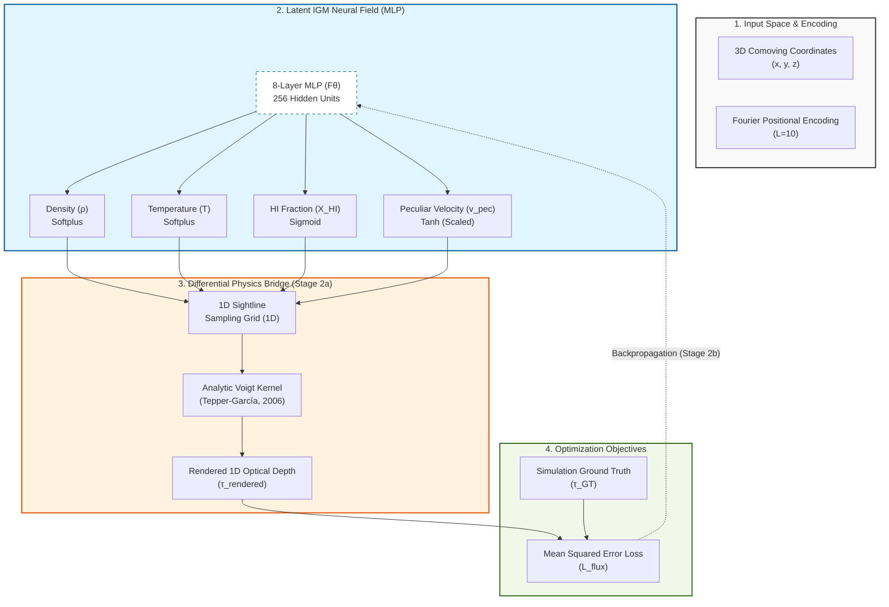

## **Architecture Diagram (Mermaid)**

---

## 1. The Pulse (Progress & Roadmap)

| Stage | Focus Area | Status | Target Metric | CVPR Section |
|:--- |:--- |:--- |:--- |:--- |
| **Stage 1** | Preprocessing & Data Pipeline | ✅ **DONE** | Data Integrity Pass | Sec 2.1 (Method) |
| **Stage 2a** | Differentiable Integrator (Voigt) | ✅ **DONE** | Grad. Flow (P3, z=0.3) | Sec 2.3 (Method) |
| **Stage 2b** | Full MLP Optimization | 🚀 **NEXT** | PSNR/SSIM Match | Sec 4.1 (Next) |
| **Stage 3** | Physics Model Classification | ⏳ **PENDING** | Acc > 85% | Sec 4.3 (Next) |

### ✅ Completed Milestones
- **2026-03-26**: Validated the analytic **Tepper-García (2006)** Voigt approximation.
- **2026-03-26**: Successfully implemented **Bounded Physics Layers** (Softplus/Sigmoid/Tanh).
- **2026-03-27**: Established consolidated **LEDGER** workflow on the host-mediated AI environment.
- **2026-03-27**: Verified gradient flow on the host Edge environment via cross-WSL sync.

---

## 2. Methodology & Architecture (Stage 1 & 2a)

### Neural Field Architecture
- **MLP**: 8 layers, 256 hidden units.
- **Input**: Comoving 3D coordinates normalized to unit cube `[0, 1]` from the 60 Mpc/h box.
- **Positional Encoding**: Fourier features with $L=10$ to resolve the high-frequency density spikes in filaments.
- **Outputs**: $\rho$ (Density), $T$ (Temperature), $X_{HI}$ (Neutral Hydrogen Fraction), $v_{\text{pec}}$ (Peculiar Velocity).

### Bounded Physics Implementation
1. **Density & Temperature**: Bounded via `Softplus` ($f(x) = \ln(1+e^x)$) to ensure absolute positivity.
2. **HI Fraction**: Bounded via `Sigmoid` ($f(x) = 1/(1+e^{-x})$) to constrain range between $[0, 1]$.
3. **Peculiar Velocity**: Mapped via `Tanh` scaled to physical range ($\pm 500$ km/s).

### Differentiable Integrator (Stage 2a)
- **Goal**: Propagate flux reconstruction loss back to the 3D neural field.
- **Physics**: Implements **Tepper-García (2006)** analytic Voigt kernel.
- **Equation**: $H(a, x) \approx e^{-x^2} - \frac{a}{\sqrt{\pi} x^2} [ e^{-2x^2} (4x^4 + 7x^2 + 4 + 1.5x^{-2}) - 1.5x^{-2} - 1 ]$.
- **Validation**: MSE loss convergence during pilot optimization over 10 sightlines (z=0.3).

---

## 3. The Logic (Decision Log)

- **[D-01] Analytic Voigt**: Used fourth-order polynomial approximation to maintain differentiability through thermal kernels.
- **[D-02] Bounded Activations**: Enforced `Softplus`, `Sigmoid`, and scaled `Tanh` to preventing unphysical field values.
- **[D-03] Hierarchical MLflow Governance**: Enforced `CosmoGasVision/<Project>` naming to prevent tracking clutter.
- **[D-04] Experiment Isolation**: Moved all experiment-specific files to `experiments/<name>/` to ensure branch cleanliness.
- **[D-05] LEDGER Consolidation**: Merged 5 disparate `.docs/` files (Plan, Data, Decision, History, Visualization) into this single source of truth.

---

## 4. The Data (Lineage & Governance)

**Box Size**: 60,000 kpc/h (60 Mpc/h) — *Optimal balance of pixel resolution (30kpc) vs representing filaments.*

| Implementation Area | Primary Data File | Tracking Metadata |
|:--- |:--- |:--- |
| **Sightlines (1D)** | `los2048_n16384_z0.300.dat` | `NSPEC=16384, Z=0.3` |
| **Optical Depth** | `tauH1_2048_n16384_z0.300.dat` | `MSE_Loss (Stage2a)` |
| **Ground Truth** | `SherwoodIGM_gal/` HDF5 Snapshots | `DVC/HDF5 Store` |

### Responsibility Matrix
- **Infrastructure Manager**: Lock binary volumes (`chmod a-w`), manage DVC remotes and MLflow registry.
- **Data Engineer**: Validate `loader.py` coordinate scaling and physical ranges.
- **PI Orchestrator**: Scientific sign-off on the snapshots and redshifts selected for optimization.

---

## 5. Evaluation Plan (Stage 2b)

- **Metric 1: PSNR/SSIM**: Compare the reconstructed neural field $\rho$ vs simulation ground-truth slices.
- **Metric 2: Flux Correlation**: Pearson correlation between rendered $\tau$ and ground-truth $\tau$ across 16,384 sightlines.
- **Validation Dataset**: Cross-model results on Physics 4 (Strong AGN) to test feedback discrimination.

---

## 6. Visualization & Artifacts

- **Run ID**: `11cdb52594fd49758f4ce3a1ac99ab16` (MLflow)
- **Primary Trace**: `experiments/nerf/artifacts/visualizations/ray_integration_fields.html`
- **Insights**: Lyman-alpha peak strength spikes nearly 100x mean in massive filaments. High-frequency bandwidth is mandatory in the Positional Embedding ($L=10$).

---

## 7. Session History & Next Handoff

### **Session Snapshot: March 27, 2026 (Refinement)**
- **Architecture Validation**: Confirmed Diagram 2 as the source of truth for the NeRF pipeline. Integrated 8-layer/256-unit MLP with bounded physics as the standard.
- **Paper Update**: Replaced Mermaid diagram placeholder in `2_method.tex` with professional TikZ code for CVPR publication.
- **Diagram Details**: Integrated Fourier Encoding ($L=10$) and Tepper-García (2006) integrator into the formalized schematic.
- **Handoff**: Infrastructure is ready for Stage 2b optimization on GPU.

### **Immediate Next Steps**
1. **Manual Sync**: Finalize Overleaf synchronization of the TikZ-based methodology section.
2. **Implementation (NeRF)**: Start full MLP optimization on AWS for Stage 2b.
3. **Visualization**: Generate 2D slices of reconstructed fields for comparison vs Ground Truth.
