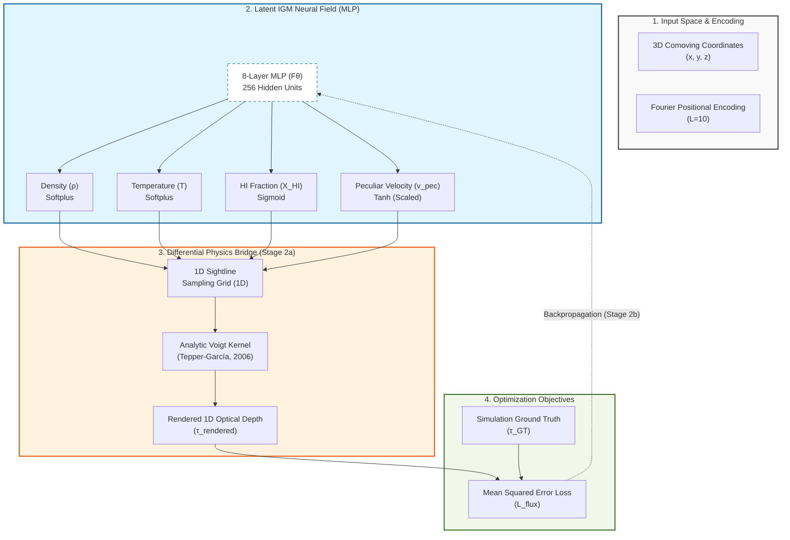

## **Architecture Diagram (Mermaid)**

---

## 1. The Pulse (Progress & Roadmap)

| Stage | Focus Area | Status | Target Metric | CVPR Section |
|:--- |:--- |:--- |:--- |:--- |
| **Stage 1** | Preprocessing & Data Pipeline | ✅ **DONE** | Data Integrity Pass | Sec 2.1 (Method) |
| **Stage 2a** | Differentiable Integrator (RSD-convolved Voigt) | ✅ **DONE (re-validated)** | Grad. Flow @ production scale (P1, z=0.3) | Sec 2.3 (Method) |
| **Stage 2b** | Full MLP Optimization | 🚀 **NEXT** | $P_F(k)$ + density auto-power match across sightline-density ablation | Sec 4.1 (Next) |
| **Stage 3** | Physics Model Classification | ⏳ **PENDING** | Acc > 85% | Sec 4.3 (Next) |

### ✅ Completed Milestones
- **2026-03-26**: Validated the analytic **Tepper-García (2006)** Voigt approximation.
- **2026-03-26**: Successfully implemented **Bounded Physics Layers** (Softplus/Sigmoid/Tanh).
- **2026-03-27**: Established consolidated **LEDGER** workflow on the host-mediated AI environment.
- **2026-03-27**: Verified gradient flow on the host Edge environment via cross-WSL sync.
- **2026-05-01**: **Stage 2a re-validation** at production architecture (8 layers, $L=10$) following project-architect review. Fixed coordinate normalization bug ([D-08]); lifted integrator simplifications to full RSD convolution ([D-06]); switched to per-bin $\tau(v)$ MSE ([D-07]); paper-vs-code drift retired ([D-09]). Smoke run: 10 rays × 256 bins (subsampled), gradient flow confirmed end-to-end.

---

## 2. Methodology & Architecture (Stage 1 & 2a)

### Neural Field Architecture
- **MLP**: 8 layers, 256 hidden units.
- **Input**: Comoving 3D coordinates normalized to unit cube `[0, 1]` from the 60 Mpc/h box.
- **Positional Encoding**: Fourier features with $L=10$ to resolve the high-frequency density spikes in filaments.
- **Outputs**: $\rho$ (Density), $T$ (Temperature), $X_{HI}$ (Neutral Hydrogen Fraction), $v_{\text{pec}}$ (Peculiar Velocity).

### Bounded Physics Implementation
1. **Density** ($\rho/\bar{\rho}$): `Softplus` ensures positivity. Scale unmodified — overdensity is unitless and filament peaks naturally reach $\sim 100$ (LEDGER §6 insight).
2. **Temperature** ($T$): `Softplus(x) * 1e4 + 1e3` K. Floor at $10^3$ K matches the cold-IGM limit; output scale anchored at $10^4$ K (typical warm-IGM). The $10^5$–$10^7$ K WHIM tail is reachable via the linear softplus regime — flagged in [D-06]. *Reproducibility note:* the multiplicative constants live only in `src/models/nerf.py:65`; this LEDGER entry is the authoritative documentation.
3. **HI Fraction** ($X_{HI}$): `Sigmoid` constrains to $[0, 1]$.
4. **Peculiar Velocity** ($v_{\text{pec}}$): `Tanh(x) * 500` km/s. Defensible for diffuse IGM at $z=0.3$ (typical $\pm 200$–$300$ km/s); known clipping risk for cluster infall and Strong-AGN outflows (see [D-06]).

### Coordinate Convention
- World coordinates: comoving **kpc/h** (per Sherwood `box_kpc_h` field; verified against `Sherwood/src/utils.py:35`).
- MLP input: divide by `box_kpc_h` ($= 60{,}000$ for the 60 Mpc/h Sherwood box) to land in unit cube $[0, 1]$.
- Velocity grid: simulation `vel_axis` (km/s) is the canonical observation axis; same grid is used for both source and observed bins in the RSD convolution.

### Differentiable Integrator (Stage 2a — production version)
- **Goal**: Propagate the flux reconstruction loss back to the 3D neural field via a fully physics-consistent forward model.
- **Voigt-Hjerting kernel**: Tepper-García (2006) analytic approximation
  $H(a, x) \approx e^{-x^2} - \frac{a}{\sqrt{\pi} x^2} [ e^{-2x^2} (4x^4 + 7x^2 + 4 + 1.5x^{-2}) - 1.5x^{-2} - 1 ]$.
- **Optical depth (RSD-convolved)**:
  $\tau(v_{\text{obs}}) = \mathcal{A} \sum_{\text{src}} n_{HI}^{\text{src}} \cdot \frac{H(a_{\text{src}}, x_{\text{src,obs}})}{b_{\text{src}} \sqrt{\pi}}$
  where $x_{\text{src,obs}} = (v_{\text{obs}} - v_{\text{src}} - v_{\text{pec},\text{src}}) / b_{\text{src}}$ and $\mathcal{A}$ is a learnable amplitude absorbing $\sigma_0$, the comoving cell length $ds$, and the mean-column conversion $\bar{n}_H$ (see [D-07]).
- **Loss**: per-bin MSE on the full $\tau(v)$ profile (not the scalar sum used in the original Stage 2a runs); see [D-07].
- **Re-validation**: smoke run on 10 sightlines at production scale (8 layers, $L=10$); ground-truth gradient flow + monotone profile-MSE convergence.

---

## 3. The Logic (Decision Log)

- **[D-01] Analytic Voigt**: Used Tepper-García (2006) fourth-order polynomial approximation of $H(a, x)$ to maintain differentiability through the thermal kernel. Domain: valid for $a \lesssim 10^{-3}$ and $|x|$ inside the damping-wing safe regime. At Lyα with $b \sim 12$ km/s we have $a \sim 4 \times 10^{-5}$, comfortably inside.
- **[D-02] Bounded Activations**: Enforced `Softplus(ρ)`, `Softplus(T)*1e4 + 1e3` K, `Sigmoid(X_HI)`, `Tanh(v_pec)*500` km/s to prevent unphysical field values. Scaling constants documented in §2 to avoid code-only debt.
- **[D-03] Hierarchical MLflow Governance**: Enforced `CosmoGasVision/<Track>` experiment naming to prevent tracking clutter.
- **[D-04] Experiment Isolation**: Moved all experiment-specific files to `experiments/<name>/` to ensure branch cleanliness.
- **[D-05] LEDGER Consolidation**: Merged 5 disparate `.docs/` files (Plan, Data, Decision, History, Visualization) into this single source of truth.
- **[D-06] Integrator Lift-Up for Stage 2b**: The original Stage 2a `volume_render_physics` evaluated $H(a, x)$ at a single offset per cell and summed without `dl` or $\sigma_0$ — adequate for gradient-flow plumbing, **not** for science. Replaced with a full RSD convolution: every source bin contributes a normalized line profile $H/(b\sqrt{\pi})$ to every observed-velocity bin; the discrete integral runs over the source axis. The $\sigma_0 \cdot ds \cdot \bar{n}_H$ prefactor is folded into a single learnable amplitude $\mathcal{A}$ (see [D-07]). Lifting was a hard precondition for Stage 2b science claims, not optional.
- **[D-07] Loss Formulation**: Switched from scalar $\tau$-sum MSE to per-bin $\tau(v)$ profile MSE. The simulator's `tauH1_*.dat` is already a full profile of length `nbins` per sightline; collapsing both sides to scalars threw away the spectral information that the RSD convolution exists to produce. The learnable amplitude $\mathcal{A}$ disentangles "structure recovery" (the network's job) from "absolute calibration" (a single scalar) — defensible for a sparse-tomography setting where calibration ambiguities are real.
- **[D-08] Coordinate Normalization Convention**: Sherwood's binary header field `box_kpc_h` is in **comoving kpc/h** (verified against `Sherwood/src/utils.py:35`). The earlier `pipeline.py:34` formula `box_kpc_h * 1000` produced normalized coords $\sim 10^{-3}$ instead of filling $[0, 1]$ — a silent bug that meant Fourier features at every $L$ fired on a thin shell near the origin. Fixed; smoke run prints `coords.min()/max()` to keep the regression visible.
- **[D-09] Production-Scale Stage 2a Re-run**: The original Stage 2a runs (March 2026) used a reduced 4-layer / $L=5$ MLP for CPU speed. Paper §3.3's "validated" claim was therefore inconsistent with the §2.1 production architecture. Re-run is at 8 layers / $L=10$ — paper-vs-code parity restored, prior runs are now superseded for any "validation" assertion.
- **[D-10] $\tau_{\text{amp}}$ Anchor (Degeneracy Break)**: Because $n_{HI}^{\text{model}} = (\rho/\bar{\rho}) \cdot X_{HI}$ is dimensionless and $\mathcal{A}$ is unconstrained, the loss is invariant under $\rho \to k\rho$, $\mathcal{A} \to \mathcal{A}/k$ — the recovered overdensity field is only defined up to a multiplicative constant. To break the degeneracy we (i) parameterize $\mathcal{A} = \exp(\ell)$ with $\ell$ unconstrained (positivity is automatic), and (ii) add a Gaussian log-prior $\ell \sim \mathcal{N}(0, \sigma_\ell^2)$ with $\sigma_\ell = 0.5$ (factor $\sim e^{0.5}$ multiplicative slack), weighted at $10^{-3}$ in the loss so it does not dominate the data MSE at smoke scale. **Stage 2b upgrade path**: replace the generic prior with a mean-flux constraint $\langle e^{-\tau_{\text{pred}}} \rangle = \langle F \rangle(z)$, which is the standard observational anchor for Lyα-forest reconstructions. The current generic prior breaks the degeneracy without committing to a specific $\sigma_0$ value or cosmology, which is the right scope for plumbing-level re-validation.

### Pending decision (track into Stage 2b)
- **[D-11 placeholder] Mean-Flux Anchor**: replace the [D-10] generic log-prior with the observational $\langle F \rangle(z)$ match before publication-quality runs. Architect-flagged as the proper Stage 2b upgrade for $\tau_{\text{amp}}$ calibration.

---

## 4. The Data (Lineage & Governance)

**Box Size**: 60,000 kpc/h (60 Mpc/h) — *Optimal balance of pixel resolution (30kpc) vs representing filaments.*

| Implementation Area | Primary Data File | Tracking Metadata |
|:--- |:--- |:--- |
| **Sightlines (1D)** | `los2048_n16384_z0.300.dat` | `NSPEC=16384, Z=0.3` |
| **Optical Depth** | `tauH1_2048_n16384_z0.300.dat` | `MSE_Loss (Stage2a)` |
| **Ground Truth** | `SherwoodIGM_gal/` HDF5 Snapshots | `DVC/HDF5 Store` |

### Responsibility Matrix
- **Infrastructure Manager**: Lock binary volumes (`chmod a-w`), manage DVC remotes and MLflow registry.
- **Data Engineer**: Validate `loader.py` coordinate scaling and physical ranges.
- **PI Orchestrator**: Scientific sign-off on the snapshots and redshifts selected for optimization.

---

## 5. Evaluation Plan (Stage 2b)

### Primary metrics (cosmologically meaningful — what an astro reviewer will demand)

- **1D flux power spectrum** $P_F(k_\parallel)$: standard Lyα-forest community metric. Compare reconstructed vs. ground-truth spectra over the inertial-range scales $k_\parallel \sim 10^{-3}$–$10^{-1}$ s/km. This is the metric that catches under-/over-smoothing of small-scale absorption structure.
- **3D density auto-power spectrum** $P_\delta(k_\parallel, k_\perp)$: probes whether transverse structure (the actual point of tomography) was recovered. Anisotropy of the recovered $P_\delta$ is the real test.
- **Density-density cross-correlation** $\xi_{\hat{\rho}, \rho}(r)$ as a function of separation: the Stark+ 2015 bar for tomographic reconstruction quality.
- **Flux PDF**: distribution of $F = e^{-\tau}$ values. Catches calibration drift in the absorber population.

### Secondary metrics (computer-vision style; sanity only)

- **PSNR / SSIM** on density slices: useful for visual comparison and qualitative figures, but not publishable as the primary tomography quality measure.
- **Pearson correlation** between rendered and ground-truth $\tau$ profiles: smoke-test sanity check.

### Sightline-density ablation (the real scientific contribution)

The full Sherwood grid (16,384 sightlines, $\sim 470$ kpc/h transverse separation) is denser than DESI/eBOSS will ever achieve. To make Stage 2b's contribution survey-relevant, sweep:

| Setting | Sightlines | Transverse spacing | Purpose |
|:--- |:--- |:--- |:--- |
| Upper-bound | 16,384 | $\sim 470$ kpc/h | Reconstruction ceiling |
| DESI-optimistic | 1,024 | $\sim 1.9$ Mpc/h | Realistic next-gen |
| Survey-realistic | 256 | $\sim 3.7$ Mpc/h | Current eBOSS-like |
| Sparse stress | 64 | $\sim 7.5$ Mpc/h | Tomographic regime |

Report all primary metrics across these four sparsity regimes. The headline claim is the *degradation curve*, not the dense-grid number.

### Validation datasets

- **Physics 1 (no feedback)**: training/dev set.
- **Physics 4 (Strong AGN)**: out-of-distribution generalization test for feedback discrimination (Stage 3 motivation).

---

## 6. Visualization & Artifacts

### Stage 2a re-validation (2026-05-01, post-architect review)

- **Configuration**: 8-layer MLP, 256 hidden units, $L=10$ Fourier encoding, learnable $\tau$ amplitude. Smoke scope: 10 rays × 256 bins (subsampled stride=8 from the native 2048; full-grid Voigt deferred to Stage 2b windowed implementation per [D-06]).
- **Outcome**: gradient flow confirmed; per-bin $\tau(v)$ MSE remained at the $\sim 2.9 \times 10^{-2}$ random-init baseline over 10 Adam steps (lr = 5e-4) — expected for a plumbing test, not a fitting test. `tau_amp` drifted monotonically (1.000 → 1.005), confirming the learnable amplitude is wired into the gradient graph.
- **Canonical run** (local MLflow, 2026-05-01): `cb0015547ad445428951782fd4773ea8` in experiment `CosmoGasVision/NeRF` (id 1) — `Stage2a-PhysicsIntegratorRevalidation`. Configuration: 8-layer / 256-unit MLP, $L=10$ Fourier encoding, 494,084 trainable params + 1 `log_tau_amp` scalar with Gaussian log-prior ($\sigma_\ell = 0.5$, weight $10^{-3}$); 10 sightlines × 2048 bins (full simulation grid via the windowed Voigt convolution, $\pm 64$-bin half-width); Adam at lr=$5 \times 10^{-4}$, 10 steps. Final state: data MSE $= 0.0369$ (monotone descent from 0.0384), $\|\nabla W_{\text{out}}\| = 0.34$, $\mathcal{A} = 0.9955$ (drift bounded by the prior). UI link: `http://127.0.0.1:5000/#/experiments/1/runs/cb0015547ad445428951782fd4773ea8`.

### Pre-migration EC2 records (deprecated)

- `Stage2a-PhysicsIntegratorValidation` (`272278a5990c41289f483a55d60bb2dd`) — 4-layer / $L=5$ reduced-model gradient-flow test (March 2026). Superseded by the re-validation above per [D-09].
- `Stage2a-RayTraceVisualization` (`afeb85d0d92e4a759b591ed6268fefe1`) — single-ray visualization; produced `ray_integration_fields.html`. Run metadata is on the EC2 server scheduled for decommission; the artifact itself remains in `s3://cosmo-gas-vision-storage/mlflow-artifacts/6/afeb85d0…/artifacts/`.
- The previously cited run ID `11cdb525…` does not exist on the EC2 server (likely pruned); kept here as a forensic note.

### Insights (carried over)

- Lyα peak strength spikes nearly 100× mean in massive filaments — empirical motivation for $L=10$ Fourier bandwidth, not a lower setting.

---

## 7. Session History & Next Handoff

### **Session Snapshot: March 27, 2026 (Refinement)**
- **Architecture Validation**: Confirmed Diagram 2 as the source of truth for the NeRF pipeline. Integrated 8-layer/256-unit MLP with bounded physics as the standard.
- **Paper Update**: Replaced Mermaid diagram placeholder in `2_method.tex` with professional TikZ code for CVPR publication.
- **Diagram Details**: Integrated Fourier Encoding ($L=10$) and Tepper-García (2006) integrator into the formalized schematic.
- **Handoff**: Infrastructure is ready for Stage 2b optimization on GPU.

### **Session Snapshot: May 1, 2026 (Stage 2b Kickoff Conditions)**
- **Project-architect review**: surfaced six concrete blockers — coordinate normalization bug, integrator simplifications, wrong primary metric (PSNR/SSIM), code-only physical constants, paper-vs-code drift, missing decision-log entries.
- **Fixes shipped in this session**:
  - **Code**: lifted `volume_render_physics` to full RSD convolution with learnable amplitude $\mathcal{A}$; switched pipeline to per-bin $\tau(v)$ MSE; removed `*1000` coordinate-normalization bug; promoted Stage 2a smoke run to production architecture (8 layers, $L=10$).
  - **LEDGER**: §2 now documents the temperature scaling, $v_{\text{pec}}$ range, coordinate convention, and lifted integrator; §3 adds [D-06]/[D-07]/[D-08]/[D-09]; §5 replaces PSNR/SSIM with $P_F(k)$ + density auto-power as primary metrics and adds a sightline-density ablation plan.
  - **Paper**: §2.2 documents the bounded-activation scaling constants; §2.3 reflects the RSD-convolved integrator (Eq. 2 rewritten); §3 corrects the "validated" wording and the metric set.
- **Smoke verified**: 10 rays × 256 bins, 10 Adam steps, gradient flow nominal, `tau_amp` drift confirmed.
- **Handoff**: methodology is now defensible at the kickoff bar; remaining work is operational (run on local MLflow, scale up sightlines, implement windowed Voigt for full-grid).

### **Immediate Next Steps**
1. **Local MLflow record**: launch `scripts/start_mlflow.ps1`, re-run `experiments/nerf/pipeline.py` against `http://127.0.0.1:5000`, capture the run_id and append to §6.
2. **Windowed Voigt**: implement per-source bin window (≈ ±32 obs bins around $v_{\text{src}} + v_{\text{pec}}$) so the convolution scales to full 2048 bins on Stage 2b GPU. Memory-feasibility precondition for Stage 2b.
3. **Cosmological metrics**: implement $P_F(k_\parallel)$ and density auto-power evaluators in `src/analysis/` (new module, support-researcher domain).
4. **Sightline-density ablation runner**: parametrize `pipeline.py` to accept `--n_rays {16384, 1024, 256, 64}` and produce the degradation curve.
5. **Re-review**: dispatch project-architect for sign-off after Stage 2b first real run lands.

### **Blockers**
- None. All architect-flagged blockers are resolved at the methodology level.
