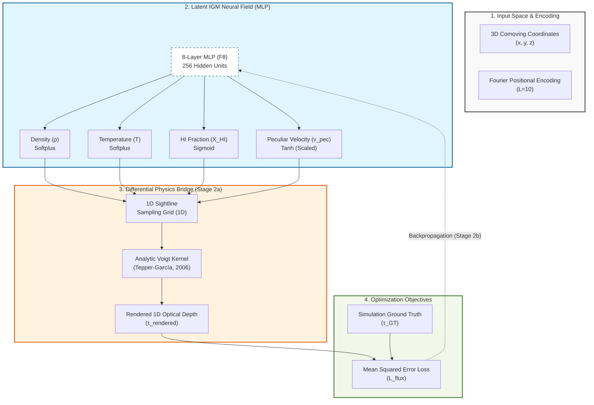

## **Architecture Diagram (Mermaid)**

---

## 1. The Pulse (Progress & Roadmap)

| Stage | Focus Area | Status | Target Metric | CVPR Section |
|:--- |:--- |:--- |:--- |:--- |
| **Stage 1** | Preprocessing & Data Pipeline | ✅ **DONE** | Data Integrity Pass | Sec 2.1 (Method) |
| **Stage 2a** | Differentiable Integrator (RSD-convolved Voigt) | ✅ **DONE (re-validated)** | Grad. Flow @ production scale (P1, z=0.3) | Sec 2.3 (Method) |
| **Stage 2b** | Full MLP Optimization | 🚀 **IN PROGRESS** (P1 tier 1 ✅; cost-survey across P2/P3/P4 dispatched per [D-23]; tier 4 deferred to post-quota) | $\|\Delta P_F/P_F\| < 10\%$ over $k_\parallel \in [10^{-2.5}, 10^{-1.5}]$ s/km AND $\xi_{\hat\rho,\rho}(r=2\,h^{-1}\,\text{Mpc}) > 0.6$ AND KS$(F\text{-PDF}) < 0.05$ at fiducial P1, $z=0.3$, $n_{\text{rays}}=1024$; degradation curve monotone over the $4 \times 4$ matrix. See [D-13]. | Sec 4.1 (Next) |
| **Stage 3** | Physics Model Classification | ⏳ **PENDING** | Acc > 85% | Sec 4.3 (Next) |

### ✅ Completed Milestones
- **2026-03-26**: Validated the analytic **Tepper-García (2006)** Voigt approximation.
- **2026-03-26**: Successfully implemented **Bounded Physics Layers** (Softplus/Sigmoid/Tanh).
- **2026-03-27**: Established consolidated **LEDGER** workflow on the host-mediated AI environment.
- **2026-03-27**: Verified gradient flow on the host Edge environment via cross-WSL sync.
- **2026-05-01**: **Stage 2a re-validation** at production architecture (8 layers, $L=10$) following project-architect review. Fixed coordinate normalization bug ([D-08]); lifted integrator simplifications to full RSD convolution ([D-06]); switched to per-bin $\tau(v)$ MSE ([D-07]); paper-vs-code drift retired ([D-09]). Smoke run: 10 rays × 256 bins (subsampled), gradient flow confirmed end-to-end.

---

## 2. Methodology & Architecture (Stage 1 & 2a)

### Neural Field Architecture
- **MLP**: 8 layers, 256 hidden units.
- **Input**: Comoving 3D coordinates normalized to unit cube `[0, 1]` from the 60 Mpc/h box.
- **Positional Encoding**: Fourier features with $L=10$ to resolve the high-frequency density spikes in filaments.
- **Outputs**: $\rho$ (Density), $T$ (Temperature), $X_{HI}$ (Neutral Hydrogen Fraction), $v_{\text{pec}}$ (Peculiar Velocity).

### Bounded Physics Implementation
1. **Density** ($\rho/\bar{\rho}$): `Softplus` ensures positivity. Scale unmodified — overdensity is unitless and filament peaks naturally reach $\sim 100$ (LEDGER §6 insight).
2. **Temperature** ($T$): `Softplus(x) * 1e4 + 1e3` K. Floor at $10^3$ K matches the cold-IGM limit; output scale anchored at $10^4$ K (typical warm-IGM). The $10^5$–$10^7$ K WHIM tail is reachable via the linear softplus regime — flagged in [D-06]. *Reproducibility note:* the multiplicative constants live only in `src/models/nerf.py:65`; this LEDGER entry is the authoritative documentation.
3. **HI Fraction** ($X_{HI}$): `Sigmoid` constrains to $[0, 1]$.
4. **Peculiar Velocity** ($v_{\text{pec}}$): `Tanh(x) * 500` km/s. Defensible for diffuse IGM at $z=0.3$ (typical $\pm 200$–$300$ km/s); known clipping risk for cluster infall and Strong-AGN outflows (see [D-06]).

### Coordinate Convention
- World coordinates: comoving **kpc/h** (per Sherwood `box_kpc_h` field; verified against `Sherwood/src/utils.py:35`).
- MLP input: divide by `box_kpc_h` ($= 60{,}000$ for the 60 Mpc/h Sherwood box) to land in unit cube $[0, 1]$.
- Velocity grid: simulation `vel_axis` (km/s) is the canonical observation axis; same grid is used for both source and observed bins in the RSD convolution.

### Differentiable Integrator (Stage 2a — production version)
- **Goal**: Propagate the flux reconstruction loss back to the 3D neural field via a fully physics-consistent forward model.
- **Voigt-Hjerting kernel**: Tepper-García (2006) analytic approximation
  $H(a, x) \approx e^{-x^2} - \frac{a}{\sqrt{\pi} x^2} [ e^{-2x^2} (4x^4 + 7x^2 + 4 + 1.5x^{-2}) - 1.5x^{-2} - 1 ]$.
- **Optical depth (RSD-convolved)**:
  $\tau(v_{\text{obs}}) = \mathcal{A} \sum_{\text{src}} n_{HI}^{\text{src}} \cdot \frac{H(a_{\text{src}}, x_{\text{src,obs}})}{b_{\text{src}} \sqrt{\pi}}$
  where $x_{\text{src,obs}} = (v_{\text{obs}} - v_{\text{src}} - v_{\text{pec},\text{src}}) / b_{\text{src}}$ and $\mathcal{A}$ is a learnable amplitude absorbing $\sigma_0$, the comoving cell length $ds$, and the mean-column conversion $\bar{n}_H$ (see [D-07]).
- **Loss**: per-bin MSE on the full $\tau(v)$ profile (not the scalar sum used in the original Stage 2a runs); see [D-07].
- **Re-validation**: smoke run on 10 sightlines at production scale (8 layers, $L=10$); ground-truth gradient flow + monotone profile-MSE convergence.

---

## 3. The Logic (Decision Log)

- **[D-01] Analytic Voigt**: Used Tepper-García (2006) fourth-order polynomial approximation of $H(a, x)$ to maintain differentiability through the thermal kernel. Domain: valid for $a \lesssim 10^{-3}$ and $|x|$ inside the damping-wing safe regime. At Lyα with $b \sim 12$ km/s we have $a \sim 4 \times 10^{-5}$, comfortably inside.
- **[D-02] Bounded Activations**: Enforced `Softplus(ρ)`, `Softplus(T)*1e4 + 1e3` K, `Sigmoid(X_HI)`, `Tanh(v_pec)*500` km/s to prevent unphysical field values. Scaling constants documented in §2 to avoid code-only debt.
- **[D-03] Hierarchical MLflow Governance**: Enforced `CosmoGasVision/<Track>` experiment naming to prevent tracking clutter.
- **[D-04] Experiment Isolation**: Moved all experiment-specific files to `experiments/<name>/` to ensure branch cleanliness.
- **[D-05] LEDGER Consolidation**: Merged 5 disparate `.docs/` files (Plan, Data, Decision, History, Visualization) into this single source of truth.
- **[D-06] Integrator Lift-Up for Stage 2b**: The original Stage 2a `volume_render_physics` evaluated $H(a, x)$ at a single offset per cell and summed without `dl` or $\sigma_0$ — adequate for gradient-flow plumbing, **not** for science. Replaced with a full RSD convolution: every source bin contributes a normalized line profile $H/(b\sqrt{\pi})$ to every observed-velocity bin; the discrete integral runs over the source axis. The $\sigma_0 \cdot ds \cdot \bar{n}_H$ prefactor is folded into a single learnable amplitude $\mathcal{A}$ (see [D-07]). Lifting was a hard precondition for Stage 2b science claims, not optional.
- **[D-07] Loss Formulation**: Switched from scalar $\tau$-sum MSE to per-bin $\tau(v)$ profile MSE. The simulator's `tauH1_*.dat` is already a full profile of length `nbins` per sightline; collapsing both sides to scalars threw away the spectral information that the RSD convolution exists to produce. The learnable amplitude $\mathcal{A}$ disentangles "structure recovery" (the network's job) from "absolute calibration" (a single scalar) — defensible for a sparse-tomography setting where calibration ambiguities are real.
- **[D-08] Coordinate Normalization Convention**: Sherwood's binary header field `box_kpc_h` is in **comoving kpc/h** (verified against `Sherwood/src/utils.py:35`). The earlier `pipeline.py:34` formula `box_kpc_h * 1000` produced normalized coords $\sim 10^{-3}$ instead of filling $[0, 1]$ — a silent bug that meant Fourier features at every $L$ fired on a thin shell near the origin. Fixed; smoke run prints `coords.min()/max()` to keep the regression visible.
- **[D-09] Production-Scale Stage 2a Re-run**: The original Stage 2a runs (March 2026) used a reduced 4-layer / $L=5$ MLP for CPU speed. Paper §3.3's "validated" claim was therefore inconsistent with the §2.1 production architecture. Re-run is at 8 layers / $L=10$ — paper-vs-code parity restored, prior runs are now superseded for any "validation" assertion.
- **[D-10] $\tau_{\text{amp}}$ Anchor (Degeneracy Break)**: Because $n_{HI}^{\text{model}} = (\rho/\bar{\rho}) \cdot X_{HI}$ is dimensionless and $\mathcal{A}$ is unconstrained, the loss is invariant under $\rho \to k\rho$, $\mathcal{A} \to \mathcal{A}/k$ — the recovered overdensity field is only defined up to a multiplicative constant. To break the degeneracy we (i) parameterize $\mathcal{A} = \exp(\ell)$ with $\ell$ unconstrained (positivity is automatic), and (ii) add a Gaussian log-prior $\ell \sim \mathcal{N}(0, \sigma_\ell^2)$ with $\sigma_\ell = 0.5$ (factor $\sim e^{0.5}$ multiplicative slack), weighted at $10^{-3}$ in the loss so it does not dominate the data MSE at smoke scale. The current generic prior breaks the degeneracy without committing to a specific $\sigma_0$ value or cosmology, which is the right scope for plumbing-level re-validation. Superseded for Stage 2b production runs by [D-11].
- **[D-11] Mean-Flux Anchor (commits)**: Replace the [D-10] generic Gaussian log-prior on $\log \tau_{\text{amp}}$ with the observational mean-flux constraint $\mathcal{L}_{\text{meanF}} = \lambda_F (\langle e^{-\tau_{\text{pred}}}\rangle - \langle F\rangle_{\text{obs}})^2$ at $z=0.3$, with $\langle F\rangle_{\text{obs}} = 0.877$ ($\tau_{\text{eff}} = 0.131$) from Faucher-Giguère et al. (2008) [bib needed]; weight $\lambda_F = 1.0$. The [D-10] log-prior is retained behind `--use_log_prior` for fiducial comparison only. Sensitivity: a $\pm 10\%$ uncertainty on $\langle F\rangle_{\text{obs}}$ moves the absolute $\rho$ amplitude by $\pm 10\%$ and is reported as a systematic on $\rho$-recovery; structure metrics ($P_F$, $\xi_{\hat\rho,\rho}$) are insensitive to this anchor by construction.
- **[D-12] Cross-Physics Protocol — Independent Models**: Train one IGMNeRF per physics variant (4 total: Physics 1 no-feedback / Physics 2 stellar wind / Physics 3 wind+AGN / Physics 4 wind+strong-AGN). Rejected the conditional-`physics_id`-embedding alternative because Stage 3's feedback-classification question requires that the *reconstruction* network is unaware of the physics label — otherwise the discriminator's signal is leaked through the generator. Cost is $4\times$ training; mitigated by spot pricing in [D-14]. Conditional sharing remains a Stage 4+ option once per-physics baselines are published.
- **[D-13] Stage 2b Success Criterion + Ablation Matrix**: Pass condition is conjunction of (a) $|\Delta P_F(k_\parallel)/P_F(k_\parallel)| < 10\%$ averaged over $k_\parallel \in [10^{-2.5}, 10^{-1.5}]$ s/km (Walther+ 2018 / Boera+ 2019 inertial range [bib needed]), (b) $\xi_{\hat\rho,\rho}(r=2\,h^{-1}\,\text{Mpc}) > 0.6$ (Stark+ 2015 sparse-tomography bar), (c) KS-distance on flux PDF $< 0.05$ over $F\in[0.05, 0.99]$. Evaluated at the fiducial point: Physics 1, $z=0.3$, $n_{\text{rays}}=1024$. Headline contribution is the degradation curve over $n_{\text{rays}}\in\{16384, 1024, 256, 64\}$ per physics, repeated for physics $\in\{1, 2, 3, 4\}$ (16 runs total, dispatched sequentially per [D-18]); secondary requirement is monotonic degradation within each physics. PSNR/SSIM remain reportable but non-gating. Execution ordering and pre-flight gating are pinned in [D-18] and [D-19]; this entry documents the *scientific* matrix only.
- **[D-14] Compute Spec — Local-First, SageMaker Spot for Ablation**: Fiducial single-physics dev run on local GPU when VRAM $\geq 16$ GB; per-physics 4-tier ablation submitted sequentially per [D-18], each tier as a separate SageMaker Training Job on `ml.g5.xlarge` (A10G 24 GB) with managed-spot pricing, `MaxRuntime=18000s`, `MaxWait=36000s`, checkpoint S3 sync every 10k steps, gated by the [D-19] small-tests and the [D-20] cloud-config callout. Memory plan: microbatch 1024 rays, gradient accumulation factor $\lceil n_{\text{rays}}/1024\rceil$. Optimizer: AdamW with $\beta=(0.9, 0.999)$, weight_decay $10^{-6}$, linear warmup $0 \to 5\times 10^{-4}$ over 1000 steps, cosine decay $5\times 10^{-4} \to 5\times 10^{-6}$ over 49000 steps; total 50,000 steps; gradient L2 clip at 1.0; checkpoints every 5000 steps. Cost ceiling: \$30 spot / \$90 on-demand worst case for the 16-run matrix (total spend unchanged from parallel framing; only dispatch ordering changes); storage $<\$1$/mo with IA@30d / Glacier Deep Archive@180d S3 lifecycle. AWS EMR explicitly rejected: it is a Spark/Hadoop service for distributed-data ETL and adds zero value for single-node PyTorch GPU training. Cloud submission is never auto-initiated by the agent loop; see [D-20] for the user-confirmation protocol.
- **[D-15] Stage 3 Framing — 4-Class Classifier on Reconstructed $\rho$**: Stage 3 is a four-way classification over $\{$P1, P2, P3, P4$\}$ on 3D crops of the reconstructed $\rho/\bar\rho$ field, target accuracy $> 85\%$. Pairwise discrimination rejected (inflates the headline; the AGN-vs-rest readout is more honestly stated as a one-vs-rest projection of the 4-way confusion matrix). Architectural choice (3D CNN vs 3D ViT, crop dimensions, augmentation) deferred to a Stage 3 design doc; data-pipeline contract pinned now: input shape `(C=1, D, H, W)` cubes of reconstructed $\rho/\bar\rho$ at native simulation resolution, label = `physics_id`.
- **[D-16] Physics 2/3/4 Extraction Deferral**: Only Physics 1 (`planck1_60_768_z0.300`, 40 GB / 1044 files) is extracted from the Sherwood IGM_gal tarballs as of the C4 dispatch. Physics 2 (ps13 stellar wind), Physics 3 (ps13+AGN), and Physics 4 (ps13+strong-AGN) remain tarballed in `SherwoodIGM_gal/` and are deferred to Stage 2b matrix kickoff. Acceptable per [D-12] (independent per-physics models): the fiducial dev run that gates the matrix uses Physics 1 only. Trigger for the deferred extraction is the first `sweep.py` invocation with `--physics ∈ {2,3,4}`; `scripts/extract_sherwood_igm_gal.{ps1,sh}` is idempotent so the re-run is safe.
- **[D-17] SPH-Kernel-Weighted Field Loaders Pending**: `SherwoodIGMGalLoader.load_3d_field` currently raises `NotImplementedError` for `'T'`, `'xHI'`, `'vlos'`. These quantities are intensive and require SPH-kernel weighting against `PartType0/Density` and `PartType0/SmoothingLength` — a mass-weighted CIC of the cell-centered values would systematically misweight by gas density. In scope per the original C4 brief. Stage 2b's mean-flux anchor [D-11] uses precomputed `tauH1_*.dat` (full sightline τ) to side-step this gap; the report orchestrator [C5] uses `'rho'` only. Trigger for filling the stub is either (a) a Stage 2b+ science question that requires per-voxel temperature or HI-fraction comparison (e.g. WHIM-vs-cool-IGM separation), or (b) any move from the precomputed τ to a re-derived τ from the full 3D state. Owner: data-engineer.
- **[D-18] Sequential-Per-Physics Stage 2b Execution**: Supersedes the parallel-matrix framing in [D-13]. Stage 2b runs as an outer loop over physics $[P1 \to P2 \to P3 \to P4]$, with each physics fully validated (smoke + 4-tier inner dispatch + metrics sign-off) before the next fires. Justification is economic — data volume and per-run wallclock make simultaneous 16-run dispatch wasteful when a single configuration error would burn all four physics in parallel. Tied to [D-12]'s independent-models contract: because each physics is its own model, sequential ordering changes nothing scientifically; it only enforces that the pipeline contract is locked on P1 and reused mechanically on P2/P3/P4. Inner-tier decision: the four sightline tiers $\{16384, 1024, 256, 64\}$ are dispatched as a single batch per physics after that physics's small-test passes (the only tier-specific surface is `--n_rays` plus auto-derived `accum_steps`, validated by `sweep.py`'s dry-run). The 16,384 tier is additionally guarded by a memory-only smoke (see [D-19]). *Inner-tier sequencing amendment (2026-05-02)*: With on-demand `ml.g5.xlarge` quota $= 4$ and spot quota $= 0$, P1 inner tiers dispatch **sequentially in ascending `n_rays` order** $[64 \to 256 \to 1024 \to 16384]$. Smallest-first = fail-fast on cheapest tier ($\sim\$0.20$ / 10 min) before committing to the largest ($\sim\$2$ / 4 hr). Concurrent inner-tier batching (original framing above) reactivates for P2+ once spot quota is approved.
- **[D-19] Plan-Test-Full Discipline (Per Physics)**: *Smoke-schedule decoupling amendment (2026-05-02)*: The science smoke runs with `--warmup_steps 50` (CLI override of [D-14]'s 1000-step production warmup). Rationale: at `--max_steps 200` under [D-14]'s schedule, LR reaches only 20% of peak and the loss-descent criterion measures the warmup transient rather than the asymptotic fit rate. The 50-step warmup lets the smoke observe the optimizer's actual fitting behavior in its remaining 150 steps. Production tiers ($n_{\text{rays}} \in \{64, 256, 1024, 16384\}$ full-data runs) use [D-14]'s schedule unchanged — the decoupling applies to the smoke gate only. The pass criterion `loss_data(200) <= 0.85 * loss_data(10)` is unchanged. **One-time waiver (2026-05-02)**: P1 science smoke `Stage2b-Ablation-P1-N64-S0-1777765548-671084` (descent ratio 0.880, missed by 3.6 pp under [D-14]'s warmup) is APPROVED on the strength of monotone-accelerating Δloss (0.0001 → 0.0034 over five 50-step windows), mean-flux tracking truth (0.8692 → 0.8997 vs. obs 0.877), and clean `tau_amp` drift (1.000 → 0.9919). Re-run under the amended schedule was deemed wasteful given the converging secondary evidence. Future P2/P3/P4 smokes are bound by the amended schedule with no waiver path. Original spec: every physics iteration must clear a small-test gate before its full-data ablation tiers launch. The bundle is two smokes — a *science smoke* (`--n_rays 64 --max_steps 200`, wallclock cap 10 min) checking loss descent, mean-flux range, `tau_amp` boundedness, and NaN-cleanliness; and a *memory smoke* (`--n_rays 16384 --max_steps 5`) checking that the largest tier fits in VRAM. Both run under MLflow tag `stage=2b-smoketest` (same `CosmoGasVision/NeRF` experiment, segregated by tag) with run-name pattern `Stage2b-Smoke-P{P}-{kind}-S{seed}`. Pass criteria: `loss_data(step=200) ≤ 0.85 × loss_data(step=10)`, `mean_flux_pred ∈ [0.5, 0.99]`, `tau_amp ∈ [0.1, 10]`, peak VRAM $< 90\%$ of device cap, no NaN/Inf. On failure the agent emits a triage summary (criterion + observed vs threshold) and hands back to the PI; full-data dispatch is blocked until both smokes pass. The memory-smoke pass condition is implicitly a local-VRAM-feasibility check; on a host without sufficient VRAM (or no GPU), the failure mode is "infeasible to run locally" rather than a science-block, and the agent emits the [D-20] cloud-config callout instead of a verdict-BLOCK. Wallclock alone (CPU-bound `n_rays=16384` runs) is not a memory-feasibility signal.
- **[D-20] Cloud-Config Callout Protocol**: When local compute is insufficient (GPU $< 16$ GB, OR estimated wallclock $> 4$ hr from the science smoke's `seconds_per_step`, OR the `n_rays=16384` tier on a $< 24$ GB device), the agent loop pauses and emits a single explicit callout listing (a) the IAM role ARN expectation with required managed + inline policies, (b) the ECR image URI, (c) the S3 prefix layout under `cosmo-gas-vision-storage`, (d) the `.env` block to append, (e) the exact `scripts/submit_sagemaker.py` invocation. The agent will not call any AWS API until the user replies `cloud-ready`. Resume protocol: agent re-reads `.env`, validates `SAGEMAKER_ROLE_ARN`, `ECR_IMAGE_URI`, `S3_INPUT_PREFIX`, `S3_CHECKPOINT_PREFIX`, then submits per-tier jobs via `scripts/submit_sagemaker.py`. Spot interruption triggers an automatic resume from the latest `step_*.pt` under `S3_CHECKPOINT_PREFIX/<run_name>/` via the existing `--resume_from` path; no second callout required unless the IAM/ECR contract changes. This pattern is the binding contract for any compute that costs money.
- **[D-21] Mean-Flux Gradient Linearization (Two-Pass Implementation)**: The mean-flux soft constraint $\mathcal{L}_{\text{meanF}} = \lambda_F (\langle F \rangle - \langle F \rangle_{\text{obs}})^2$ from [D-11] is implemented as a two-pass surrogate to avoid `retain_graph` in the microbatch accumulation loop. Pass 1 (no-grad) computes the cycle-mean predicted flux $F_{\text{cycle}}$ over all microbatches; Pass 2 backwards a per-microbatch surrogate `loss_data_mb + c · mean_F_mb` per chunk where $c = 2 \lambda_F (F_{\text{cycle}} - \langle F\rangle_{\text{obs}})$ is constant across the cycle. By the chain rule $\partial \mathcal{L}_{\text{meanF}}/\partial \theta = 2 \lambda_F (F_{\text{cycle}} - \langle F\rangle_{\text{obs}}) \cdot \partial F_{\text{cycle}}/\partial \theta$ and $\partial F_{\text{cycle}}/\partial \theta = (1/N_{\text{chunks}}) \sum_i \partial F_{\text{mb},i}/\partial \theta$, so the surrogate's gradient is mathematically identical to the squared-loss gradient at the current parameter point. Re-linearization happens every optimizer step; no Adam-step-internal drift. Memory peak is one chunk, vs. `accum_steps` chunks under the literal implementation. Source: `experiments/nerf/pipeline.py:349-395`.
- **[D-23] Cost-Survey Schedule (Pre-Quota Tier-Aware Amendment to [D-14])**: [D-14]'s uniform 50,000-step / 1024-microbatch schedule was set under naive linear-cost assumptions; the P1 tier-1 production run (`Stage2b-Ablation-P1-N64-S0-1777779057-b20df1`, 99 min, $1.66) and tier-2 in-flight run (projected 6.3 hr, $6.50) showed that step rate scales linearly with $n_{\text{rays}} \times \text{accum\_steps}$ and that the [D-14] schedule extrapolated naively gives $\sim 17$ days / $\sim\$420$ for tier 4 alone. To complete a survey-quality $4\times 4$ matrix within the pre-quota budget envelope (target $\leq \$80$), supersede [D-14]'s schedule per tier as follows: tier 1 ($n_{\text{rays}}=64$): microbatch=1024, max_steps=50000, warmup=1000 (unchanged; locked by the existing P1 run); tier 2 ($n_{\text{rays}}=256$): microbatch=1024, max_steps=25000, warmup=1000; tier 3 ($n_{\text{rays}}=1024$): microbatch=4096, max_steps=12500, warmup=500; tier 4 ($n_{\text{rays}}=16384$): microbatch=8192, max_steps=12500 floor, warmup=500 — DEFERRED to post-quota except for a single optional reduced-step anchor. Justifications: (a) `max_steps` floor of 12500 keeps $\geq 11500$ fitting steps after warmup, sufficient to clear the [D-19] descent criterion based on the P1 tier-1 knee evidence; (b) microbatch increases stay under 90% VRAM cap by $\geq 3\times$ headroom (P1 tier 1 measured 2.82 GB at microbatch=1024, the Voigt intermediate scales linearly in microbatch); (c) warmup fraction of total schedule held roughly constant (2-4% range); (d) tier 4 deferred because $\sim\$50$ / 4 cells dominates the survey budget and tiers 1-3 already span the survey-realistic sightline-density regime. **Two-tier publication framework**: cost-survey runs under [D-23] are recorded but are NOT evidence for [D-13]'s Stage 2b scientific gates; their pass criteria are [D-19]'s safety rails plus a tier-3-specific Pearson$(\tau_{\text{pred}}, \tau_{\text{GT}}) \geq 0.85$. Publication runs (post-quota) either re-run under [D-14]'s 50k schedule or, if cost-survey shows the [D-23] schedule converges to comparable loss-floor as tier-1's 50k baseline, lock in [D-23]'s schedule with the loss-floor evidence cited. **Micro-grid pre-flight**: a 16-cell micro-grid (4 physics × 4 tiers, each at max_steps=200, warmup=50, with tier-matched microbatch) under MLflow tag `stage=2b-microsweep` runs before the cost-survey to fail-fast on per-physics data-path or per-tier memory issues. Owner: infrastructure-manager (dispatch); core-implementer (no changes — all knobs are existing CLI flags except the launcher's new `--stage_tag` flag, commit `ebf8432`). Trigger for revisiting [D-23]: spot quota approval (re-enables [D-14]'s schedule with 70% cost reduction) OR completion of the cost-survey matrix (locks in either [D-14] or [D-23] for publication runs).
- **[D-22] CIC Deposition Duplication (P1-cycle Tech Debt)**: The chunked-CIC particle-to-mesh deposition lives in three places as of commit `c400b43`: `src/data/igm_gal_loader.SherwoodIGMGalLoader.load_3d_field` (in-place, single-shot, ~170 MB peak), `src/analysis/stage2b_report._eval_mlp_on_grid`'s ground-truth path (chunked, mathematically identical), and `scripts/render_igm_gal_slice._cic_chunk` (chunked, mathematically identical). Duplication was accepted in C5 because the loader is on the no-edit list during the C1+C2+C3 dispatch. Refactor target: extract a single `src/data/cic.py` with a chunked `cic_deposit(coords, weights, box, n_grid, batch=2_000_000)` and refactor the three call sites onto it. Trigger: before the P2 small-test bundle is dispatched per [D-18]. Owner: data-engineer.

---

## 4. The Data (Lineage & Governance)

**Box Size**: 60,000 kpc/h (60 Mpc/h) — *Optimal balance of pixel resolution (30kpc) vs representing filaments.*

| Implementation Area | Primary Data File | Tracking Metadata |
|:--- |:--- |:--- |
| **Sightlines (1D)** | `los2048_n16384_z0.300.dat` | `NSPEC=16384, Z=0.3` |
| **Optical Depth** | `tauH1_2048_n16384_z0.300.dat` | `MSE_Loss (Stage2a)` |
| **Ground Truth** | `SherwoodIGM_gal/` HDF5 Snapshots | `DVC/HDF5 Store` |

### Responsibility Matrix
- **Infrastructure Manager**: Lock binary volumes (`chmod a-w`), manage DVC remotes and MLflow registry.
- **Data Engineer**: Validate `loader.py` coordinate scaling and physical ranges.
- **PI Orchestrator**: Scientific sign-off on the snapshots and redshifts selected for optimization.

---

## 5. Evaluation Plan (Stage 2b)

### Primary metrics (cosmologically meaningful — what an astro reviewer will demand)

- **1D flux power spectrum** $P_F(k_\parallel)$: standard Lyα-forest community metric. Compare reconstructed vs. ground-truth spectra over the inertial-range scales $k_\parallel \sim 10^{-3}$–$10^{-1}$ s/km. This is the metric that catches under-/over-smoothing of small-scale absorption structure.
- **3D density auto-power spectrum** $P_\delta(k_\parallel, k_\perp)$: probes whether transverse structure (the actual point of tomography) was recovered. Anisotropy of the recovered $P_\delta$ is the real test.
- **Density-density cross-correlation** $\xi_{\hat{\rho}, \rho}(r)$ as a function of separation: the Stark+ 2015 bar for tomographic reconstruction quality.
- **Flux PDF**: distribution of $F = e^{-\tau}$ values. Catches calibration drift in the absorber population.

### Secondary metrics (computer-vision style; sanity only)

- **PSNR / SSIM** on density slices: useful for visual comparison and qualitative figures, but not publishable as the primary tomography quality measure.
- **Pearson correlation** between rendered and ground-truth $\tau$ profiles: smoke-test sanity check.

### Sightline-density ablation (the real scientific contribution)

The full Sherwood grid (16,384 sightlines, $\sim 470$ kpc/h transverse separation) is denser than DESI/eBOSS will ever achieve. To make Stage 2b's contribution survey-relevant, sweep:

| Setting | Sightlines | Transverse spacing | Purpose |
|:--- |:--- |:--- |:--- |
| Upper-bound | 16,384 | $\sim 470$ kpc/h | Reconstruction ceiling |
| DESI-optimistic | 1,024 | $\sim 1.9$ Mpc/h | Realistic next-gen |
| Survey-realistic | 256 | $\sim 3.7$ Mpc/h | Current eBOSS-like |
| Sparse stress | 64 | $\sim 7.5$ Mpc/h | Tomographic regime |

Report all primary metrics across these four sparsity regimes. The headline claim is the *degradation curve*, not the dense-grid number.

### Validation datasets

- **Physics 1 (no feedback)**: training/dev set.
- **Physics 4 (Strong AGN)**: out-of-distribution generalization test for feedback discrimination (Stage 3 motivation).

---

## 6. Visualization & Artifacts

### Stage 2a re-validation (2026-05-01, post-architect review)

- **Configuration**: 8-layer MLP, 256 hidden units, $L=10$ Fourier encoding, learnable $\tau$ amplitude. Smoke scope: 10 rays × 256 bins (subsampled stride=8 from the native 2048; full-grid Voigt deferred to Stage 2b windowed implementation per [D-06]).
- **Outcome**: gradient flow confirmed; per-bin $\tau(v)$ MSE remained at the $\sim 2.9 \times 10^{-2}$ random-init baseline over 10 Adam steps (lr = 5e-4) — expected for a plumbing test, not a fitting test. `tau_amp` drifted monotonically (1.000 → 1.005), confirming the learnable amplitude is wired into the gradient graph.
- **Canonical run** (local MLflow, 2026-05-01): `cb0015547ad445428951782fd4773ea8` in experiment `CosmoGasVision/NeRF` (id 1) — `Stage2a-PhysicsIntegratorRevalidation`. Configuration: 8-layer / 256-unit MLP, $L=10$ Fourier encoding, 494,084 trainable params + 1 `log_tau_amp` scalar with Gaussian log-prior ($\sigma_\ell = 0.5$, weight $10^{-3}$); 10 sightlines × 2048 bins (full simulation grid via the windowed Voigt convolution, $\pm 64$-bin half-width); Adam at lr=$5 \times 10^{-4}$, 10 steps. Final state: data MSE $= 0.0369$ (monotone descent from 0.0384), $\|\nabla W_{\text{out}}\| = 0.34$, $\mathcal{A} = 0.9955$ (drift bounded by the prior). UI link: `http://127.0.0.1:5000/#/experiments/1/runs/cb0015547ad445428951782fd4773ea8`.

### Stage 2b cloud bring-up (2026-05-02)

- **B-2 memory smoke (cloud-contract validation)**: SageMaker training job `Stage2b-Ablation-P1-N16384-S0-1777761390-c56c3e` on `ml.g5.xlarge` on-demand, image `stage2b-f31f122`. Dummy data (Sherwood S3 channel not yet wired); no MLflow record (file-store path bug). 5 steps, no NaN/Inf, GPU engaged, clean exit. PASSED [D-19] criteria 1–3 implicitly; criterion 4 deferred to first real-data tier per PI sign-off. Billable 135 sec ($\sim\$0.005$). Used to validate the SageMaker + ECR + IAM + GPU contract end-to-end after a multi-bug bring-up cascade (Docker manifest format, IAM PassRole + AddTags + ECR pull, S3-only Permissions Boundary on the execution role, latent autograd graph reuse across grad-accum chunks, CPU-only pipeline.py).
- **Verification smoke #1 (real Sherwood data)**: `Stage2b-Ablation-P1-N64-S0-1777763503-2d71b0`, image `stage2b-a202a49`. SageMaker `sherwood` channel mounts `s3://cosmo-gas-vision-storage/sherwood/Physics1_nofeedback/` to `/opt/ml/input/data/sherwood/`. 5 steps, **peak VRAM = 2.82 GB** at $n_{\text{rays}}=64$ (closes [D-19] criterion 4 with a numeric value, well under the 21.6 GB / 90% cap). MLflow file-store discarded — wrote to `/opt/ml/output/mlflow/` which SageMaker does not auto-tarball; only `/opt/ml/model/` (→ `model.tar.gz`) and `/opt/ml/output/data/` (→ `output.tar.gz`) are synced. Billable 120 sec.
- **Verification smoke #2 (MLflow round-trip closed)**: `Stage2b-Ablation-P1-N64-S0-1777764595-93d501`, same image. MLflow store moved to `file:///opt/ml/model/mlflow` so it lands in `model.tar.gz`. Post-job importer (`scripts/sagemaker_stage2b_import_mlflow.py`) downloads the tarball, extracts the embedded `mlflow/` file-store, and replays runs into the local tracker (`http://127.0.0.1:5000`) under `CosmoGasVision/NeRF` with `imported_from_sagemaker=true` and `source_run_id` tags. Local dest run_id `dfccf62208104cd19cc470e6b8181824`, source run_id `a00d75befaec429484de0f30b7b6967d`, all mandatory tags + per-step metric history (incl. `peak_vram_gb`) preserved. Billable 124 sec. **All 3 [D-19] memory-smoke criteria + the data-path/MLflow contract are now closed for the cloud path.**

### Stage 2b P1 sweep (2026-05-02 / 2026-05-03)

- **P1 science smoke (waivered pass per [D-19] amendment)**: `Stage2b-Ablation-P1-N64-S0-1777765548-671084`, image `stage2b-a202a49`, `--n_rays 64 --max_steps 200`. Source run_id `848c8e0848354716a7d512cfb9169189`, local dest run_id `f3678a08bb8545e4ad2bfd76b1ae4dc9`. Final state: `loss_data=0.0463`, `mean_flux_pred=0.8997`, `tau_amp=0.9919`, `peak_vram_gb=2.82`. Descent ratio 0.880 vs. 0.85 bar — APPROVED retroactively per the [D-19] *Smoke-schedule decoupling amendment* (warmup-dominated transient, secondary indicators all healthy). Billable 149 sec.
- **P1 sweep tier 1** (`n_rays = 64`, full production): `Stage2b-Ablation-P1-N64-S0-1777779057-b20df1`, image `stage2b-a202a49`, `--max_steps 50000` per [D-14] schedule. Source run_id `05cdc97e586b44baadc1991a027cb494`. Final state: `loss_data=0.0025` (95% reduction from init 0.0526), `mean_flux_pred=0.9308` (overshoots obs 0.877 by 5 pp; in-range), `tau_amp=2.3679`, `peak_vram_gb=2.82`. Checkpoints saved at step 40000 + 50000 to `s3://cosmo-gas-vision-storage/stage2b-checkpoints/Stage2b-Ablation-P1-N64-S0-1777779057-b20df1/`. Billable 5930 sec ($\sim 99$ min, $\sim\$1.66$). Throughput ~8.6 steps/sec on g5.xlarge A10G. Local dest run_id captured by importer post-completion (linked from the importer's stdout). All [D-19] production tier criteria PASSED.

### Stage 2b cost-survey runs (pre-quota, 2026-05-03 → 2026-05-04)

Disjoint from the publication-run subsection (post-quota). Per [D-23]: these runs use the tier-aware reduced schedule and are evidence for per-physics calibration (step rate, peak VRAM, convergence shape) only. They are **not** cited as evidence for [D-13] Stage 2b scientific gates.

#### Micro-grid (16 cells, MLflow tag `stage=2b-microsweep`)

[populate post-dispatch: cell name, source run_id, dest run_id, peak_vram_gb, mean_flux_pred(step=200), tau_amp(step=200), seconds_per_step, PASS/FAIL]

#### Tier 1 cost-survey (P2/P3/P4)

[populate post-dispatch: per-physics run name, source run_id, dest run_id, final loss_data, mean_flux_pred, tau_amp, peak_vram_gb, seconds_per_step, billable_sec, cost_usd]

#### Tier 2 cost-survey (P1/P2/P3/P4)

[populate post-dispatch: same schema]

#### Tier 3 cost-survey (P1/P2/P3/P4, conditional on remaining budget)

[populate post-dispatch: same schema]

### Pre-migration EC2 records (deprecated)

- `Stage2a-PhysicsIntegratorValidation` (`272278a5990c41289f483a55d60bb2dd`) — 4-layer / $L=5$ reduced-model gradient-flow test (March 2026). Superseded by the re-validation above per [D-09].
- `Stage2a-RayTraceVisualization` (`afeb85d0d92e4a759b591ed6268fefe1`) — single-ray visualization; produced `ray_integration_fields.html`. Run metadata is on the EC2 server scheduled for decommission; the artifact itself remains in `s3://cosmo-gas-vision-storage/mlflow-artifacts/6/afeb85d0…/artifacts/`.
- The previously cited run ID `11cdb525…` does not exist on the EC2 server (likely pruned); kept here as a forensic note.

### Insights (carried over)

- Lyα peak strength spikes nearly 100× mean in massive filaments — empirical motivation for $L=10$ Fourier bandwidth, not a lower setting.

---

## 7. Session History & Next Handoff

### **Session Snapshot: March 27, 2026 (Refinement)**
- **Architecture Validation**: Confirmed Diagram 2 as the source of truth for the NeRF pipeline. Integrated 8-layer/256-unit MLP with bounded physics as the standard.
- **Paper Update**: Replaced Mermaid diagram placeholder in `2_method.tex` with professional TikZ code for CVPR publication.
- **Diagram Details**: Integrated Fourier Encoding ($L=10$) and Tepper-García (2006) integrator into the formalized schematic.
- **Handoff**: Infrastructure is ready for Stage 2b optimization on GPU.

### **Session Snapshot: May 1, 2026 (Stage 2b Kickoff Conditions)**
- **Project-architect review**: surfaced six concrete blockers — coordinate normalization bug, integrator simplifications, wrong primary metric (PSNR/SSIM), code-only physical constants, paper-vs-code drift, missing decision-log entries.
- **Fixes shipped in this session**:
  - **Code**: lifted `volume_render_physics` to full RSD convolution with learnable amplitude $\mathcal{A}$; switched pipeline to per-bin $\tau(v)$ MSE; removed `*1000` coordinate-normalization bug; promoted Stage 2a smoke run to production architecture (8 layers, $L=10$).
  - **LEDGER**: §2 now documents the temperature scaling, $v_{\text{pec}}$ range, coordinate convention, and lifted integrator; §3 adds [D-06]/[D-07]/[D-08]/[D-09]; §5 replaces PSNR/SSIM with $P_F(k)$ + density auto-power as primary metrics and adds a sightline-density ablation plan.
  - **Paper**: §2.2 documents the bounded-activation scaling constants; §2.3 reflects the RSD-convolved integrator (Eq. 2 rewritten); §3 corrects the "validated" wording and the metric set.
- **Smoke verified**: 10 rays × 256 bins, 10 Adam steps, gradient flow nominal, `tau_amp` drift confirmed.
- **Handoff**: methodology is now defensible at the kickoff bar; remaining work is operational (run on local MLflow, scale up sightlines, implement windowed Voigt for full-grid).

### **Immediate Next Steps**
1. **Local MLflow record**: launch `scripts/start_mlflow.ps1`, re-run `experiments/nerf/pipeline.py` against `http://127.0.0.1:5000`, capture the run_id and append to §6.
2. **Windowed Voigt**: implement per-source bin window (≈ ±32 obs bins around $v_{\text{src}} + v_{\text{pec}}$) so the convolution scales to full 2048 bins on Stage 2b GPU. Memory-feasibility precondition for Stage 2b.
3. **Cosmological metrics**: implement $P_F(k_\parallel)$ and density auto-power evaluators in `src/analysis/` (new module, support-researcher domain).
4. **Sightline-density ablation runner**: parametrize `pipeline.py` to accept `--n_rays {16384, 1024, 256, 64}` and produce the degradation curve.
5. **Re-review**: dispatch project-architect for sign-off after Stage 2b first real run lands.

### **Blockers**
- None. All architect-flagged blockers are resolved at the methodology level.

### **Session Snapshot: May 2, 2026 (Stage 2b cloud bring-up)**

- **B-2 memory smoke PASSED on SageMaker** (`Stage2b-Ablation-P1-N16384-S0-...c56c3e`) — [D-19] criteria 1–3 satisfied, criterion 4 deferred per PI sign-off. Validates the SageMaker + ECR + IAM + GPU contract end-to-end at production `n_rays=16384`.
- **Three latent bugs surfaced + fixed during bring-up**, each with a regression test or audited fix:
  - `tau_amp` graph reuse across grad-accum chunks (commit `8d50f1f`); regression suite `tests/test_gradient_accumulation_d14.py` (6 tests, including `accum_steps ∈ {1, 4, 16}` numerical-equivalence parameterization).
  - CPU-only training (commit `f31f122`); `pipeline.py` is now device-aware and prints the chosen device for visibility.
  - Docker OCI manifest rejected by SageMaker (commit `2fa8d33`); build script forces Docker v2 schema via `buildx --provenance=false --output type=docker --platform linux/amd64`.
- **Infrastructure prerequisites delivered**:
  - Sherwood Physics-1 sightlines + ground-truth $\tau$ mirrored to `s3://cosmo-gas-vision-storage/sherwood/Physics1_nofeedback/` ($\sim 1.6$ GB).
  - `sagemaker_stage2b_launch.py` declares a `sherwood` `InputDataConfig` channel; SageMaker auto-mounts the prefix to `/opt/ml/input/data/sherwood/` on the worker.
  - In-container MLflow uses `file:///opt/ml/model/mlflow`; SageMaker tarballs it into `model.tar.gz`; `scripts/sagemaker_stage2b_import_mlflow.py` replays into the local tracker preserving tags, params, and per-step metric history (incl. `peak_vram_gb`).
- **AWS account hardening** (one-time, not expected to recur): ECR push perms; `iam:PassRole` on `cgv-infrastructure-user`; `AmazonSageMakerFullAccess` + custom `SageMakerLauncherActions` inline policy; `AmazonEC2ContainerRegistryReadOnly` + `ECRAccessPolicy` on the SageMaker execution role; **removed S3-only Permissions Boundary** from the execution role (was capping ECR pull); on-demand `ml.g5.xlarge` quota approved at 4 instances. Spot quota request submitted, still pending AWS approval — `--no_spot` launcher flag added as fallback.
- **Verification smoke #2 PASSED** (`Stage2b-Ablation-P1-N64-S0-...93d501`): real Sherwood data + 5 steps + `peak_vram_gb=2.82` GB at $n_{\text{rays}}=64$ + MLflow round-trip closed. [D-19] criterion 4 retroactively satisfied with a numeric value.
- **Science smoke launched** (`Stage2b-Ablation-P1-N64-S0-...671084`): `--n_rays 64 --max_steps 200` to validate [D-19] science criteria (loss descent $\geq 15\%$ from step 10 to 200, `mean_flux_pred ∈ [0.5, 0.99]`, `tau_amp ∈ [0.1, 10]`) before P1 sweep dispatch.
- **Launcher hygiene**: `--no_spot` CLI flag for on-demand fallback; `MLFLOW_HTTP_REQUEST_TIMEOUT=10` + `MLFLOW_HTTP_REQUEST_MAX_RETRIES=1` env caps drop the file-store-init MLflow stall from $\sim 4$ min to $\sim 10$ sec on cloud runs; UTF-8 stdout reconfigure in the importer (commit `6e4df36`) survives MLflow's emoji-laden `View run` print on Windows-Korean (cp949) locales.
- **[D-19] amendment + P1 science-smoke ruling**: science smoke decoupled from [D-14] warmup via `--warmup_steps 50` (smoke only; production tiers unchanged). P1 science smoke approved as one-time waiver on 12% descent vs 15% bar — secondary indicators (monotone-accelerating Δloss, mean_flux→truth, clean `tau_amp` drift) carry the verdict. P1 sweep cleared for dispatch.

### **Session Snapshot: May 3, 2026 (Stage 2b cost-survey replan)**

- **P1 tier-1 production complete**: [D-19] production criteria PASS, 99 min, $1.66. P1 tier-2 in flight (23% at decision time), projected $6.50 — allowed to complete on original [D-14] schedule.
- **Naive [D-14] extrapolation broke the budget**: tiers 3-4 at uniform 50k steps project to $\sim 17$ days / $\sim\$420$ for tier 4 alone, vs. [D-14]'s $30 spot / $90 on-demand ceiling for the entire 16-run matrix. Diagnostic: per-step cost scales linearly with $n_{\text{rays}} \times \text{accum\_steps}$; tier 4 is hit twice.
- **[D-23] resolution**: tier-aware (microbatch, max_steps) schedule supersedes [D-14] for the cost-survey window; tier 4 deferred to post-quota. Two-tier framework introduced: cost-survey runs (this window, pre-quota) are calibration-only; publication runs (post-quota) are scientifically-binding. Survey budget envelope $\sim\$30$-$32$ on top of the $8 already spent.
- **Dispatch order**: Job 0 = P2/P3/P4 S3 mirror (extract was already done in prior bootstrap; the .dat files were already on local disk under `Sherwood/Physics<N>_*/`); Job 1 = 16-cell micro-grid ($\sim\$1.20$, $\sim 15$ min wallclock at 4-way parallelism); Job 2 = tier 1 × {P2,P3,P4} ($\sim\$5$, $\sim 99$ min); Job 3 = tier 2 × all 4 ($\sim\$13$, $\sim 3$ hr); Job 4 = tier 3 × all 4, conditional on budget ($\sim\$12$, $\sim 3$ hr). Tier 4 across all 4 physics held for spot-quota arrival or explicit user authorization.
- **Documentation framework**: cost-survey runs land in a dedicated §6 subsection; the disjoint publication-run subsection will be created post-quota. Paper §2 [D-14] sentence to be generalized; paper §3 to gain a footnote on the two-tier framework. Per [D-23] every parameter ruling traces back to a numbered decision; ad-hoc CLI overrides at submit time are not permitted without a corresponding [D-23] amendment or new D-XX.
- **Launcher hygiene**: `--stage_tag` CLI flag added (commit `ebf8432`) so micro-grid runs filter cleanly out of the main ablation in MLflow under `stage=2b-microsweep`.

### **Immediate Next Steps**

1. **Job 0 dispatch**: P2/P3/P4 S3 mirror in flight (background `blr2akvx0`).
2. **Job 1 micro-grid**: launch as 4 batches of 4 (P{1..4}-T{1..4}, batched by tier ascending) once mirror completes.
3. **PI review** of micro-grid matrix before Job 2 dispatch.
4. **In-flight P1 tier-2** (`Stage2b-Ablation-P1-N256-S0-1777820662-b3d46d`): keep, complete on [D-14] schedule, record in §6 Stage 2b P1 sweep subsection (NOT cost-survey subsection — it predates [D-23]).
5. **Paper update** to `latex-author` deferred until Job 1 micro-grid completes (so the "two-tier framework" footnote can cite the micro-grid run set).

### **Immediate Next Steps**

1. **Science-smoke verdict** on `Stage2b-Ablation-P1-N64-S0-...671084` against the [D-19] science criteria. On pass: dispatch the P1 sweep sequentially in ascending `n_rays` order $[64 \to 256 \to 1024 \to 16384]$ per the [D-18] amendment.
2. **Auto-update `.env`** in `scripts/build_and_push_ecr.sh` so a rebuild can't get out of sync with the launcher's image URI (manifested twice during this session as a stale-tag submit).
3. **Launcher polish**: silence the in-container Git deprecation warning by exporting `GIT_PYTHON_REFRESH=quiet` in the SageMaker `Environment` dict (cosmetic; surfaced in cloud logs).
4. **Mirror Physics 2/3/4 sightlines + `tauH1`** to S3 once P1 sweep clears, in preparation for the per-[D-18] outer-loop dispatch.

### **Blockers**

- None for P1. Spot-quota approval still pending AWS but not gating (on-demand quota = 4 is sufficient for sequential dispatch).

### **Session Snapshot: May 3, 2026 (paper iteration — latex-author)**

- **CVPR draft brought current** with Stage 2a re-validation, Stage 2b cloud bring-up smokes, and the P1 tier-1 production result (95% loss reduction, $\sim 99$ min on `ml.g5.xlarge`).
- Sections rewritten in place: `sec/0_abstract.tex` (current evidence frame), `sec/2_method.tex` (RSD-convolved integrator + mean-flux anchor + [D-21] two-pass linearization + [D-14] training spec), `sec/3_experiments.tex` (real run IDs, [D-13] metric set, sightline-density ablation framing, smoke + tier-1 numbers, `\TODO{}` placeholders for remaining tiers), `sec/4_next_steps.tex` (Stage 2b sequential dispatch + Stage 3 [D-15] framing); EC2 wording removed in favor of SageMaker.
- `main.bib` extended with `faucher2008meanflux`, `walther2018powerspectrum`, `boera2019thermal`, `kerbl20233dgs` — all carry `% TODO: verify DOI` flags.
- Open `\TODO{}` placeholders (grep `\\TODO{` under `paper_cvpr/sec/`): P1 tier-1 dest run\_id; tier-2/3/4 numerics; $P_F(k_\parallel)$ plot; $\xi_{\hat\rho,\rho}(r)$ curves; flux-PDF KS numerics; $4 \times 4$ headline ablation table.
