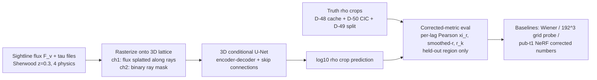

# LEDGER — unet-inversion (amortized 3D U-Net inversion of Lyα sightlines)

## **Architecture Diagram (Mermaid)**

---

## 1. The Pulse (Progress & Roadmap)

| Stage | Focus Area | Status | Target Metric | Notes |
|:--- |:--- |:--- |:--- |:--- |
| **Stage 0** | Track founding + research proposal | ✅ **DONE 2026-07-23** — (a) PI ratification landed as **[U-04]** (R15-PROVISIONAL, panel pre-review owed before Stage-2 Juno dispatch); (b) corrected-metric table landed ([U-03], [D-75]); (c) novelty panel landed ([U-02]) | Proposal + ratified gates in §2/§3 + `design/u04_stage1_ratification.md` | Founded + ratified 2026-07-23 per user directives (NeRF track wrapped same day) |
| **Stage 1** | Pair-manufacture data plumbing (crop × ray-pattern sampler, flux rasterizer) | 🟢 **DISPATCHED 2026-07-23** per [U-04] §2 (192-pitch 64³ crops; input δ_F=1−F; target x=log₁₀(max(ρ/⟨ρ⟩,1e-3)); DE→CI→SR ladder, R28 9≥9) | [U-04] §2(d) exit criteria S1–S4 | Reuses [D-48]/[D-49]/[D-50] infra from exp/nerf |
| **Stage 2** | Baseline 3D U-Net training + corrected-metric eval | ⏳ | Gates G2 in §3 [U-01] | Juno dispatch per juno-hpc skill |
| **Stage 3** | Cross-physics generalization (train 3 physics, test held-out 4th) | ⏳ | Gate G3 in §3 [U-01] | Measures prior-robustness risk |

### Completed Milestones
- **2026-07-23**: Track founded; proposal parked (this file). No code, no runs yet.

---

## 2. Methodology & Architecture (proposal of record, v0 — pre-PI-ratification)

**The one-paragraph mental model.** The NeRF track proved the flux data alone does not decide the 3D map at z=0.3 ([D-73] K2 on exp/nerf: a free voxel grid fit the flux 4× better than the truth field does). So the missing ingredient is knowledge of what cosmic structure looks like. This track supplies that knowledge by training across many examples: the same simulation box gives matched pairs (sightline flux in, true 3D density out), and a network trained on pairs carries the prior in its weights. Per-scene fitting is retired; learned inversion replaces it.

**Task definition.** Input: two 3D channels on a lattice — (1) observed flux values written along each ray path, (2) a binary mask marking which voxels a ray crosses. Output: the log10 overdensity crop. Supervision: direct density-domain regression (log-ρ MSE; optional spectral-consistency term, truth-anchored only per exp/nerf [D-41] lesson).

**Architecture: 3D conditional U-Net (encoder–decoder with skip connections).** Chosen because its built-in assumptions match the field: statistical homogeneity → translation-equivariant convolutions; hierarchical web structure → multiscale encoder + skips; sparse local evidence + global prior → skips carry the ray data, the bottleneck carries the context. It is the standard strong baseline for sparse-measurement inversion and the cheapest architecture to falsify. FNO (Fourier Neural Operator) is the pre-registered ablation alternative.

**Training-pair manufacture (same dataset, no new data — user directive 2026-07-23).** Random crop positions from the training region of the [D-49] 70/15/15 axis-0 split; a fresh random subset/pattern of the 16384 available sightlines per example; 90° rotations/flips of the transverse axes; all 4 physics variants. Test: fixed ray pattern, held-out region only.

**Deliberate exclusions.**
- The FGPA/Voigt forward integrator stays OUT of the training loop. The sim's own τ files are the input; truth density is the target. This removes the forward-model slack that the exp/nerf grid exploited ([D-73] am-9 §9b caveat b).
- No per-scene optimization anywhere. That axis is falsified at maximal capacity (192³ free grid, exp/nerf [D-73]).
- 3DGS is not a candidate: it is a per-scene explicit representation, same class as the free grid that already hit the information wall (and deprecated repository-wide per user directive 2026-05-11).

---

## 3. The Logic (Decision Log)

- **[U-01] Track founding + inherited constraints + preliminary gates (2026-07-23).**
  Provenance: user directive 2026-07-23 (session: Fable): change of experiment design with a different neural-network architecture, SAME dataset; grid explicitly ruled "not the method — a baseline"; branch+LEDGER per track.
  **Inherited binding constraints from exp/nerf close-out** (any violation re-runs a paid experiment):
  1. Flux supervision at z=0.3 under FGPA does not identify the 3D field (exp/nerf [D-73] am-9/am-10, K2). Successor must inject information beyond the flux likelihood → here: cross-example learned prior.
  2. Passing flux gates ⇏ 3D structure recovery (am-10 §10d). All gates here are density-domain on held-out truth.
  3. Every outcome cell enumerated in advance (am-10 lesson); symmetric-disclosure FAIL branches pre-committed.
  4. Regularizers anchor to truth only, never to the model's own predicted state (exp/nerf [D-41]).
  5. Integrated statistics are gameable (exp/nerf [D-40]); gates use field-level + scale-resolved statistics.
  6. The ξ estimator defect is inherited by anyone copying `src/analysis/cross_corr.py` (S5: cross-correlation function ≠ per-lag Pearson; truth-vs-truth = 0.0298 at r≈2). Gate G1 below is a hard prerequisite.
  7. Real-vs-redshift-space frame mismatch (S7, Δχ_rms ≈ 1.3 h⁻¹Mpc at z=0.3) must be resolved by scoring in matched frames.
  8. Bootstrap mandatory for any flux-derived statistic (exp/nerf [D-44] 2–9σ seed-vs-bootstrap divergence).
  9. [D-53] supervision-target axis (upstream, never discharged on exp/nerf) is discharged **by design** here: supervision IS the density target.
  10. [D-37] honest-reporting + verb-ceiling discipline carries over unchanged.
  **Preliminary success gates (PI ratification owed before any dispatch):**
  - **G1 (estimator acceptance, prerequisite):** corrected per-lag Pearson ξ(r) = C_xy(r)/√(C_xx·C_yy) returns 1.0 (±1e-6) for truth-vs-truth at every r bin.
  - **G2 (methods win):** on the held-out region, same frame, U-Net beats BOTH the Wiener baseline AND the banked exp/nerf 192³ grid probe on (a) smoothed-field Pearson r at σ ∈ {1, 2, 4} h⁻¹Mpc and (b) stochasticity r(k) over the resolved band.
  - **G3 (generalization):** train on 3 physics variants, test on the held-out 4th; G2-style margin retained within a pre-set tolerance (tolerance TBD at PI ratification).
  **Pre-enumerated outcome cells:** (a) beats both baselines → quantifiable methods win, paper track re-licensed; (b) beats grid, not Wiener → learned prior helps but stays under the linear-optimal bar → diagnostic follow-up, no win claim; (c) ≈ grid → the z=0.3 information budget dominates even with a learned prior → strengthens the exp/nerf under-constraint characterization (publishable as its extension, not as a win); (d) wins only at large smoothing σ ≥ 4 → scoped large-scale-only claim, verb-ceiling accordingly; (e) FAIL trainability/overfit → process finding, disclose symmetrically.
  **Compute posture:** local smoke at small crops first; Juno A30/H100 per juno-hpc skill only after twin-gate behavioral tests (exp/nerf R20 discipline).

- **[U-02] Prior-art absorption from the 2026-07-23 defense-panel novelty audit (binding on all claims).**
  Provenance: defense-panel prior-art audit, dispatched from the exp/nerf close-out session 2026-07-23.
  **Closest prior work: DeepCHART (Maitra, Viel & Kulkarni, MNRAS 2026, arXiv:2507.00135)** — supervised deep-learning inference of 3D density from survey-realistic Lyα sightlines at z=2.5, voxel Pearson ρ ≈ 0.77. This IS the method template of this track (amortized, simulation-pair-trained inversion). Consequences:
  1. **Method-template novelty claim BARRED** for this track. The template exists and succeeded at z=2.5. Any novelty verb must attach to the residue, not the recipe.
  2. **Defensible novelty axes (verb-ceiling for each):** (a) the information-sparse ⟨F⟩≈0.98 / z=0.3 regime, where no learned-inversion result exists and where the sibling exp/nerf track measured likelihood-domain under-constraint (K2); (b) the controlled likelihood-only vs learned-prior CONTRAST on one common corrected-metric table (per-scene NeRF + free grid + Wiener + this track — nobody has published that four-way in any regime); (c) the cross-physics generalization axis (train 3 feedback variants, test the 4th) — DeepCHART does not test prior-robustness across sub-grid physics.
  3. **Related precedent to cite, not compete with:** Porqueres+ 2019/2020 (Bayesian field-level sparse-Lyα inference, z≈2.5); Huang+ 2021 Deep Forest (1D); TARDIS I/II (differentiable-forward inversion). Several sit annotated-but-uncited in `papers/shared/main.bib` — the bib is ahead of the prose repo-wide; do not repeat that failure in this track's write-ups.
  4. **Pre-work obligation before any novelty claim ships:** full scan of the Chaves-Montero 2026 ML-Lyα review (arXiv:2605.22489), whose field-level-inference section the panel could not extract; if it names learned-inversion work at low z, this entry re-opens.
  5. **External reference point for gates:** DeepCHART's ρ ≈ 0.77 at z=2.5 is the literature anchor the corrected-metric table positions against (with the regime caveat stated both ways). G2 remains a *benefit* gate vs our own baselines; U-02 adds no numeric bar, only claim discipline.

- **[U-03] Pivot targets from the exp/nerf [D-75] corrected-metric campaign + user grid ruling (2026-07-23).**
  Provenance: exp/nerf LEDGER §3 [D-75] (commit c627aad) + [D-75] §H user ruling (5423c3c). The user barred the grid from the NeRF-track paper (it belittles the chosen method); its numbers live HERE, as this track's quantitative pivot rationale and targets:
  1. **Measured recoverable ceiling**: r_s(σ=2 h⁻¹Mpc, real frame, 192³ log-density) = **0.595 ± 0.020** at z=0.3, n_rays=1024 — what a maximal-capacity per-scene fit extracts from the flux likelihood alone (≈ truth low-passed at k_c ≲ 0.25 h/Mpc; coherence r(k) > 0.5 to k ≈ 0.62; amplitude-compressed). Estimator: `src/analysis/nccf.py` + smoothed Pearson per the [D-75] suite (acceptance-validated).
  2. **NeRF method-lineage reference**: r_s(σ=2) = **0.275 ± 0.052** (production pub-t1, n_rays=64 config caveat rides). The 0.275 → 0.595 gap is the measured method-attributable improvement space that motivates this track.
  3. **Classical reference**: Wiener best-L = **0.165 ± 0.031** ("this Wiener configuration" verbs mandatory; R14 caveats per [D-75]).
  4. **Gate G2 is now CONCRETE**: this track claims a win only if the U-Net beats **0.595** (the likelihood-only ceiling) on the [D-75] scoreboard, held-out region, same estimator suite — beating 0.275 or 0.165 alone is progress, not the win condition, because the learned prior must demonstrably add information beyond what per-scene likelihood fitting already extracts (the K2 lesson: flux margin of record 3.884× means flux-fit quality cannot adjudicate; density-domain r_s on held-out truth is the only scoreboard).
  5. Scale honesty inherited: recovery claims are scale-resolved (σ=2 gated; small scales and amplitude are where the data ran out for likelihood-only methods — they are exactly where a learned prior must prove itself).

- **[U-04] PI founding ratification + Stage-1 spec of record (2026-07-23; R15-PROVISIONAL, PI-only, panel pre-review deferred to pre-Stage-2).**
  Full text: `experiments/unet-inversion/design/u04_stage1_ratification.md` (committed verbatim; that file governs). Summary of record: [U-01] gates RATIFIED with amendments — G1 = [D-75] acceptance suite via `src/analysis/nccf.py` + NEW held-out-mask re-run clause; G2 = five-condition win test (identical machinery to [D-75] §7 B-ii, two disclosed held-out-geometry adaptations) on pairs unet>grid / unet>wiener_L3 / unet>mlp, real-frame primary, test region only, **operative bars re-measured on the held-out mask from the pinned baseline cubes** (0.595 stays the full-box context anchor; direction conservative against the U-Net); G3 = cross-physics drop ≤ 0.05 (provisional, self-anchored-flagged, finalized at Stage-3 spec). Outcome cells U0–U-I pre-committed (incl. U-G zero-input/input-ignoring flag and U-D implementation-suspect). Stage-1 rulings: 192-pitch lattice, 64³ crops; input = δ_F = 1−F with fixed global scale (per-crop normalization FORBIDDEN); target = the [D-75] scoring variable x = log₁₀(max(ρ/⟨ρ⟩,1e-3)); exit criteria S1–S4. Dispatch ladder R28 9≥9: data-engineer (locality enumeration FIRST → P2–P4 192³ truth cubes → crop provider) → core-implementer (sampler, rasterizer, dataset, tests, viz) → support-researcher (held-out baseline re-score + Chaves-Montero scan, parallel after locality audit). Anti-degeneracy audit (rule 3) stated in advance: amplitude compression invisible to r_s (mandatory variance/P(k) columns), diffuse-bin domination, input-ignoring basin (zero-input control), single-box memorization ([D-49] + distance stratification), physics averaging, frame slack. Compute: local smoke ladder + R20 twin-gate before any HPC; Juno reachability re-verification owed (infrastructure-manager) before Stage-2 planning. Drift flag resolved: the [D-75] spec markdown lives on `exp/nerf` (57985bb/753a478/f80f7df), absent from this branch's tree by branch placement, not loss.

---

## 4. The Data (Lineage & Governance)

Same dataset as exp/nerf — no new external data (user directive 2026-07-23):
| Item | Path | Notes |
|:--- |:--- |:--- |
| Sightlines (1D flux) | `Sherwood/Physics{1..4}_*/los2048_n16384_z0.300.dat` | 16384 LOS × 2048 bins |
| Optical depth (supervision input) | `Sherwood/Physics{1..4}_*/tauH1_2048_n16384_z0.300.dat` | redshift-space half per exp/nerf [D-06] |
| 3D truth ρ | `SherwoodIGM_gal/` snapshots via `SherwoodLoader.extract_rho_crops` | [D-48] disk cache + [D-50] chunked CIC, reused |
| Train/val/test split | [D-49] `HeldoutSplitScheme` 70/15/15 axis-0, strict straddle rejection | reused unchanged |
| Baseline artifacts for eval table | exp/nerf `d73-1dprime` grid ckpt (DVC), A4′ Wiener, pub-t1 MLP ckpts (`cloud_runs/pub-t1-extracted/`) | context columns only |

DVC: any produced artifact > 10 MB tracked at `s3://cosmo-gas-vision-storage/dvc-data` per repo rule.

---

## 5. Evaluation Plan

Prerequisite: the corrected-metric suite being spec'd on the exp/nerf close-out (PI, 2026-07-23) — per-lag Pearson ξ(r); Gaussian-smoothed log-density Pearson r at σ ∈ {1, 2, 4} h⁻¹Mpc; stochasticity r(k) = P_xy/√(P_xx·P_yy); SSIM/PSNR on smoothed log-ρ slabs; both real-space and RSD-remapped frames; truth+noise ladders as controls. This track adopts that suite verbatim as its gating set (G1–G3 above) so exp/nerf artifacts and this track's outputs are scored on one common table.

---

## 6. Visualization & Artifacts

(placeholder — first entries expected at Stage 1: one rendered (input channels, target crop) example per physics variant)

---

## 7. Session History & Next Handoff

### Session Snapshot: 2026-07-23 (track founding — Fable session)
- User directives absorbed: (1) benefit gate on paper work (no quantifiable NeRF win in record → paper halted pending corrected metrics); (2) grid ≠ method — NeRF-centric framing for all exp/nerf re-scoring; (3) new track = new architecture on SAME dataset; (4) branch + LEDGER per suggested track.
- This track (amortized U-Net inversion) parked at Stage 0. Sibling track parked at `exp/diffusion-posterior` (dormant until this track's Stage 2 gate — see its LEDGER).
- In flight on exp/nerf side: PI corrected-metric spec (NeRF-primary re-scoring of pub-t1 checkpoints + baselines); defense-panel prior-art/novelty audit (covers this track's related-work positioning too — supervised deep-learning Lyα tomography prior work must be checked before any novelty claim).
- **Immediate next steps:** (1) corrected-metric table lands → PI ratifies/adjusts G2–G3 bars against the measured Wiener/grid numbers; (2) PI review of this proposal; (3) Stage 1 data plumbing dispatch (core-implementer + data-engineer).
